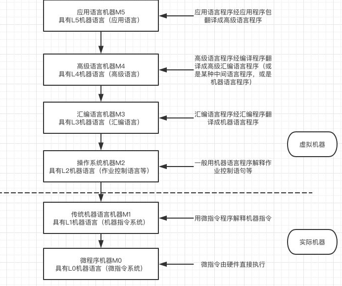
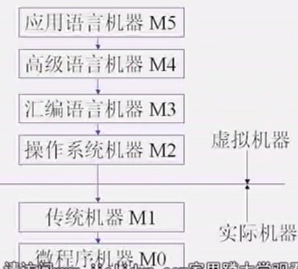
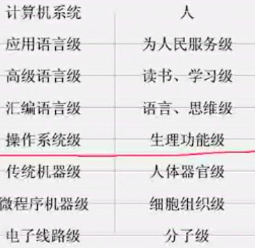
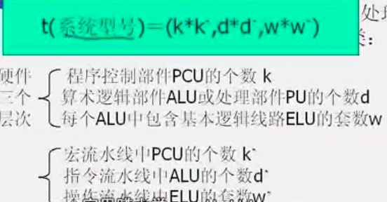

## 1. 计算机系统多级层级结构

 ### 计算机系统层级结构

### 翻译和解释

翻译Translation——将**高一级机器的程序转变为低一级机器上**等效的程序，在低一级机器上实现

解释Interpretation——**低级机器用指令仿真高级机器语句**，通过对高级机器语言程序逐条解释实现。

掌握层级结构中，每个级别对应翻译还是解释。

## 2. 计算机系统的结构、组成和实现

### 计算机系统结构 

## 1. 计算机换代

​				元器件		软硬件
​	第一代	电子管、继电器存储器、绝缘导线		单CPU、定点计算||汇编语言
​	第二份	晶体管、磁芯存储器、印刷电路板		单CPU、变址寄存器、浮点计算、多路存储器||高级语言
​	第三代	集成电路、多层印刷电路			微程序控制、流水线、高速缓存
​	第四代	超大规模集成电路、半导体存储器	并行计算机
​	第五代	高速处理器、存储器芯片			大规模并行计算、可拓展、容延迟系统结构

系统结构的改进==>推进计算机改进

## 2. 计算机系统结构	基本概念	课程目录

	多级层次结构
	
	计算机系统结构定义
	
	系统结构、组合、实现 含义和关系
	
	软硬件分配原则
	
	软件、应用、期间对系统结构影响
	
	并行发展
	
	系统分类

## 3. 多级层级结构

### 使用语言角度==机器、汇编、高级、应用语言(翻译)

机器语言

汇编语言	符号设计语言	虚拟机器语言
	汇编语言→汇编程序→机器语言

高级语言	
	高级→编译程序→汇编语言

应用语言	CAD、VBA etc.
	应用语言包→翻译程序→高级语言

### 机器内部延伸==微程序级(解释)

	微程序适用范围   控制存储器

#### 翻译和解释的区别

翻译		解释

中间代码、文件	

需要翻译程序

不占运行时间	运行费时

### 操作系统级

### 计算机系统结构总层级划分

## 4. 计算机系统结构定义

定义1——G.M.Amdahlss

计算机系统结构是程序员所看到的计算机的属性，即程序员编写出能在机器上正确运行的程序所必须了解的**概念性结构和功能特性**

定义2

计算机系统结构是指传统机器及的系统结构，即软件和硬件交互界面以及上下功能的分配。

它是计算机系统的外特性。

**课程主要研究——传统机器级系统结构**

​				**软件与硬件交界面**

## 5. 计算机组成与实现

### 计算机组成

定义：

**计算机组成是计算机系统结构的逻辑实现。包括机器级内的数据流和控制流的组成以及逻辑设计。是计算机系统的内特性。**

计算机组成设计包括：

数据通路宽度、专用部件；各种操作对

缓冲排队技术、预估预判技术、可靠性技术 等

### 计算机实现

定义：

**计算机实现是计算机组成的物理实现。包括处理机和主存等部件物理结构**

包括：

器件的集成度和速度；功能部件并行度；控制结构组成方式等

### 系统结构>组成>实现 关系

系统结构->组成->实现

## 6. 软硬件取舍与计算机系统设计思路

### 软硬件取舍3个原则

1. 在现有逻辑器件和存储器件条件下，系统要有较高性能价格比
2. 系统结构设计不要过多或不合理限制各种组成、实现技术的应用。
3. 硬件设计不仅要运用最新技术成果，而且要考虑如何为软件提供更好支持。

### 计算机系统设计方法

1. "由上往下"设计：先考虑满足应用要求。确定使用者机器应具备的功能特性——>往下设计。
2. "由下往上"设计：先设计微程序机器级和传统机器级。然后再为不同应用配置多种操作系统和编译系统软件。
3. "由中间设计"：先确定好软硬件功能分配。从软硬件两方面分头进行设计。弥补其他两种设计带来的软硬件脱离缺点。

## 7. 软件的可移植性

软件移植技术：

### 统一高级语言

通用高级语言。——绝对统一较难，可实现相对统一。

### 系列机思想

定义：

系列机是在同一系统结构下，采用不同的组成和实现技术，制作出不同档次的机器。(同一厂商)

//不同厂商的同一系统结构称为兼容机

方法：

统一汇编语言、机器语言

特点：

- 与"从中间开始"设计方法相呼应
- 较好解决了软件环境相对稳定
- 与硬件迅速发展相矛盾

向上/下兼容——软件不加修改运行在比它更高/低的机器上。向上需要绝对，向下不一定。——针对运行环境。

向前/后兼容——软件可以运行在之后/前的软件环境中。尽量保证向后兼容，尽量向前。——针对软件。

### 模拟与仿真

模拟与仿真均是——在一台机器上模拟另一台机器上的指令系统。

模拟——用一台机器的机器语言去解释另一台机器的机器语言。——软件方法(解释：模拟程序)

仿真——用一台机器的微程序去解释另一台机器的机器程序语言。——少一重解释的过程

仿真速度比模拟速度快。

## 8. 应用与器件发展对系统结构影响

应用要求提高——>优化系统结构

器件发展——>使计算机指标提高，促成了算法、语言的发展

## 9. 并行性与计算机系统分类

### 并行概念

概念：

解题过程中同时进行运算或操作的特性。

并行性的双重含义——同时性、并发性——//并发是并行的子集

#### 同时性——同一时刻

两个或两个以上事件在同一时刻发生

####并发性——同一间隔

两个或两个以上时间在同一间隔发生 

#### 并行性开发途径

时间重叠——多个处理过程在时间上相互错开，轮流使用同一硬件的各个部分——示例：指令流水线处理、现代微机

资源重复——多套硬件设备——阵列处理机

资源共享——让多个用户轮流按时间顺序使用一套资源——通过网络等

#### 并行等级分类

1. 执行程序角度

指令内——微操作之间

指令间——多条指令并行执行

任务或进程间——任务或程序段

作业或程序间 ——作业或多道程序

2. 数据处理角度

//todo 

### 并行处理系统结构

- 流水线计算机
- 并行(阵列)处理机
- 多处理机
- 数据流计算机

### 多机系统耦合度

- 最低耦合系统——无物理间联系
- 松散耦合系统——通过通道、通讯线路互连
- 紧密耦合系统——高信息传送速度

### 计算机系统分类

出发点——并行性等级

1. **Flynn（弗林）分类法**——按指令流和数据流的多倍性分类

指令流——机器执行的指令序列——≈CPU

数据流——指令流调用的数据系列——≈PE(处理单元)

多倍性——同时处理指令流或数据流

分类：

- 单指令流单数据流	SISD	单处理机

- 单指定流多数据流	SIMD	并行处理机

- 多指令流单数据流	MISD	//不存在//处理机间宏流水

- 多指令流多数据流	MIMD	紧耦合多处理机、松耦合多处理机、多机系统MSISD

缺点：

不能反映工作原理

2. J.Kuck（库克）分类法——指令流、执行流

分类：

- SISE

- SIME

- MISE

- MIME

3. **冯泽云分类法**——从数据处理的并行度

最大并行度pm

​	计算机	单位时间内处理最大而仅是位数

//todo	//图

字长(位)	字有多少个

分类：

- 字串位串	WSBS	n=1,m=1	位串行机

- 字串位并	WSBP	n>1,m=1	现代常用计算机

- 字并位串	WPBS	n=1,m>1	并行处理机

- 字并位并	WPBP	n>1,m>1	多处理机

4. Handler分类法——根据硬件结构可并行处理单元数和流水线处理级数

## 10. 透明性分析

