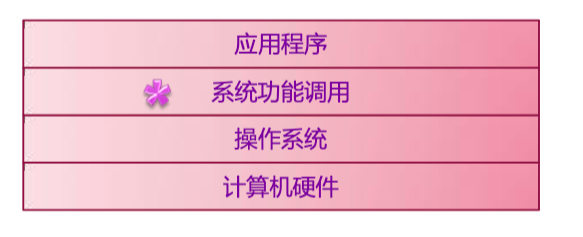
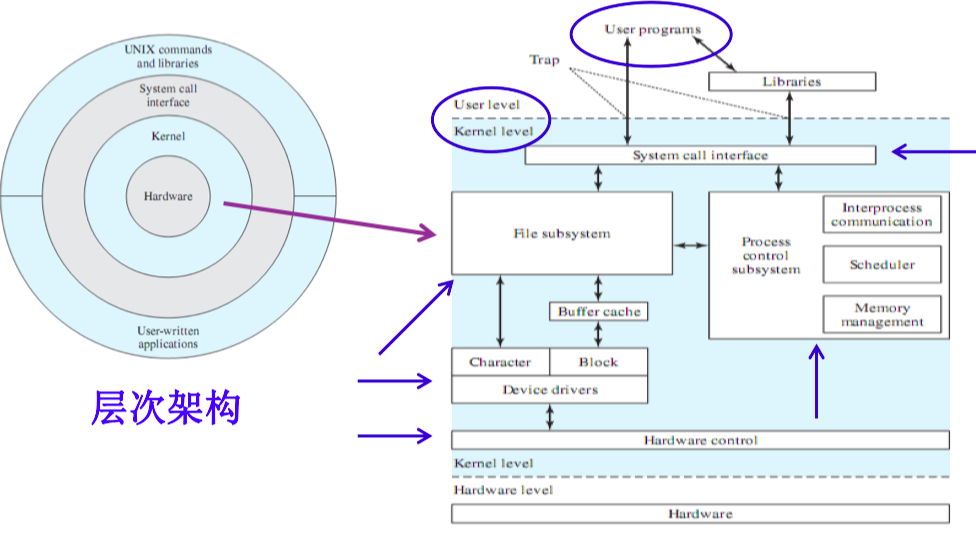
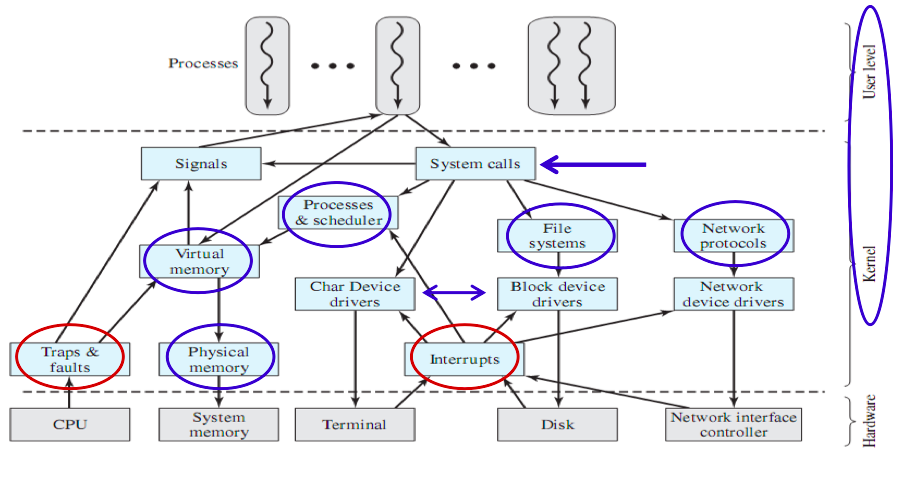
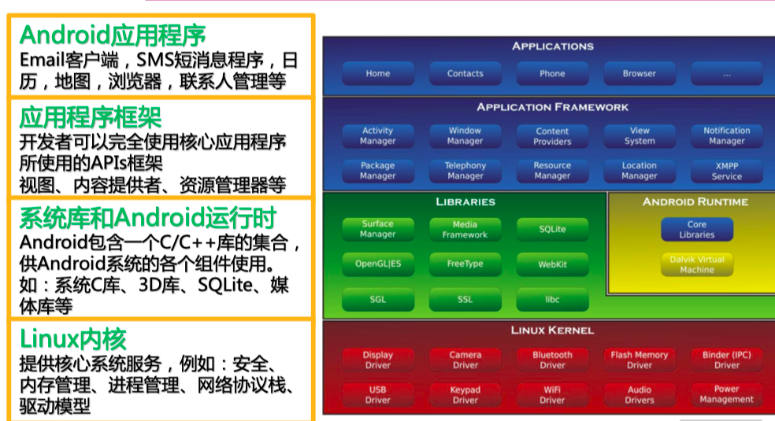

## 1. 操作系统概念

### 计算机系统

计算机系统定义——接受和**存储信息**、自动进行**数据处理**、并**输出结果**信息的系统。——面向信息

计算机系统分类——机械式系统、电子式系统

电子式系统——模拟式、数字式系统

此处讨论的计算机系统是**数字电子计算机系统**。

### 

### 操作系统定义

操作系统**是计算机系统的系统软件**，是以下 程序模块的集合：

组织和**管理**计算机系统中的**硬件和软件**资源、

组织计算机工作流程、

控制程序执行、

并向用户提供各项服务——面向用户

### 操作系统的特征

- **并发性**
- **共享性**
- 虚拟性——一个物理实体对用多个逻辑实体
- **随机性**——操作系统设计实现考虑各种可能性

###操作系统的功能

作业管理、进程管理、存储管理、文件管理、设备管理

//作业管理——计算机完成的某项任务，一组进程组成(主要用在批处理系统中)

## 2. 操作系统体系结构

### Windows体系结构

**分层模块结构**

| 层次          | 作用                                 | 备注           |
| ------------- | ------------------------------------ | -------------- |
| 硬件抽象层HAL | 隐藏硬件细节                         | 保护、可移植性 |
| 内核          | 线程调度、中断\|异常处理、处理器同步 | 保护           |
| 执行体        | 用户态可调用函数                     | 保护           |
| 子系统集合    |                                      | —//非保护      |

### UNIX

硬件→内核→系统调用接口→UNIX命令和库

### LINUX

LINUX操作系统组成部分——内核、shell、文件系统、应用程序

####LINUX内核组件

###Android

## 3. 操作系统分类

- 批处理操作系统      
- 分时系统      
- 实时操作系统      
- 嵌入式操作系统      
- 个人计算机操作系统      
- 分布式操作系统

大型机 → 个人计算机 → 网络 → 移动 计算 → 云计算 → 泛在计算（物联网） → 机器人

## 4. 操作系统结构设计

### 操作系统结构

- 整体式结构——先构建整体，功能拆分为模块
- 层次式结构——对模块划分层级，保证之间可以互相调用
- 微内核结构——内核最基本功能保留在内核，非核心功能转移到用户态执行——C/S架构，分化明显维护成本低

