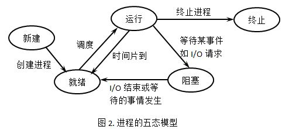
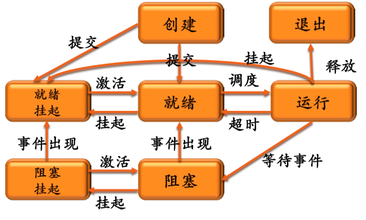

## 1. 进程


定义——程序在某数据集合上的运行活动


### 组成

进程==程序、数据、进程控制块PCB


### 可再入程序

定义——可被多个用户同时调用的程序。


### 特征

进程的两个基本属性：

- 可拥有资源独立单位
- 可以独立调度和分配的基本单位


进程的特性：

- 并发性
- 动态性——有生命周期，生命周期内状态不断变化 
- 独立性——资源分配单位
- 交往性——与其他进程交互
- 异步性
- 结构性——进程==程序、数据、进程控制块


## 2. 进程的状态


### 三状态模型

运行、就绪、等待(睡眠、阻塞)


### 五状态模型

增加新建态、终止态



### 七状态模型

操作系统引入虚拟内容后，模型增加了对内存和外存的划分




## 3. 进程控制块PCB

进程存在的唯一标志。

包含内容——调度信息和线程信息

调度信息——进程名、进程号、地址空间信息、优先级、当前状态、自愿清单、家族关系、消息队列指针、进程队列指针、当前打开文件


### 进程队列

用于实现对进程的管理。系统将进程PCB排成若干个队列。就绪队列、等待队列、运行队列。


### 进程队列组成

单向链接、双向链接


## 4. 进程控制

原语——若干条指令组成的指令序列，原子操作。


进程控制原语——创建、撤销、挂起、激活、阻塞、唤醒、改变进程优先级


### 创建(类Unix)

fork创建子进程——调用一次，返回两次；父进程返回子进程PID，子进程返回0

exec——替换父进程代码——//运行外部命令/程序

wait——父进程等待子进程结束——//退出进程：阻塞等待

_exit——子进程调用退出——//退出进程：直接退出子进程，不在后台运行

signal——Unix处理异步事件——//退出进程：接受信号退出进程

//Linux与Unix存在部分不同


```c
int main(){
  pid_t pid;
  int x=1;
  //创建子进程
  pid=fork();
  
  if(pid==0){
    printf("child:x=%d\n",++x);
    exit(0);
  }
  
}
```


//以下为实践拓展部分

<https://blog.csdn.net/mybelief321/article/details/9068033>

### 进程创建、进程控制


### 进程间通信


## 5. 线程

线程是进程的实体，处理器调度和分派基本单位


### 线程属性

- 唯一标识符、线程描述表
- 共享进程内存地址
- 处理器独立调度单位


## 6. 线程机制实现

### 用户级线程

线程表不包含在内核内部


### 内核级线程

线程表、进程表保存在内核内部


### 混合模型

同时实现用户级线程和内核线程。

内核仅识别内核级线程。


### Pthread线程包


主要函数调用

| 线程调用             | 描述                  |
| -------------------- | --------------------- |
| pthread_create       | 创建一个新线程        |
| pthread_exit         | 结束调用线程          |
| pthread_join         | 等待特定线程退出      |
| pthread_yield        | 释放CPU运行另一个线程 |
| pthread_attr_init    | 创建+初始化线属性结构 |
| pthread_attr_destory | 删除线程属性结构      |

```c
/*
*创建线程打印线程标识符，
*创建失败打印失败语句
*/

#include <pthread.h>
#include <stdio.h>
#include <stdlib.h>
#define NUMBER_OF_PTHREADS 10


void *print_hello_world(void* tid){
  printf("Hello Wolrd. %d0, tid");
  pthread_exit(NULL);
}

int main(int argc, char * argc[]){
  pthread_t thread[NNUMBER_OF_PTHREADS];
  int status,i;
  for(i=1; i<NUMBER_OF_PTHREADS;i++){
    printf("Main here. Creating thread % d0, i");
    status=pthread_create(&thread[i],NULL,print_hello_world,(void *)i);
    if(status!=0){
      printf("pthread_create returned error code %d0, status");
      exit(-1);
    }
  }
  eixt(NULL);
}


```


## 7. 进程调度

### 处理器调度

概念——控制、协调进程对CPU的竞争


需要解决的问题——**调度算法**、**调度时机**、**调度过程**(进程上下文切换/进程切换)


### 处理机调度层次


| 层级                         | 调度对象 | 功能                                           | 目的                                                         |
| ---------------------------- | -------- | ---------------------------------------------- | ------------------------------------------------------------ |
| 高级调度(长程调度、作业调度) | 作业     | 将外存中的**后备队列**作业调入内存**就绪队列** | //主要用于多道批处理系统<br />//实时和分时系统中不设置高级调度 |
| 低级调度(进程调度、短程调度) | 进程     | 决定**就绪队列**中的进程获得处理机             | 最基本调度                                                   |
| 中级调度(内存调度)           |          | 存储器管理兑换                                 | 提高内存应用率和系统吞吐量                                   |


### 进程调度时机

balabala


### 进程调度过程

#### 处理器调度方式

抢占式、非抢占式

抢占式——就绪队列进程优先级高进程高于当前进程，立即转让处理器进行调度

非抢占式——进程调用原语或等待I/O进入阻塞状态，时间片用完才让出处理器


##### 进程切换主要工作

//对原有进程状态的保存，对新进程状态的恢复

- **切换全局页目录**以加载一个新的地址空间
- **切换内核栈和硬件上下文**，硬件上下文包括了内核执行新进程的全部信息，如CPU相关寄存器


### 进程调度算法


#### 进程调度算法设计原则

- 进程行为
- 系统分类
- 调度算法设计目标


#### 进程调度算法分类

- 先来先服务算法
- 最短进程优先算法
- 最短剩余时间优先算法
- 最高响应比优先算法
- 轮转算法
- 最高优先级算法
- 多级反馈队列算法


## 8. 系统内核

功能：

- 中断处理程序
- 进程同步与互斥
- 进程调度
- 控制与通信
- 存储管理的基本操作
- 时钟管理