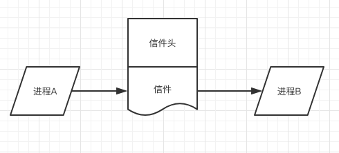
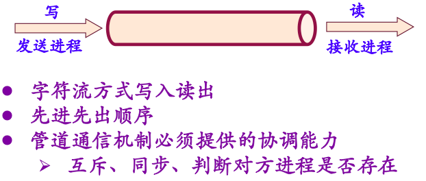
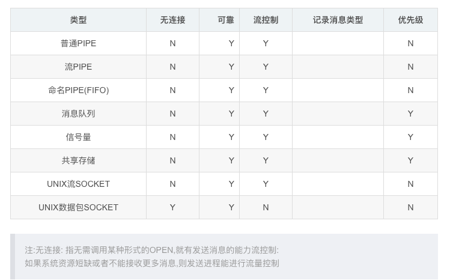

## 2. 进程同步&互斥


### 进程同步

进程间发生事件存在时序关系，需要相互合作，共同完成任务。

进程A执行依赖进程B的消息，没有收到消息进程则等待，等消息到达进程才被唤醒，继续进程执行


### 进程互斥

共享资源具有**排他性**，进程之间竞争使用资源


### 自旋锁


### 临界区

临界资源/互斥资源/共享变量——资源只允许一个进程使用

临界区——访问临界资源的程序


#### 临界区调度使用原则

//TODO


## 3. 信号量&PV操作

信号量&PV操作是一种**进程同步**机制


### 信号量

Semaphore，简称S

概念——一种特殊的**变量**，**整型+队列**(等待队列、就绪队列)，只能被原语**P操作**、**V操作**、初始化操作使用


物理含义——某类可用的临界资源，不同的临界资源用不同的信号量表示

S>0，S值代表临界资源数量

S<0，表示无可用资源，S绝对值代表等待队列中进程数目


### PV操作


P(S){
  S = S-1;
  若S<0，进程状态置为**等待状态**，进程**PCB插入S**信号量**等待队列末尾**，直达有其他进程在S上执行V操作——**请求进程分配到一个资源**
}


V(S){

​	S = S+1;

​	若S<=0，释放S等待队列中的一个进程，将其状态改为**就绪态**，并插入就绪队列；然后执行本操作的进程继续执行——**进程释放了一个资源**

}


### PV操作解决进程互斥问题


设置信号量，mutex，初值为1


### PV操作解决进程同步问题

通用处理：

第一个操作为P，S值设定为1

第一个操作为V，S值设定为0


## 4. PV操作解决经典进程同步问题


### 生产者-消费者问题

缓冲区

//TODO

### 多个生产者-消费者问题


### 读者-写者问题


## 5. 管程


### 概念

管程概念——由过程、变量、数据结构组成的模块或软件包。

一种语言特性，c语言不支持，使用类Pascal语言描述。


### 组成部分

组成部分——管程名称、共享数据的说明、对数据进行操作的一组进程、对共享数据赋初值的语句


### 特征

1. 模块化
2. 抽象数据类型
3. 信息屏蔽


### Hoare管程机制、设计思想


### 管程条件变量

//TODO


## 6. 进程通信IPC

### IPC——InterProcess Communication


信号量及管程的不足；

不适用多处理器情况


### 通信机制类型

通信机制类型——共享内存、消息机制、管道通信


### 共享内存

提供共享内存区域，一组进程写，另一组进程读


### 消息缓冲通道//消息队列//FIFO先进先出


### 信箱通信//消息传递





```
信箱的消息传递方式：

采用消息信箱的方式是一种简介的通信的方式，接受方和发送方需要通过信箱进行交互信息，就像是以前通信一样。那么刚刚的target ,he Soure都是信箱了，就是mailbox.

Send()：

Send(MailBox,Message);//

其中MailBox就是信箱，是一种结构体，原语将信息发送到信箱，过程为：首先是检查指定的邮箱是否满，如果满了，则发送信件进程就会被堵塞，进入“等待发送信件”，状态，假如没有满的话，将信件Message存入信箱中，有进程等待取信件，那么将会唤醒正在等待取信件的进程。

Receive（）:

Receive(MailBox,&Message);

执行的过程：首先还是检查信箱中的文件，如果信箱中有信的话，那么就会取出信件，放入Message,假如这时有进程在等待将信件存入信箱中，则等待的发送的进程将会被唤醒。如果没有信件，那么取信件的进程将会被阻塞。
--------------------- 
作者：hello_world6 
来源：CSDN 
原文：https://blog.csdn.net/hello_world6/article/details/52693607 
版权声明：本文为博主原创文章，转载请附上博文链接！
```


### 管道通信

利用缓冲传输介质——内存或**文件**连接两个相互通信的进程




<https://songlee24.github.io/2015/04/21/linux-IPC/>


```c

#include <unistd.h>
#include <stdio.h>

int main(int argc, char *argv[]) {
	int fd[2];
	pid_t pid;
	
	char buff[20];
	if(pipe(fd)<0)
		printf("create pipe error\n");
	
	if((pid=fork())<0)
		printf("fork error");
	
	else if (pid>0)
	{
		close(fd[0]);
		write(fd[1],"hello world\n",12);
	}
	else {
		close(fd[1]);
		read(fd[0],buff,20);
		printf("%s",buff);
	}
	return 0;
}
```


### //信号


### 进程间通信方式效率比较

