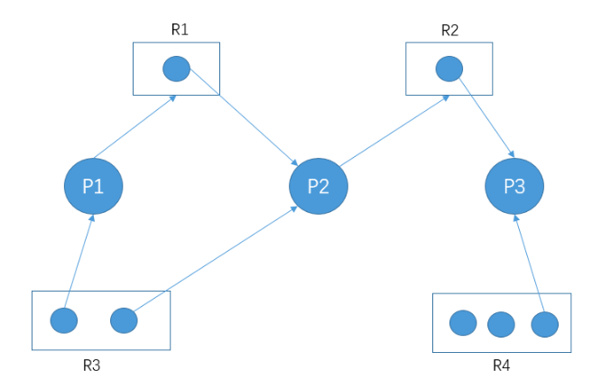
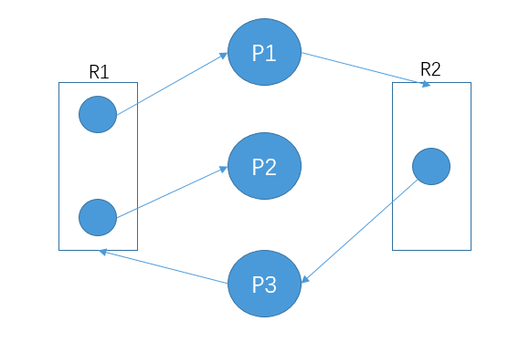

## 1. 死锁的产生

### 定义

一组进程中，每个**都无限等待**被该组进程中**另一进程所占有的资源**。

### 原因

资源数量有限、锁和信号量错误使用

### 必要条件

1. 互斥条件
2. 不可剥夺条件
3. 请求和保持条件
4. 循环等待条件

### 死锁的处理

//并发由低到高

- 预防死锁
- 避免死锁
- 检错与解除死锁
- 忽略死锁

## 2. 死锁预防

实现确定资源分配算法，限制进程对资源的申请。具体实现为破坏死锁产生的四个必要条件之一。

### 资源静态分配策略

进程必须在开始执行前就申请它所需要的全部资源，仅当系统能满足进程的资源 申请请求且把资源分配给进程后，该进程才开始执行。——进程在执行过程中不能再申请资源——**破坏请求和保持条件**

### 资源有序分配法

对资源进行编号，较为稀缺的资源编号大。

进程申请资源，按照资源编号小→大顺序进行。释放资源，按编号减序进行。——**破坏循环等待条件**

## 3. 死锁避免

基本思想——对进程发出的每一个系统能够满足的资源申请进行动态检查，根据检查结果决定是否分配资源。

//不严格限制死锁必要条件

### 安全状态、安全序列

#### 安全状态

安全状态——系统运行过程中，对进程发出的每一个系统能够满足的**资源申请进行动态检查**，根据检查结果决定是否分配资源

安全状态——如何系统中存在由所有进程构成的安全序列P1,…,Pn，则称系统为安全状态

#### 安全序列

一个进程序列{P 1 ，…，P n }是安全的，表示进程序列所占资源未超过系统可以分配的范围

### 银行家算法

测试1——进程已占用资源+本次申请资源>进程对资源的最大需求量？拒绝：通过

测试2——进程申请最大资源>系统尚余资源？推迟分配：通过

保证任意时刻至少有一个进程可以获得全部资源而执行结束，

保证所有进程在有限时间内执行结束

## 4. 死锁的检测与解除

### 死锁检测时机

//检测是否存在循环等待条件	//检测是否形成环路

- 任何一次资源分配后、多次调度后、定时器定时检测

- 当系统某个进程长期阻塞或阻塞进程过多时，启动自锁检测

### 死锁检测算法

示例算法：

1. 为进程、资源指定唯一编号
2. 设置资源分配表，包含"资源号"和占用资源的"进程号"
3. 设置进程等待表，包含"进程号"和进程等待的"资源号"

4. 算法——检查资源分配表、进程等待表，判断是否形成环路

### 死锁解除方法

//让释放资源的进程继续运行——进程回退到接触死锁之前的地步

解除方法分类：

#### 1. 剥夺资源

剥夺正常运行进程资源给死锁进程

#### 2. 撤销进程

撤销死锁进程，将它们资源分配给另一些死锁进程。

## 5. 资源分配图

### 资源分配图

//无环路，无死锁

//有环路，有死锁

//有环路，无死锁	//环路未闭合(非绝对，根据简化图判断)

### 死锁定理

- 资源分配图没有环路，系统没有死锁
- 出现环路，可能存在死锁

- 资源图不可完全简化，则存在死锁

### 资源分配图化简方法

//可获取全部资源的进程，将其资源分配给申请他们的进程

- 对一个非等待、非孤立的进程P，消去其申请边和分配边
- 将P资源分配给申请他们的进程，将进程对资源的申请边改为分配边

## 6. 哲学家就餐问题

//进程同步、互斥	//资源有序分配法