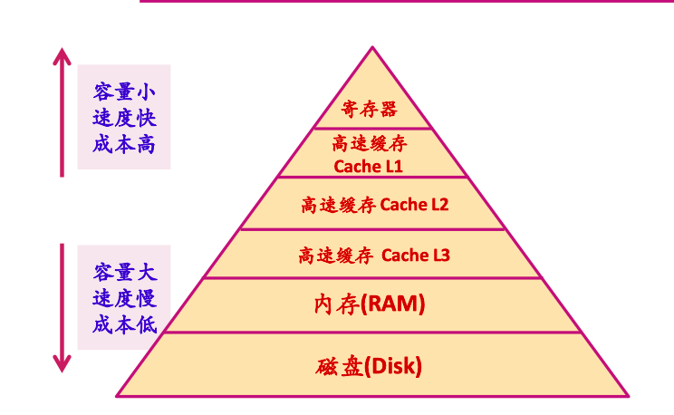
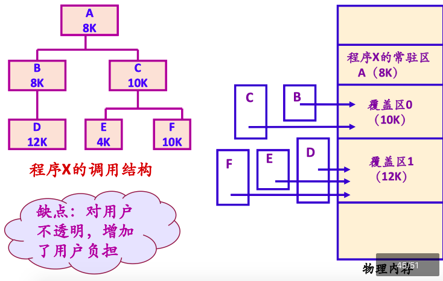

## 0. 内容概述

章节主要介绍对内存的管理

## 1. 存储管理的任务

### 存储体系

//L1、L2——Cache

### 存储管理任务

 1. 内存的分配和回收
 2. 存储共享
 3. 存储保护
 4. "扩充"内存容量

### 地址转换

物理地址、逻辑地址

1. 静态重定位
2. 动态重定位

## 2. 分区管理方案

### 固定分区

### 可变分区

#### 紧缩技术/压缩技术

#### 分区保护

## 3. 覆盖、交换技术

//内存"扩容"技术

### 覆盖技术

//程序员指定

### 交换技术

将内存放不下的进程保存到磁盘中

## 4. 虚拟页式存储方案

产生背景：

由程序员处理内存空间代价高，改为由系统维护

技术实现方案：

- 逻辑地址连续程序分散存储到几个不连续内存区域中——页式存储

- 大容量外存扩充内存——虚拟存储

### 虚拟页式存储地址转换

### TLB转换检测缓冲区

Translation Lookaside Buffer——转换检测缓冲区/快表

存储当前访问最频繁的少数活动页面的页号。

### 缺页异常

页表中所要访问页面不在内存

缺页异常发生时，系统必须从内存中选择一个页面将其移出内存。

### 页面调度策略

调度策略——页面由外存调入到内存之中

置页策略——指定调入的虚拟页存放在物理内存的位置

置换策略——若物理内存已满，指定策略将特定虚拟页面从内存移出

### 页面置换算法

发生缺页时，选择算法进行置换

主要页面置换算法：

**理想页面置换算法OPT**、**先进先出页面置换算法FIFO**、

第二次机会页面置换算法SC、时钟页面置换算法Clock、

**最近最少使用页面置换算法LRU**

#### OPT

Optimal replacement——理想置换

置换将来最迟被访问的页面——实现困难

#### FIFO

First In First Out——先进先出

堆栈模型

#### SC

Second Chance——第二次机会

在先进先出的基础上，判断页面R位是否为1？清0，页面放置栈尾；直接移除

#### Clock

所有页面保存在环形链表中，类似于时钟，提高了页面移动效率

#### LRU

Last Recently Used——最近最少使用页面置换算法

先移出最长时间未使用页面,页面增加计时标志

## 5. 缺页异常计算

//默认进程在内存中分配3个内存块

时间短-页

时间中-页

时间长-页

### FIFO——先进先出

加粗的是要下次请求被置换掉的。

| 页面走向  | 4    | 3    | 2     | 1     | 4     | 3     | 5    | 4    | 3     | 2     | 1    | 5    |
| --------- | ---- | ---- | ----- | ----- | ----- | ----- | ---- | ---- | ----- | ----- | ---- | ---- |
| 时间短-页 | 4    | 3    | 2     | 1     | 4     | 3     | 5    | 5    | 5     | 2     | 1    | 1    |
| 时间中-页 |      | 4    | 3     | 2     | 1     | 4     | 3    | 3    | 3     | 5     | 2    | 2    |
| 时间长-页 |      |      | **4** | **3** | **2** | **1** | 4    | 4    | **4** | **3** | 5    | 5    |
| 缺页      | ×    | ×    | ×     | ×     | ×     | ×     | ×    |      |       | ×     | ×    |      |
| 缺页计数  | 1    | 2    | 3     | 4     | 5     | 6     | 7    |      |       | 8     | 9    |      |

### OPT——置换将来最迟被访问页面

| 页面走向  | 4    | 3    | 2     | 1    | 4    | 3     | 5    | 4    | 3     | 2     | 1    | 5    |
| --------- | ---- | ---- | ----- | ---- | ---- | ----- | ---- | ---- | ----- | ----- | ---- | ---- |
| 时间短-页 | 4    | 3    | **2** | 1    | 1    | **1** | 5    | 5    | 5     | **2** | 1    | 1    |
| 时间中-页 |      | 4    | 3     | 3    | 3    | 3     | 3    | 3    | **3** | 5     | 5    | 5    |
| 时间长-页 |      |      | 4     | 4    | 4    | 4     | 4    | 4    | 4     | 4     | 4    | 4    |
| 缺页      | ×    | ×    | ×     | ×    |      |       | ×    |      |       | ×     | ×    |      |
| 缺页计数  | 1    | 2    | 3     | 4    |      |       | 5    |      |       | 6     | 7    |      |

 

### LRU——最长时间未使用

//未置换但顺序发生改变

| 页面走向  | 4    | 3    | 2     | 1     | 4     | 3     | 5     | 4    | 3    | 2     | 1     | 5    |
| --------- | ---- | ---- | ----- | ----- | ----- | ----- | ----- | ---- | ---- | ----- | ----- | ---- |
| 时间短-页 | 4    | 3    | 2     | 1     | 4     | 3     | 5     | 4    | 3    | 2     | 1     | 5    |
| 时间中-页 |      | 4    | 3     | 2     | 1     | 4     | 3     | 5    | 4    | 3     | 2     | 1    |
| 时间长-页 |      |      | **4** | **3** | **2** | **1** | **4** | 3    | 5    | **4** | **3** | 2    |
| 缺页      | ×    | ×    | ×     | ×     | ×     | ×     | ×     |      |      | ×     | ×     | ×    |
| 缺页计数  | 1    | 2    | 3     | 4     | 5     | 6     | 7     |      |      | 8     | 9     | 10   |

 

### Belady异常

页面数量增加，缺页次数增加现象——FIFO算法会发生

### 缺页率

==缺页异常/访问总数

### 工作集模型

### 颠簸/抖动

