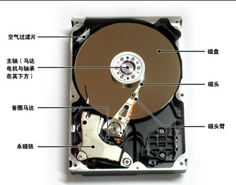
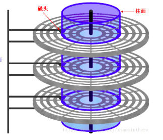
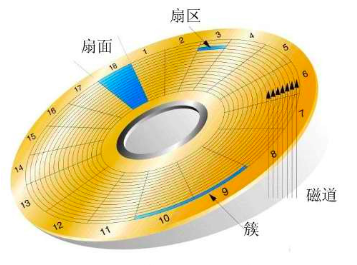
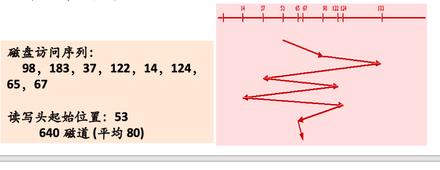
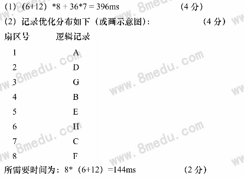

## 5. 磁盘调度策略

### 磁盘的结构

	

### 访盘请求流程

//磁盘读写——按柱面进行，不按盘面进行

读/写，磁盘地址(设备号，柱面号，磁头号，扇区号)，内存地址(源/目)

### 信息传输时间

寻找时间(寻道时间)——磁头/**旋转臂移动到**指定**柱面**花费的时间

延迟时间(旋转时间)——指定**扇区旋转到磁头**所需时间

传送时间——磁头读写完成信息传送时间

 

 

### 磁盘驱动调度

#### 移臂调度

寻找时间——磁头/**旋转臂移动到**指定**柱面**花费的时间

- 先来先服务——移动臂移动顺序长

- **最短寻找时间优先**——移动到**寻找时间**最短执行

- 电梯调度(扫描算法)——按移动臂方向选择最近，再改变臂方向，反复

- 单向扫描法——从0道向里道扫描，里道再向0道扫描，反复

#### 旋转调度

**同一个柱面**的多个访问者请求调度算法——优先选择**延迟时间**最短访问者执行

延迟时间——指定**扇区旋转到磁头**所需时间

可能情况：

1. 多访问者请求访问同一磁头上的不同扇区

2. 多访问者请求访问不同磁头上的不同扇区

3. 多访问者请求访问不同磁头上的相同扇区

第3种情况，任选一个磁头执行，不能同时执行

**最省时间响应次序**

### 信息优化分布

未经过优化总时间，(左)

8×(5+10)+7×30=330ms——经15ms处理时间，磁盘仍在旋转，多旋转3个扇区

经优化后的总时间(右)

8×(5+10)=120ms

**示例2**

