## //-1概述

### *处理逻辑

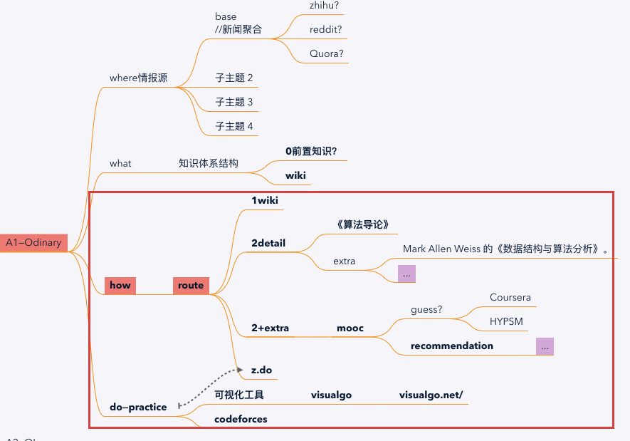

### *CS情报源//TODO

### *知名CS学习路线//TODO

#### Google

## 1知识体系结构

### wiki

[https://zh.wikipedia.org/wiki/%E6%95%B0%E6%8D%AE%E7%BB%93%E6%9E%84](https://zh.wikipedia.org/wiki/数据结构)

实现—— 可透过[编程语言](https://zh.wikipedia.org/wiki/编程语言)所提供的 **[数据类型](https://zh.wikipedia.org/wiki/數據類型)**、[引用](https://zh.wikipedia.org/wiki/參照)及其他操作加以实现。

###  Dict.

https://xlinux.nist.gov/dads/

##2具体项目

### *情报

筛选原则

3/10

#### 0newbie

Mooc——**cs61b**

书——

​	数据结构——《大话数据结构》

​	算法——《漫画算法》《算法图解》

​	//应试——《程序员代码面试指南：IT名企算法与数据结构题目最优解左程云著》《剑指 offer》

---

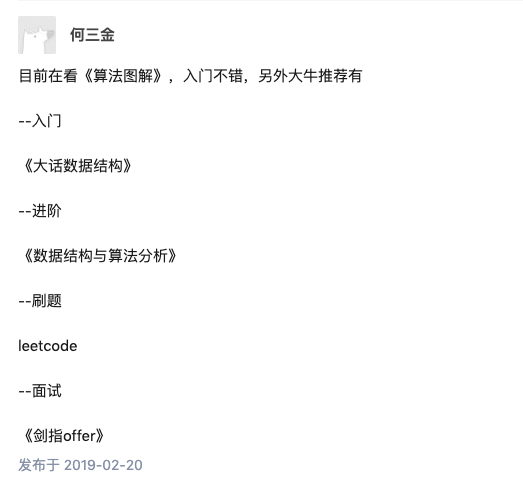

#### 1书adv

Mark Allen Weiss 的《数据结构与算法分析》。

---

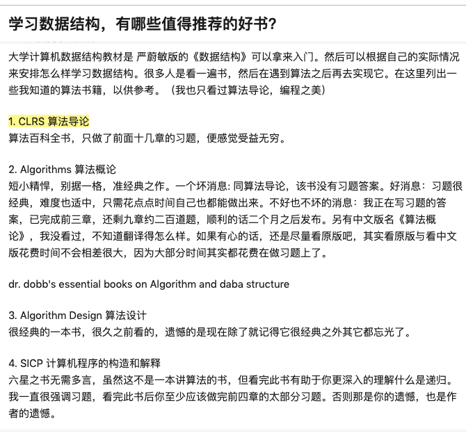

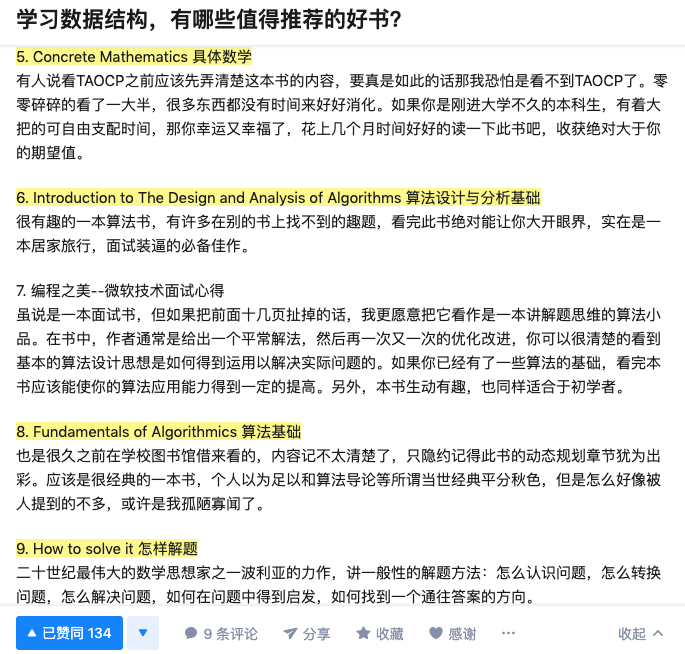

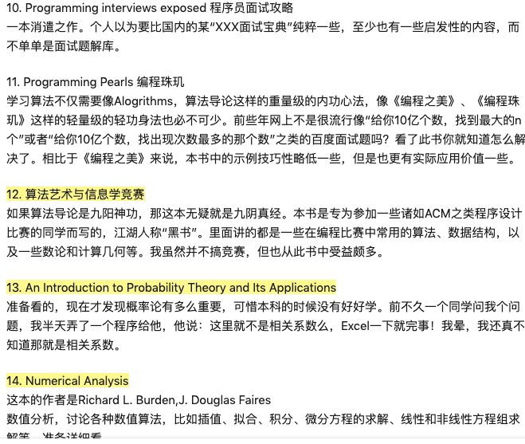

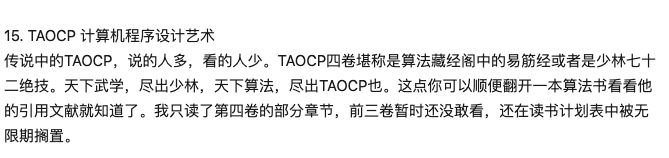

---

应用

5.1《matlab数学建模算法》
5.2《常用数据挖掘算法总结及ython实现》
5.3《机器学习十大算法》
5.4《计算机程序设计艺术 The Art o Comuter rogramming 第2卷（第3版）》
5.5《算法百科 Encycloeia o Algorithms》
5.6《智能Web算法》
5.7《现代计算机常用数据结构与算法》
5.8《数据挖掘原理与算法》
5.9《计算几何–算法与应用》
5.10《数值最优化算法（numerical otimization）》
5.11《计算机图形学原理及算法教程(Visual C++版)-和青芳 清华大学》
5.13《数据结构教程》
5.14《图论中的常用经典算法》

作者：元先生
链接：https://www.zhihu.com/question/34605825/answer/525176855
来源：知乎
著作权归作者所有。商业转载请联系作者获得授权，非商业转载请注明出处。

#### 2算法导论

《算法》→《算法导论》

---

https://www.zhihu.com/question/34605825

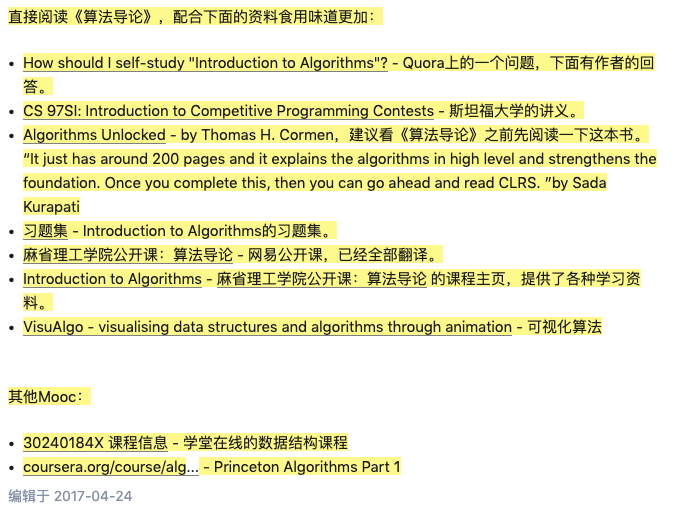

---

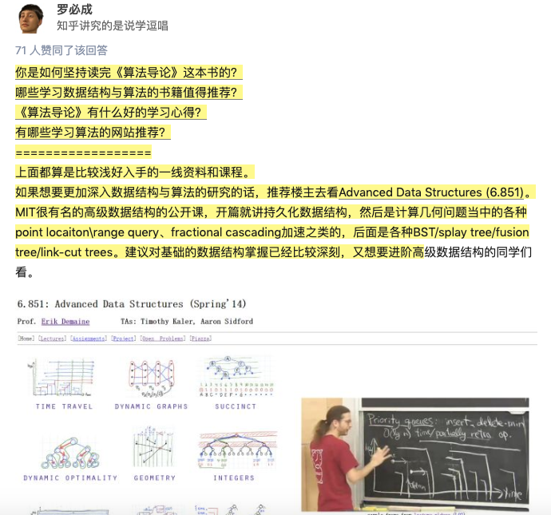

#### 3+1Mooc

**UCB CS61 b：数据结构（Java)**

|

~~//Data Structures and Algorithms Specialization—UCSD~~

1. ~~Algorithm Toolbox：讲的是基本算法，囊括一名初级程序员所要了解的最根本的算法概念和实现。浅显易懂，讲解还算比较细~~

2. ~~Data Structures：算法与数据结构是相辅相成的，了解数据结构有助于你理解算法。在这个课程中你将了解一名初级程序员所要掌握的最根本的数据结构类型，如何构造以及在什么时候用哪种结构。~~

3. ~~Algorithms on Graphs：进阶课程，讲解的是“图“的概念和相关算法，这个课里的内容帮助我战胜了好多道面试中与图有关的题目（Leetcode Easy~ Medium 难度），在我并未大量刷题的情况下。~~

4. ~~Algorithm on Strings：同上，内容侧重点是字符串算法。~~

|

**普林斯顿 Algs4: 算法**

//Stanford 的《算法分析与设计》https://www.coursera.org/specializations/algorithms#courses

MT6.006: 算法导论https://ocw.mit.edu/courses/electrical-engineering-and-computer-science/6-006-introduction-to-algorithms-fall-2011/

---

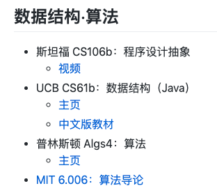

---

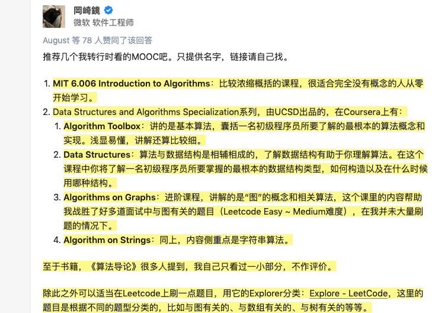

---

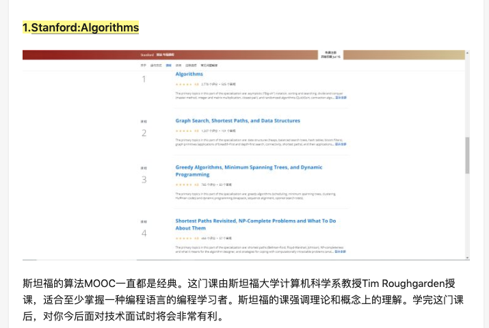

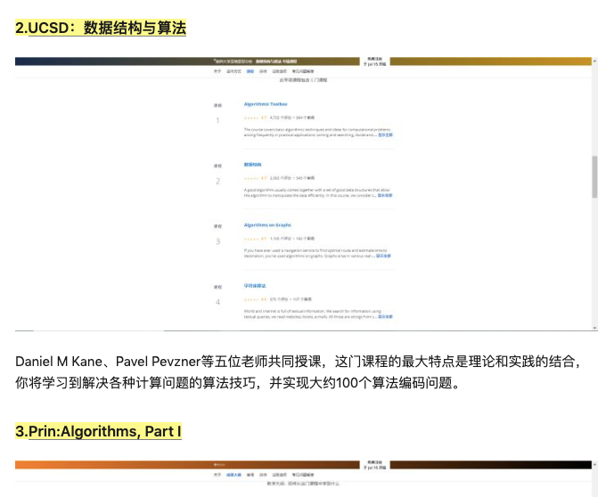

---

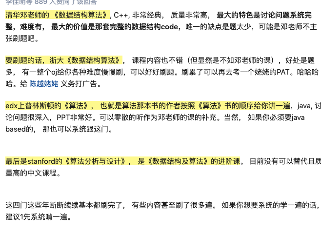

#### //z应试

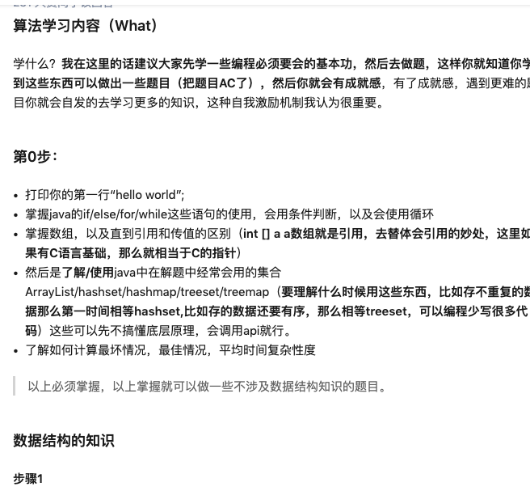

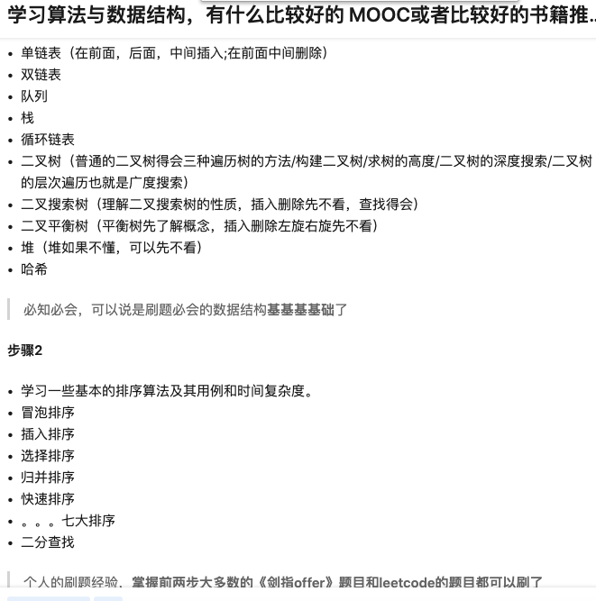

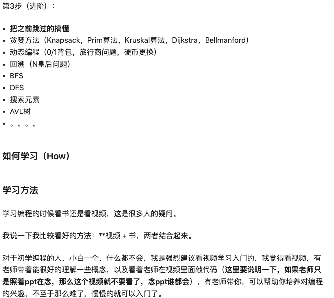

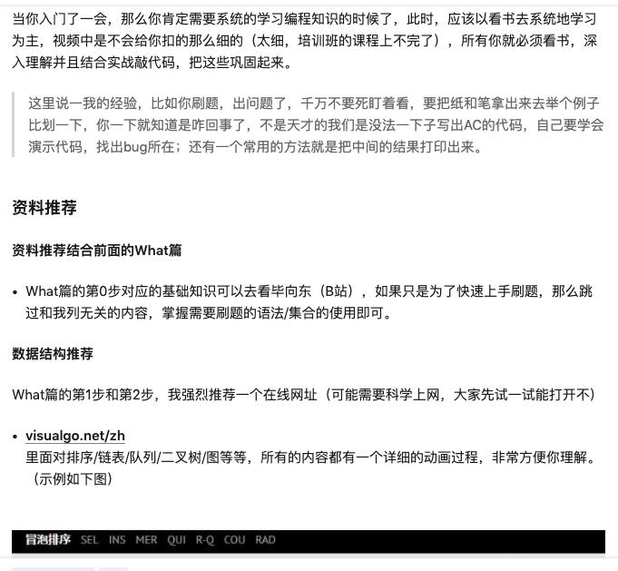

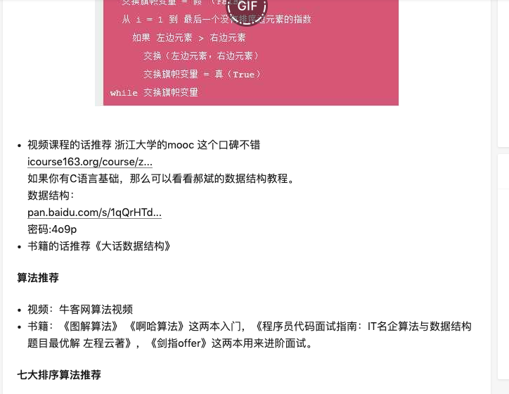

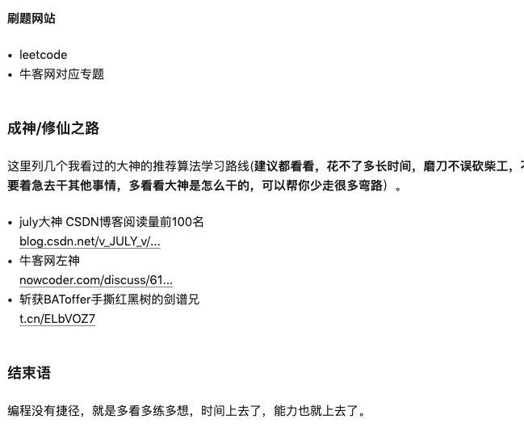

## z练习

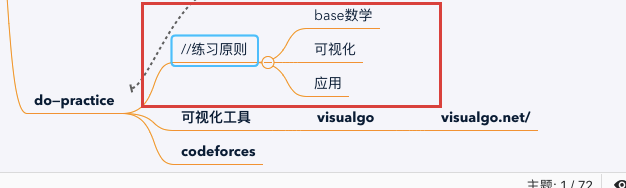

### codeforces

