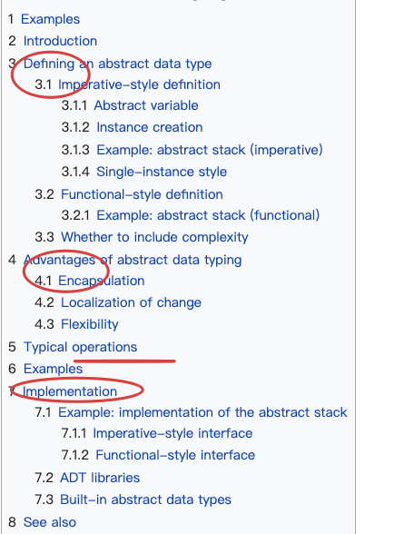

## 数据结构

### 知识图谱

### 定义

定义——a **data structure** is a data organization, management, and storage format that enables [efficient](https://en.wikipedia.org/wiki/Algorithmic_efficiency) access and modification

(数据**组织**、管理、**存储**)'s结构

Data type关系——

重要性——(尼古拉斯·沃斯) **算法+数据结构=程序**

## ADT

https://en.wikipedia.org/wiki/Abstract_data_type

### 定义—