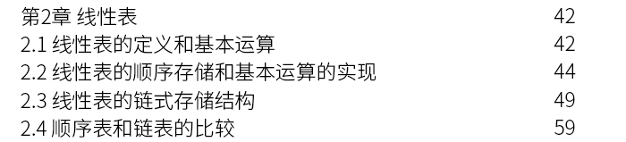
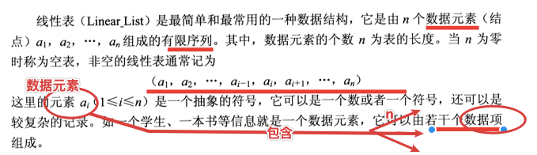
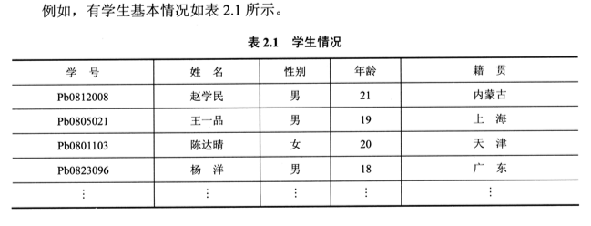
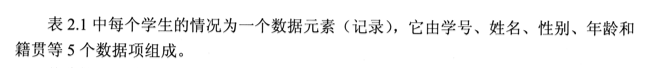
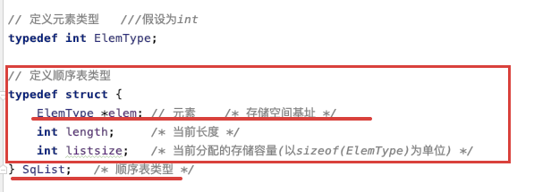
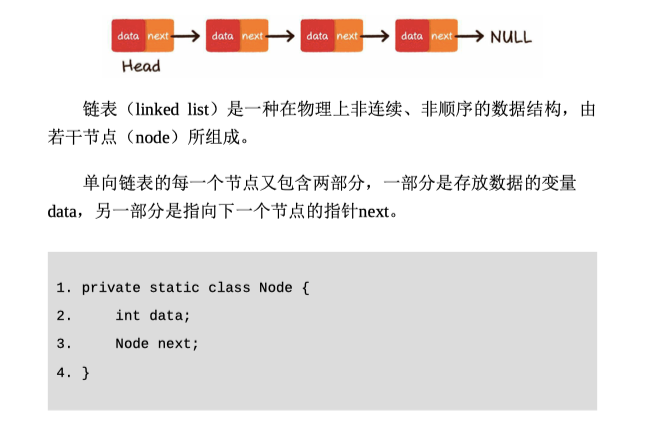
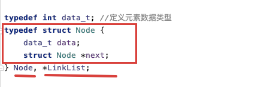

## 0概述—线性表linear list/linked list


### //目录




### 线性表—类型


### 操作

1) 对顺序表进行初始化、查找、插入和除等基本操作 

2) 对单链表进行初始化、查找、插入和删除等基本操作 


## //Step0—tag—all——0线性表


### 线性表

SUM:

Linear_List线性表What—逻辑定义(base数学)、**基本运算**(base**存储结构**)

​	运算——增删改查、init、len、get	

​		顺序存储(**顺序表**)——定义、**组成**(size,offset)

​		基本运算/数据结构——**CRUD**


Notes:


#### 定义

是否有序？








### 顺序表

顺序表——线性性表的数据元素按其逻辑次序依次存入一组地址连续的存储单元中


## 1顺序表sequence list

[https://zh.wikipedia.org/wiki/%E9%A1%BA%E5%BA%8F%E8%A1%A8](https://zh.wikipedia.org/wiki/顺序表)

https://blog.csdn.net/howard2005/article/details/79263674




```C++
/* 线性表的顺序存储实现 */
#include<stdio.h>
#include<stdlib.h>
#include<string.h>

// 定义符号常量
#define LIST_INIT_SIZE 50 /* 线性表存储空间的初始分配量 */
#define LISTINCREMENT 10    /* 线性表存储空间的分配增量 */
#define OK 1
#define ERROR 0
#define OVERFLOW -2

// 定义元素类型   ///假设为int
typedef int ElemType;

// 定义顺序表类型
typedef struct {
    ElemType *elem; // 元素    /* 存储空间基址 */
    int length;     /* 当前长度 */
    int listsize;   /* 当前分配的存储容量(以sizeof(ElemType)为单位) */
} SqList;   /* 顺序表类型 */

// 初始化——构造空顺序表  //malloc
int InitList(SqList *L) {
    // 获取顺序表基址
    L->elem = (ElemType *) malloc(sizeof(ElemType));
    // 存储空间分配失败
    if (!L->elem) return ERROR;
    // 空表长度为0
    L->length = 0;
    // 分配给空表的存储容量
    L->listsize = LIST_INIT_SIZE;
    return OK;
}

// 查找——获取顺序表第i个元素
ElemType GetListElem(SqList *L, int i) {
    // 检查i的合法性
    if (i < 1 || i > L->length)
        return ERROR;
    else
        return L->elem[i - 1];
}


// 插入——在顺序表第i个位置插入元素    //recalloc
int InsertListElem(SqList *L, int i, ElemType e) {
    int k;
    // 位置合法性判断
    if (i < 1 || i > L->length + 1) return ERROR;
    // 顺序表空间满，按增量重新分配
    if (L->length >= L->listsize) {
        // 增加LISTINCREMENT个元素元素，获取顺序表新基址
        L->elem = (ElemType *) realloc(L->elem, (L->listsize + LISTINCREMENT) * sizeof(ElemType));
        if (!L->elem) return ERROR;
        // 按增量修改存储空间大小
        L->listsize += LISTINCREMENT;
    }

    // 元素后移1位
    for (k = L->length - 1; k >= i - 1; k--)
        L->elem[k + 1] = L->elem[k];
    // 插入元素
    L->elem[i - 1] = e;
    // 顺序表长度加1
    L->length++;
    // 插入成功
    return OK;
}

// 删除——删除顺序表第i个元素
int DeleteListElem(SqList *L, int i) {
    int k;
    // 判断位置合法性
    if (i < 1 || i > L->length) return ERROR;
    // 元素前移1位
    for (k = i; k <= L->length; k++)
        L->elem[k - 1] = L->elem[k];
    // 顺序表长度减1
    L->length--;
    // 删除成功
    return OK;
}

//——————————————————————————————————————————————————————
//未考察项目

// 定位——定位目标元素在顺序表中位置
int LocateListElem(SqList *L, ElemType e) {
    int i = 1;
    // 定义指针p，指向第一个元素
    ElemType *p = L->elem;
    // 目标元素依次与顺序表元素比较
    while (*p != e && i <= L->length) {
        i++;
        p++;
    }
    if (i > L->length)
        return 0;
    else
        return i;
}

// 修改——修改顺序表第i个元素
int UpdateListElem(SqList *L, int i, ElemType e) {
    // 判断位置合法性
    if (i < 1 || i > L->length) return ERROR;
    // 修改第i个元素值
    L->elem[i - 1] = e;
    // 修改成功
    return OK;
}

// 输出顺序表全部元素
void PrintList(SqList *L) {
    int i;
    if (L->length == 0)
        printf("\n顺序表为空！\n\n");
    else
        for (i = 1; i <= L->length; i++)
            printf("%d ", L->elem[i - 1]);
    printf("\n");
}

int main() {
    int i, choice, position;
    ElemType data, elem;
    int isRunning = 1;

    //init
    SqList *pl = (SqList *) malloc(sizeof(SqList));

    while (isRunning) {
        printf("======顺序表操作演示=======\n");
        printf("1. 创建一个空的顺序表\n");
        printf("2. 输出顺序表的全部数据\n");
        printf("3. 查询顺序表某个位置的数据\n");
        printf("4. 查询数据在顺序表中的位置\n");
        printf("5. 向顺序表指定位置插入数据\n");
        printf("6. 删除顺序表指定位置的数据\n");
        printf("7. 更新顺序表指定位置的数据\n");
        printf("8. 退出顺序表操作演示程序\n");
        printf("===========================\n");
        printf("\n输入1-8，选择所需功能号：");
        scanf("%d", &choice);
        printf("\n您选择的功能号为：%d\n", choice);

        switch (choice) {
            //初始化
            case 1:
                if (InitList(pl))
                    printf("\n顺序表创建成功！\n\n");
                else
                    printf("\n顺序表创建失败！\n\n");
                system("pause");
                break;
                //查找
            case 3:
                printf("i=");
                scanf("%d", &i);
                elem = GetListElem(pl, i);
                if (elem)
                    printf("L[%d]=%d\n\n", i, elem);
                else
                    printf("输入的位置不合法！");
                system("pause");
                break;
            case 4:
                printf("data=");
                scanf("%d", &data);
                position = LocateListElem(pl, data);
                if (position)
                    printf("%d is at [%d] of the list.\n\n", data, position);
                else
                    printf("%d is not in the list.\n\n", data);
                system("pause");
                break;
                //插入
            case 5:
                printf("i,data=");
                scanf("%d,%d", &i, &data);
                if (InsertListElem(pl, i, data))
                    printf("\n数据插入成功！\n\n");
                else
                    printf("\n数据插入失败！\n\n");
                system("pause");
                break;
                //删除
            case 6:
                printf("i=");
                scanf("%d", &i);
                if (DeleteListElem(pl, i))
                    printf("\n数据删除成功！\n\n");
                else
                    printf("\n数据删除失败！\n\n");
                system("pause");
                break;


                //---------------------------------------------------------
                //未要求功能

                //输出全部
            case 2:
                PrintList(pl);
                system("pause");
                break;


            case 7:
                printf("i,data=");
                scanf("%d,%d", &i, &data);
                if (UpdateListElem(pl, i, data))
                    printf("\n数据更新成功！\n\n");
                else
                    printf("\n数据更新失败！\n\n");
                system("pause");
                break;
            case 8:
                isRunning = 0;
                break;
        }
    }

    printf("\n谢谢使用本程序~");

    return 0;
}
```


## 2单链表linkedlist


### linked list

[https://zh.wikipedia.org/wiki/%E5%8D%95%E5%90%91%E9%93%BE%E8%A1%A8](https://zh.wikipedia.org/wiki/单向链表)







```C++
#define Status int
#define ElemType int // 以整型為例

#define OVERFLOW -1
#define ERROR 0
#define OK 1

// 線性表的單鏈表存儲结構
typedef struct LNode {
    ElemType data;
    struct LNode *next;
} LNode, *LinkList;

// 1init
void InitList(LinkList *L) {
    // 操作结果：構造一个空的線性表L
    *L = (LinkList)malloc(sizeof(struct LNode));
    // 產生头结點，並使L指向此头结點
    if (!*L) // 存儲分配失敗
        exit(OVERFLOW);
    (*L)->next = NULL; // 指针域為空
}

// 2get
Status GetElem(LinkList L, int i, ElemType *e) {
    // L为带头结点的单链表的头指针。当第i个元素存在时，其值赋给e并返回OK，否则返回ERROR
    int j = 1; // j为计数器
    LinkList p = L->next; // p指向第一个结点
    while (p && j < i) { // 顺指针向后查找，直到p指向第i个元素或p为空
        p = p->next;
        j++;
    }
    if (!p || j > i) // 第i个元素不存在
        return ERROR;
    *e = p->data; // 取第i个元素
    return OK;
}

int LocateElem(LinkList L, ElemType e, Status(*compare)(ElemType, ElemType)) {
    // 初始条件: 线性表L已存在，compare()是数据元素判定函数(满足为1，否则为0)
    // 操作结果: 返回L中第1个与e满足关系compare()的数据元素的位序
    // 若这样的数据元素不存在，则返回值为0
    int i = 0;
    LinkList p = L->next;
    while (p) {
        i++;
        if (compare(p->data, e)) // 找到这样的数据元素
            return i;
        p = p->next;
    }
    return 0;
}

// 3insert
Status ListInsert(LinkList L, int i, ElemType e) {
    // 算法2.9。不改变L
    // 在带头结点的单链线性表L中第i个位置之前插入元素e
    int j = 0;
    LinkList p = L, s;
    while (p && j < i - 1) { // 寻找第i-1个结点
        p = p->next;
        j++;
    }
    if (!p || j > i - 1) // i小于1或者大于表长
        return ERROR;
    s = (LinkList)malloc(sizeof(struct LNode)); // 生成新结点
    s->data = e; // 插入L中
    s->next = p->next;
    p->next = s;
    return OK;
}

// 4delete
Status ListDelete(LinkList L, int i, ElemType *e) {
    // 算法2.10。不改变L
    // 在带头结点的单链线性表L中，删除第i个元素，并由e返回其值
    int j = 0;
    LinkList p = L, q;
    while (p->next && j < i - 1) { // 寻找第i个结点，并令p指向其前驱结点
        p = p->next;
        j++;
    }
    if (!p->next || j > i - 1) // 删除位置不合理
        return ERROR;
    q = p->next; // 删除并释放结点
    p->next = q->next;
    *e = q->data;
    free(q);
    return OK;
}
```


### static linked list


