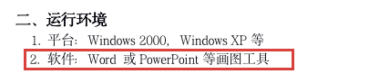
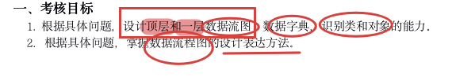
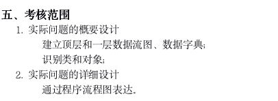
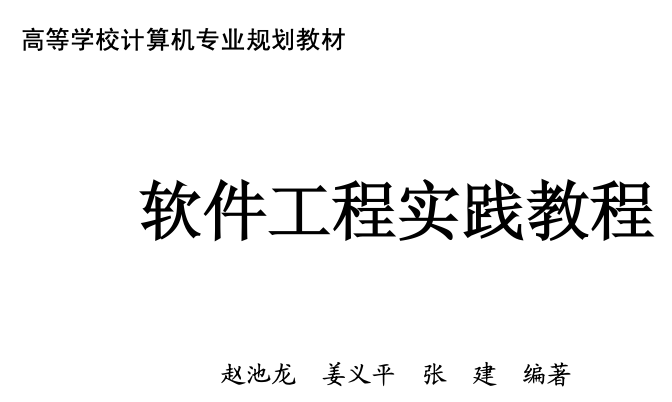
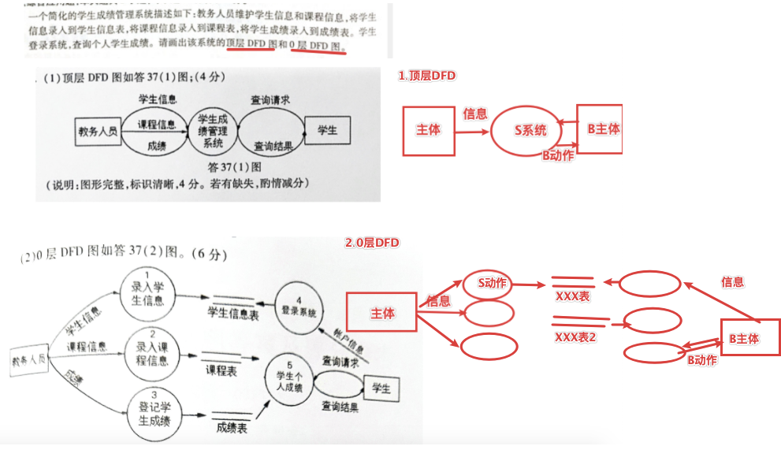
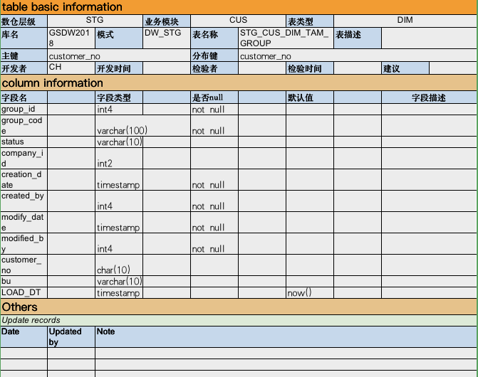
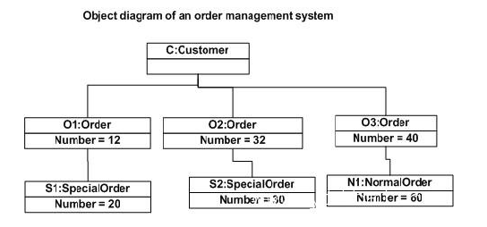
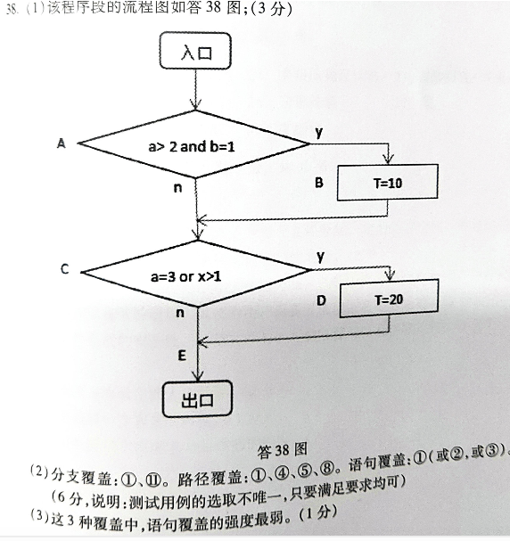
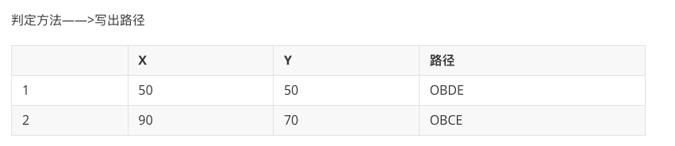

## 0概述

## 1课本要求

无。。。

## 2官网考试大纲

### //*环境

说白了就是用ppt画图呗

### //goal

### *推荐资料

软件工程实践教程  赵池龙

### 数据流图

#### 1数据流图

     ★★★ 设计原则：
    
           1、数据守恒原则：对于任何一个加工来说，其所有输出数据流必须能从该加工的数据流中直接获得
    
           2、守恒加工原则：对于同一个加工来说，输入与输出的名字必须不相同，即使他们的组成成分相同
    
           3、父图与子图平衡：子图输入输出数据流必须与父图相应加工的输入输出的数据流必须一致
    
           4、外部实体与外部实体之间、数据存储与数据存储之间、数据存储与外部实体之间不存在数据流
    
           5、自外向内，自顶向下，逐层细化，完善求精
    
           6、每个加工，必须有输入数据流和输出数据流

————————————————
版权声明：本文为CSDN博主「杨晓敏M」的原创文章，遵循 CC 4.0 BY-SA 版权协议，转载请附上原文出处链接及本声明。
原文链接：https://blog.csdn.net/u010924897/article/details/41148931

#### 2数据字典

#### 3识别类和对象

类图

对象图

### 数据流程图

