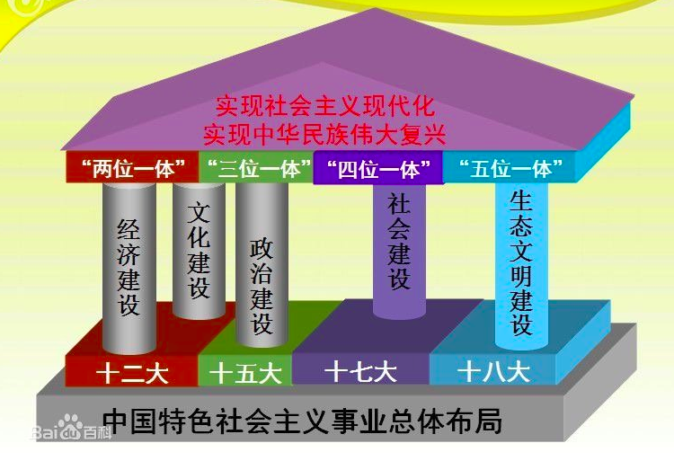

## 1. 反对外国侵略斗争——资本-帝国主义对中国的侵略

### [表格]1840- 清政府签订条约

| 时间 | 条约                       | 影响                       |
| ---- | -------------------------- | -------------------------- |
| **1842** | **英国《南京条约》(江宁条约)** | 割让香港岛——中国沦为半殖民地半封建社会 |
| 1843 | 英国《虎门条约》 | 南京条约的补充                         |
| **1844** | **法国《黄埔条约》** |                                        |
| 1845 | 美国《望厦条约》(中美五口贸易章程) |                                        |
|1858|英、美、法、俄《天津条约》 俄国《瑷珲条约》——割让黑龙江|割让黑龙江|
| **1860** | **//(英法侵占圆明园) 英国《北京条约》** | 割让九龙岛，归属香港岛境内 |
| **1895** | **日本《马关条约》** | 割让辽东半岛、香港全岛 |
| **1901** | **八国联军《辛丑条约》** | 侵占北京——彻底陷入半殖民地半封建社会 |

### 中国封建社会特点

经济上，封建土地所有制占主导地位，地主阶级和民主阶级矛盾尖锐

政治上，实行高度中央集权的封建君主制度

文化上，儒家思想为核心

社会结构上，形成族权和政权相结合的封建宗法等级制度

地主阶级矛盾和农民阶级矛盾是中国封建社会主要矛盾。

### 人民群众的反侵略斗争

1.1841年广州郊区三元里人民与英国侵略者展开激烈战斗，这是中国近代史上中国人民第一次大规模的反侵略武装斗争

2.太平天国农民战争后期，太平军多次重创外国侵略者。

3.台湾人民也曾多次反抗侵略者。

4.1900年，义和团和部分清军与八国联军进行了殊死搏斗

### 反侵略斗争失败原因

社会制度的腐败(根本原因)，清政府为维护自己的统治，经常压制人民反抗斗争，力求避战求和，为此不惜割地赔款。

经济技术的落后

---

1. 社会制度的腐败
2. 经济技术的落后
3. 前者为主要原因

### 工人阶级的特点和优点

1. 深受帝国主义、封建势力压迫、剥削，革命力量最强
2. 人数相对集中 ，集中在大城市和大企业，便于形成革命力量
3. 多由农民转化而来 ，便于形成工农同盟

### 资产阶级缺点

1. 不敢否定封建主义
2. 对帝国抱有幻想
3. 脱离人民群众

### 半殖民地半封建社会 特点

1. 资本——帝国主义逐步操纵了中国财政和经济命脉，逐步控制了中国政治，成为支配中国的力量
2. 中国封建势力同帝国主义相勾结，成为压迫中国人民的社会基础和经济支柱
3. 封建剥削制度扔大量保留，是中国走向现代化的严重障碍
4. 中国资本主义有所发展，在政治、文化生活起了做了，但没有成为中国社会主体
5. 中国各地经济、政治、文化发展不平衡，长期不统一
6. 中国人民极度贫穷

### 中国近代主要矛盾||矛盾关系||历史任务

**主要矛盾：**
	帝国主义与中华民族矛盾、封建主义与人民大众矛盾; **其中帝国主义矛盾为主要矛盾**
**矛盾关系：**
	帝国主义侵略使中国各阶级团结，阶级矛盾降到次要，民族矛盾上升到主要
	帝国主义与中国封建政权勾结，镇压革命，阶级矛盾为主要矛盾
	国内战争威胁帝国主义以及封建地主阶级利益，帝国主义和国内封建主义站到统一战线上
**影响：**
	这两对矛盾相互交织，贯穿了半殖民地半封建社会始终，对中国社会发展变化起决定性作用
**历史任务：**
	民族独立和人民解放
	实现国家繁荣和人民共同富裕

### 为什么说鸦片战争是中国近代史的起点

- 中国进入半殖民地半封建社会
- 外国资本主义入侵，中国出现资本主义生产关系

1840年第一次鸦片战争是中国近代史的开端。英国与其他西方列强强迫清政府与之签订了一系列不平等条约，迫使清政府割地、赔款，摄取一系列经济、政治和文化特权，中国主权独立受到侵犯，领土完整遭到破坏。另一方面外国资本主义的入侵，使中国出现资本主义生产关系，不再是传统意义上的封建社会了。

## 2. 对国家出路的早期探索

### [表格]农民运动总结

| 时间                   | 运动               | 评价               |
| ---------------------- | ------------------ | ------------------ |
| 1841(鸦片战争期间)     | 三元里人民抗英斗争 | 最早的农民运动     |
| 1851                   | 太平天国运动       | 农民战争的最高峰   |
| 1898(1900八国联军侵华) | 义和团运动         | ——迫使八国联军远征 |

### 《天朝田亩制度》土地分配方案 意义

《天朝田亩制度》确立了平均分配土地的方案

方案：

田地分为9等，好坏搭配，按人口平均分配

16岁以上分整份，16岁以下分一半

意义：

是一个以解决土地问题为中心的比较完整的社会改革方案，代表了农民平均分配土地的强烈愿望；

反映了农民反对封建土地所有制的普遍需求

### 《天朝田亩制度》性质与内容

1.颁布于1853年，是最能体现太平天国社会理想和这次农民战争的纲领性文件。

2.确立了平均分配土地的方案，根据“**凡天下田，天下人同耕**”的原则进行分配。

3.规定了农副业产品的生产与分配，都以农村政权的基层组织“两”来实行管理，25户为一两。

4.《天朝田亩制度》是一个以解决土地问题为中心的比较完整的社会改革方案。

5.这个纲领没有超出农民小生产者的狭隘眼界。

### 2 1860-1869 洋务运动主要内容

1. 兴办近代工业。洋务派最早创建军工业，先后创办24个兵工厂。后开始举办民用企业。经营轮船、电报、采矿冶炼和纺织工业四个部门。
2. 建立新式海陆军。其中北洋水师是清政府海军主力。
3. 创办新式学堂，派遣留学生。培养懂西方先进技术的专业人才，创建新式学堂30多所，先后派遣120名幼童赴美学习。

纲领：师夷长技、自强求富
	魏源   师夷长技以制夷

失败标志：
	北洋海军全军覆没

### 洋务派兴办的影响较大的军用工业

洋务派最早兴办的是军用工业。30余年中先后办过24个规模不同的兵工厂。

其中有沪宁闽津四局和张之洞在汉阳办的湖北枪炮厂。

### 1860-1869 洋务运动历史作用

1. 客观上促进了中国早期工业和资本主义发展
2. 成为中国教育开端
3. 传播了新知识，打开了人们的眼界
4. 引起了社会风气和价值观念的变化

### 1860-1869 洋务运动失败的原因

1. 洋务运动具有封建性，洋务运动指导思想是"中学为体，西学为用"，目的是维护封建统治阶级
2. 对西方列强具有依赖性，在技术、管理方面极度依赖洋人
3. 洋务企业管理具有腐朽性，官办、官督商办具有严重衙门气息

###1898 维新派与守旧派论战的主要内容与意义

维新派与守旧派主要围绕以下三个问题展开：

1. 要不要**变法**
2. 要不要**兴民权**，设议院，实行**君主立宪**
3. 要不要**废八股文**，改科举和兴学堂

维新派与守旧派论战实质，是**资产阶级思想与封建主义思想**在中国第一次正面交锋。为维新变法运动做了思想舆论准备。

### 1911年保路风潮发动的原因

1911年5月，清政府皇族为筹集借款，宣布"**铁路干线归国有**"，将铁**路路权卖给帝国主义**。

随后，**各省立宪文明保路**，遭清政府暴力镇压。

广大群众在**中国同盟会成员**参与下，掀起了**全四川的武装**暴动。

## 3. 辛亥革命

### 辛亥革命爆发的历史条件

1. **民族危机加深**，**社会矛盾激化**。一方面。外国列强对中国的侵略日益扩大，民族危机加深。另一方面，社会矛盾激化，民变四起。
2. **清末"新政"及其破产**。**1901年4月清政府实行"新政"**。1906年宣布"预备仿行宪政"1908年颁布《钦定宪法大纲》，学习日本君主立宪，但预备立宪没有挽救清王朝，反而激化了社会矛盾，加重了危机。
3. **资产阶级革命派的阶级基础**和**骨干力量**。中国**资产阶级民主革命**是由以孙中山为首的**资产阶级革命派首先发动**的，其阶级基础是**中国民族资产阶级**。资产阶级革命派骨干力量是一批**资产阶级和小资产阶级**知识份子。

### 辛亥革命胜利的历史意义

1. 是一次比较完整意义上的**资产阶级民主革命**
2. 推翻了清王朝在中国的统治，沉重打击了中外反动势力在中国的统治
3. 结束了统治中国两千多年的封建君主专制制度，建立了中国历史上第一个资产阶级共和政府
4. 传播了民主共和的理念，推动了中华民族的思想解放
5. 推动了近代中国的社会变革，推动了民族资产阶级发展，促进了社会风气的改变和人民的精神解放
6. 打击了帝国主义在华示例，推动了亚洲各国民族解放运动的高涨

### 1911 革命派对中国民主革命认识的阶级和历史局限性

1. 革命派**未能认清帝国主义的本质**，**不敢旗帜鲜明的提出反帝口号**，反而希望争取帝国主义的支持
2. 革命派停留在对民主制度形式的理解上，**缺乏对民主建政的深入认识**
3. 革命派**未能把土地制度改革和反对封建主义联系起来**，从无无法真正解决农民土地问题。这些局限不可避免地会影响辛亥革命的进程和结局。

## 4. 开天辟地的大事变——新文化、五四运动||马克思主义与共产党

### 五四运动爆发的历史条件

1. 俄国十月革命开辟了无产阶级社会主义革命时代
2. 新的社会力量的增长。一战期间，中国民族资本主义得到了短暂又迅速地发展。中国工人阶级和民族资产阶级迅速壮大。中国工人阶级成为重要的社会力量
3. 新文化运动之后，提供了群众基础和骨干力量

### 五四运动特点

1. 中国近代史上由知识份子主导的一次彻底的**反帝反封建运动**
2. 广泛动员和组织了群众；青年学生起了先锋作用，工人阶级作为独立政治力量登上舞台，运动后期发挥了主力军作用
3. 促进了马克思主义在中国的广泛传播
4. 中国新民主主义的开端，五四运动后，无产阶级逐渐替代资产阶级成为中国民族革命领导者

### 1922 中共二大规定党的最高纲领和最低纲领的内容及其意义

党的**最高纲领**是**实现社会主义**、**共产主义**。

党的**最低纲领**是：

在党当前阶段——民主革命阶段纲领
消除内乱，打到军阀，建设国内和平；
推翻国际帝国主义压迫，达到中华民族完全统一；
统一中国为真正的民主共和国

意义：

中共二大在中国近代历史上第一次明确提出了**反帝反封建**的**民主革命纲领**，解决了分清敌友这个革命首要问题。历史证明，只有用马克思主义武装起来的中国共产党才能为中国革命指明方向。

### 3 1924年 国民党一大 新三民主义的新诠释

内容：

民族主义——突出了反对帝国的内容，强调中华民族的独立，主张国内各民族团结
民权主义——强调民权为一般平民所共有
民生主义——在”平均地权“基础上增加了”节制资本“的原则 ，并提出改善工农生活状况

### [表格]工人运动总结

| 时间           | 事件                                     | 评价                 |
| -------------- | ---------------------------------------- | -------------------- |
| 1919(五四运动) | 上海工人罢工(北京→上海)                  | 工人阶级登上政治舞台 |
| 1921.8         | 上海成立劳动组合书记部                   | 工人运动高潮         |
| 1922.1         | 香港海员罢工                             | 工人运动高潮起点     |
| 1922.9         | 毛泽东、刘少奇、李立三 安源铁路罢工 |                      |
| 1923.2         | 京汉铁路罢工——二七惨案                   | 工人运动转入低潮     |

### 中国革命统一战线中的两个联盟及其相互关系

<https://baike.baidu.com/item/%E7%BB%9F%E4%B8%80%E6%88%98%E7%BA%BF#7_1>

概述——革命包括大革命、土地革命、抗战、解放战争、社会主义

统一战线存在两个联盟：

1. 劳动者联盟，主要是**工人**、**农民**和**城市小资产阶级**的联盟，这是基本的、主要的
2. **劳动者与非劳动者的联盟**，主要是**劳动者与民族资产阶级的联盟**，有时还包括与一部分大资产阶级的暂时联盟，这是辅助的，同时又是重要的

必须坚决依靠第一个联盟，争取建立和扩大第二个联盟。巩固和扩大统一战线的关键，是**坚持工人阶级及其政党的领导权**，率领**同盟者**向共同敌人作坚决的斗争并取得胜利；对领导者**给与物质福利**，至少不损害其利益；同时又对领导者给与政治教育；对同工人阶级争夺领导权的**资产阶级**采取**又联合、又斗争**的政策。

## 5. 中国革命的新道路——土地革命

### 新民主主义革命vs国民革命vs土地革命

新民主主义——1919-1949——

国民革命——1924-1927——推翻北洋军阀统治

土地革命——1927-1937

### [表格]国共合作的标志

| 时间                                                         | 事件                           | 评价                               |
| ------------------------------------------------------------ | ------------------------------ | ---------------------------------- |
| 1924——1927 (1923中三大——共和合作方针) (国民革命)   | 国民党一大 国共第一次合作 | 标志着**革命**统一战线的正式形成   |
| 1937——1945 (1935——瓦窑堡——确定抗议民族统一战线政策) (1936杨虎城西安事变) (1937卢沟桥事变) | 国共第二次合作                 | 联合对外 **抗日民族**统一战线 |

### 1927.8.7 4 八七会议的内容和意义

内容
	清算了大革命后期陈独秀右倾投降主义错误，确定了**土地革命**和**武装斗争**总方针
	选出以**霍秋白**为书记的中央临时政治局
	毛泽东提出"**政权是由枪杆子取得的**"，阐述了农民问题和武装斗争对革命的重要性
意义
	给处在思想混乱、组织散乱的中国共产党指明了出路
	是由**大革命失败**到**土地革命战争**兴起的历史转折点

### 1927.9 (秋收起义)三湾改编内容及意义

主要内容：将原有的一个师**缩编为一个团**；在部队中建立共产党各级组织，将**党的支部建在连上**；成立各级士兵委员会，部队内部**实行民主管理**。

意义："三湾改编"成为建设**共产党领导的新型人民军队的重要开端**。确定了**党对军队的绝对领导**。

### 中国红色政权为什么能够存在？

1928 毛泽东 《中国红色政权为什么能够存在？》和《井冈山斗争》阐述了红色政权存在的**原因**和**条件**。

1930 毛泽东《星星之火，可以燎原》——农村包围城市，武装夺取政权的理论。

1930 毛泽东 《反对本本主义》——坚持辩证唯物主义的思想路线，坚持理论和实践相结合。

### 简述红色政权存在和发展原因和条件

1. 中国是一个几个**帝国主义国家间接统治**的**政治经济发展极端不平衡**的**半殖民地半封建**国家。这事红色政权能够存在和发展的根本原因。

客观条件：

1. **国民革命**的影响。
2. 全国革命形势的继续向前发展。

主观条件：

1. 相当力量的**正式红军**的存在。
2. **共产党组织**的坚强有力和各项政策的正确贯彻执行。

### 2 左倾错误带来的严重后果

”左“的教条错误是中国共产党和中国革命陷入困境。

1. 共产党在国民党统治区工作一片混乱，党的组织遭到严重破坏。
2. 对坚持正确路线的毛泽东以及中央革命根据地实施打击。
3. 第五次反围剿失败，红军主力被迫战略转移

### 3 遵义会议意义

意义

​	确立了以毛泽东为代表的新的中央领导
​	解决了决定意义的军事和组织问题
​	在极其危机的情况下，拯救了中国共产党、工农红军和中国革命
​	是共产上历史上**生死攸关的转折点**——**标志着中国共产党在政治上走向成熟**

### 3 长征的伟大意义

1. 粉碎国民党的围剿，**是中国革命转危为安的关键**

2. 将革命本营放在了西北，**为抗日救亡新高潮准备了条件**，长征结束后建立了广泛的抗日民族统一战线

3. **保存并锤炼了革命骨干力量**

4. **散播了革命火种**

5. **铸造了伟大的长征精神**。长征精神，就是把全国人民和中华民族的根本利益看得高于一切， 坚定革命的理想和信念，坚信正义事业必然胜利的精神； 就是为了救国救民，不怕任何艰难险阻，不惜付出一切牺牲的精神；就是坚持独立自主、实事求是，一切从实际出发的精神；就是顾全大局、严守纪律、紧 密团结的精神；就是紧紧依靠人民群众， 同人民群众生死相依、患难与共、艰苦奋斗的精神。

### 中共工农红军铸就的长征精神是什么

把**全国人民**和**中华民族**的根本利益看得高于一切，坚定革命的理想和信念，坚信正义事业必然胜利的精神；为了救国救民，**不怕任何艰难险阻**，不惜付出一切牺牲的精神；坚持独立自主、**实事求是**，一切从实际出发的精神；**顾全大局**、严守纪律、紧密团结的精神；**仅仅依靠人民群众**，同人民群众生死相依、患难与共，艰苦奋斗的精神。

## 6. 中华民族的抗日战争

### [表格]志愿军、共产党人物

| 人物   | 职位                                                     |
| ------ | -------------------------------------------------------- |
| 毛泽东 | 中央**执行委员会主席**——1931中华苏维埃第一次全国代表大会 |
| 董必武 | 解放区代表——1946联合国制宪会议                           |
| 彭德怀 | 志愿军**司令员兼政治委员**                               |
| 霍秋白 | 中央临时政治局**书记**                                   |
| 左权 | 八路军**副参谋长**——狼牙山五壮士                 |

### 中国民族资产阶级特点

1. 一方面，受到外国资本主义和本国封建主义压迫，**一定条件下可以参加反帝反封建斗争**——好
2. 另一方面，由于力量薄弱，又与外国资本主义和封建主义存在关联，在斗争中**缺乏彻底革命性**——坏

### 4 1935.12 瓦窑堡会议内容和意义

概述——1931.9.18九一八之后，1934工农红军第五次反围剿失败，长征开始之后——批判左的错误

1935年12月，中共中央在瓦窑堡召开了政治局扩大会议。

提出了在抗日条件下**与民族资产阶级重建统一战线**的新政策，**批评了**党内长期存在的**左倾错误**。

意义——瓦窑堡会议为迎接全国抗日高潮做了理论和政治上的准备。

### 2 1937 中国抗日民族统一战线 策略总方针 以及 斗争策略

为了坚持、扩大和巩固抗日民族统一战线。

**策略总方针**——**发展进步势力**，**争取中间势力**，**孤立顽固势力**

1. 进步势力是指**工人**、**农民**、**城市小资**阶级。——是统一战线的基础，抗日战争主要依靠力量。——为发展进步势力，要冲破国民党限制和束缚，放手发动人民群众，扩大八路军武装，简历革命根据地。——整个策略的中心环节
2. 中间势力是指**民族资产阶级**、**开明绅士**和**地方实力派**。——争取中间势力条件：共产党有充足力量；尊重他们权益；同顽固派做坚决斗争。——是十分重要的任务
3. 顽固势力是**大地主大资产阶级抗日派** 即**以蒋介石为代表的国民党亲美派**。——贯彻**又联合又斗争**的政策
4. 共产党同国民党顽固派斗争时，紧紧抓住中国社会主要矛盾即中日民族矛盾。把**统一战线内部矛盾限制在一定范围**内，始终**坚持和发展抗日民族统一战线**。

### 1937 巩固和扩大新民主主义革命统一战线的关键

1. 坚持工人阶级及政党领导权
2. 对被领导者给与物质物理，不损害其利益
3. 对资产阶级采取又联合、又斗争的政策

### 1937 洛川会议共产党实行全面抗战的要求

洛川会议，共产党提出 **抗日救亡十大纲领** 。抗战关键在于**全国民众**的抗战。

为此提出以下要求：

1. 实行**全国军事总动员**、**全国人民总动员**
2. **改革政治机构**，**给人民**充分抗日**民主权利**，改善工农生活。

### 1940 《新民主主义论》毛泽东，简述新民主主义革命纲领

政治上——**推翻帝国主义和封建主义的压迫**，建立一个以无产阶级为领导，以工农联盟为基础的各革命阶级联合专政的**新民主主义共和国**。

经济上——**没收操纵国计民生的大银行**、大工业、大商业**归新民主主义国家所有**，**建立国营经济**；**没收地主阶级的土地**归农民所有，并引导个体农民**发展合作经济**；允许民族资本主义经济的发展和富农经济的存在。

文化上——**废除封建买办文化**，发展无产阶级领导的人民大众的**反帝反封建的中华民族的新文化**，即民族的科学的大众的文化。

### 抗战中进步势力、中间势力、顽固势力分别指什么？

进步势力主要指：工人、农民、城市小资阶级

中间势力：民族资产阶级、地方实力派

顽固势力：大地主大资产阶级抗日拍，以蒋介石为代表的国民党亲英美派

### 抗战胜利的原因

1. 以爱国主义为核心的伟大民族精神是中国人民抗战胜利的**决定因素**
2. 中国共产定的中流砥柱作用是中国人民抗战的**关键**
3. 全民族抗战时中国人民抗日战争的**重要法宝**
4. 世界爱好和平和争议的国家和人民、国际组织以及反法西斯力量的支持是中国人民取得抗战的**国际条件**

### 3 抗战胜利的基本经验

1.全国人民的大团结，是战胜一切艰难的力量远源泉
2.以爱国主义为核心的伟大民族精神
是中国人民团结奋进的精神动力
3.中国人民热爱和平、反对侵略

### 新民主主义革命胜利的基本经验

1. 中国国产党领导作用。
2. 人民群众支持。
3. 国际无产阶级支持。
4. 爱国主义为核心的伟大民族精神。

## 7.为创建新中国而奋斗

### 中国革命胜利的基本经验

1. 建立广泛的统一战线
2. 坚持革命武装斗争
3. 加强共产党自身建设

### 1947 二二八起义的过程及意义

**1947年2月28日**，台湾省台北市人民为反抗国民党党军的暴政、抗议反动军警屠杀市民，矩形大规模示威游行，又遭国民党军警镇压。2月底3月初，台湾各地汉族、高山族人民纷起响应，夺取武器，举行起义，并攻占台中、嘉义等城市。国民党当局从大陆调来大批军警 、特务，对起义群众进行镇压。3月14日，起义失败。二二八起义虽然失败了，但**他有利地显示了台湾人民反对国民党的黑暗统治**，**争取人民民主的革命精神**，它**是全国人民民主运动的重要组成部分**。

### 1949 论述毛泽东在《论人民民主专政》一文中关于建立人民民主专政的新中国的主张

1949年6月30日，毛泽东发表《论人民民主专政》一文，系统地阐明了中国共产党关于建立人民民主专政的新中国的主张：

1. 人民民主专政的基础是**工人阶级**、**农民阶级**和**城市小资产阶级**的联盟。
2. 在上述联盟中，主要是**工人阶级**和**农民阶级**的联盟，因为这两个阶级占了中国人口的80%~90%。推翻帝国主义和国民党反动派，主要是这两个阶级的力量。由新民主义到社会主义，主要依靠这两个阶级的联盟。
3. 为建立新中国，必须利用一切与国计民生有力而不是有害的城市资本主义因素，**团结民族资产阶级**。但是民族资产阶级不能充当革命的领导者，也不应当在国家政权中占主要地位。毛泽东指出：总结我们的经验，集中到一点，就是**工人阶级领导**的**以工农联盟为基础**的**人民民主专政**。这个专政必须和国际革命力量团结一致。

### 1949.9.29 《中国人民政治协商会议共同纲领》内容及其作用

内容：

1. 关于**新中国的国体和整体**。《中华人民政治协商会议共同纲领》规定"中华人民共和国为**新民主主义**即**人民民主主义**的国家，实行**工人阶级领导的**、**以工农联盟为基础的**、团结各民族阶级和国内各民族的**人民民主专政**"。"中华人民共和国的国家政权属于人民。人民行使国家政权的机关为各级人民代表大会和各级人民政府"。"各级政权机关一律实行民主集中制"。
2. 关于新中国的基本**民族政策**。《中华人民政治协商会议共同纲领》规定"中华人民共和国境内**各民族一律平等**"。"各少数民族聚集的地区，应实行民族区域自治"。"各少数民族均有发展其语言、保持或改革其风俗习惯及宗教信仰的自由。人民政府应帮助各少数民族的人民你打中发展期政治、经济、文化、教育的建设事业"，"使中华人民共和国成为各民族友爱合作的大家庭"。
3. 关于新中国的**经济工作**方针，规定"以**公私兼顾**、劳资两利、城乡互助、内外交流的政策，达到发展生产、繁荣经济之目的"国家应调剂国营经济，、个体经济、私人资本主义经济等。"使各种社会经济成分在国营经济领导之下，分工合作，各得其所，以促进整个社会经济的发展"
4. 关于新中国的**外交工作**原则。规定"**保障本国独立**、**自由和领土主权的完整**，维护国际的持久和平和各国人民间的友好合作，反对帝国主义略政的侵策和战争政策"

作用：在当时情况下《中华人民政治协商会议共同纲领》**起着临时宪法的作用**。其中关于**新中国的国体**和**政体**的规定，是《中华人民政治协商会议共同纲领》最基本、最核心的内容。其他各项内容都是服从和服务于它及体现它的。这项规定也从法律上**正式确立了中国共产党在全国的执政地位**，因为中国工人阶级对国家的领导是要通过它的先锋队——中国共产党的领导来实现。

### 为什么说中华人民共和国的成立开辟了中国历史的新纪元

1. **帝国列强压迫中国人民**、奴役中国人民的历史**就此结束**，中华民族一洗近百年来受的屈辱，开始以崭新的姿态自立于世界的民族之林。
2. **本国封建主义、官僚资本主义统治的历史就此结束**，长期以来受尽压迫和欺凌的广大中国人民在政治上翻了身，第一次成为新社会、新国家的主人。
3. **军阀割据、战乱频繁、匪患不断的历史就此结束**，国家基本统一，民族团结，社会政治局面趋于稳定，各族人民开始过上安居乐业的生活。
4. **从根本上改变了中国社会的发展方向**，为实现**由新民主主义向社会主义**的过渡，创造了政治前提。
5. **中国共产党成为全国范围内的执政党**。它可以运动国家政权凝聚和调集全国力量，巩固民族独立和人民解放的成果，解放并发展社会生产力，以造福于各族人民，造福于整个中华民族
6. 总是，中华人民共和国的成立，**标志着中国的新民主主义革命**取得了基本的**胜利**，标志着**半殖民地半封建社会的结束**和**新民主主义社会在全国范围内的建立**。

## 8. 社会基本制度的全面确立

### 我国农业社会主义改造经历的集中经济组织形式及其性质

互助组——社会主义萌芽经济组织

初级农业生产合作社——半社会主义性质的经济组织

高级农业生产合作社——完全社会主义性质的经济组织

### ”三反“”五反“意义

概述——三反，行贿；五反，工商业非诚信经营

1. 针对不法资本家行贿党政干部情况的严重发展，1951年底到1951年春，中国共产党在党政机关工作人员中开展了反贪污、反浪费、反官僚主义"三反"运动。这次运动教育了干部的大多数，挽救了犯错误的同志，清除了党的队伍和国家干部队伍的腐化分子，有力地抵触了旧社会恶习和资产阶级的腐蚀，对于在正正的条件下保持共产党人的革命精神，促进中国共产党和人民政治的廉政建设，起了重要作用
2. 1951.1中共中央决定开展反行贿、反偷税漏税、反盗窃国家资财、反偷工减料、反盗窃国家经济情报的"五反"运动。"五反"运动历时半年，打击了不发资本家严重的"五毒"行为，在工商业中普遍进行了一次守法经营的教育，推动了私营企业中建立工人监督和实行民主改革。

### 3 真理标准问题讨论内容 意义

《光明日报》发表《实践是检验真理的唯一标准》特邀原文章，讨论冲破了”两个凡是“的思想束缚，得到了邓小平等人的支持

意义：

1. 冲破了两个凡是的思想束缚，是一场马克思主义思想解放运动
2. 确立了实事求是的思想路线，纠正了长期以来左倾错误

### 对资本主义工商业采取 和平赎买政策 特点 以及 意义 

特点：

1. **有偿的而不是无偿，逐步而不是突然改变资产阶级所有制**
2. 在改造他们同时，**给与他们必要工作安排**
3. **不剥夺**资产阶级**选举权**

意义：

1. 对资产阶级进行赎买是**马克思、恩格斯提出**的设想
2. **中国共产党**把这种设想付诸**实现**并取得**成功**，资产阶级绝大数表示接受这样的方案。
3. 在实行**公私合营**的同时，国家**为资本家安排了工作**
4. 有利于为他们**发挥经营管理特长**又**为劳动创造了条件**

### 没收官僚资本对新中国经济发展的作用：

1. 削弱了资本主义经济力量。消灭了中国资本主义主要部分
2. 壮大了社会主义国营经济。

## 9.社会主义建设在探索中曲折发展——新中国过渡时期

### 在社会主义民主政治建设方面，毛泽东提出的主要观点是什么

1. 我们的目的是造成一个**又集中又有民主**，**又有纪律又有自由**，**又有统一意志**，**又有个人自由**，那样一种政治局面；
2. 要把**正确处理人民内部矛盾**作为国家政治生活的主题，**坚持人民民主**，尽可能团结一切可以团结的力量
3. 处理好中共同各民主党派的关系，坚持长期共存、互相监督的方针，**巩固和扩大爱国统一战线**
4. 要**切实保障人民当家做主的各项权利**，尤其是人民参与国家和社会事务管理的权利
5. **社会主义法治**要保护劳动人民的利益，保护社会主义经济基础，保护社会生产力。

### 1956 中共八大， 社会改造完成后国内的主要矛盾和主要任务

概述——1953社会主义改造后国内主要矛盾是**人民对于建立先进工业国和落后农业国现实的矛盾**，大会因此确立了主要任务是**集中力量完成社会主义工业化**建设

中国八大正确分析了国内**主要矛盾**和**主要任务**

国内的主要矛盾：

1. 人民对于建立先进工业国和落后农业国现实的矛盾
2. 矛盾的实质是先进社会制度和落后生产力的矛盾

主要任务：

集中力量完成中国社会主义工业化建设

### 1956 中共八大，提出我国经济建设、政治建设和执政党建设的指导方针

在经济建设上，大会坚持**反保守又反冒进**，即**在综合平稳中稳步前进**的方针。

在政治建设上：

大会要求继续加强我国的人民民主专政；

加强中国内个民族的团结；

继续巩固人民民主统一战线；

逐步制定完备的法律，建立健全的法制

在执政党建设上：

大会强调要提高全党的马克思列宁主义思想水平，健全党内民主集中制，坚持集体领导制度，反对个人崇拜，发展党内民主和人民民主，加强党和群众的联系。

### 1962七千人会议的背景和历史意义

背景(时间点)——1958—1960左倾错误之后

概述——平反右倾

1. 1962年1、2月期间，中共中原在北京召开扩大的中央工作会议，这次会议被称为"七千人会议"
2. **会议对于恢复实事求是**、**民主精神**和**自我批评精神**起了积极作用，在贯彻落实"八字方针"、推动形式迅速好转的过程中起了关键作用。"七千人大会"前后，中央开始对"反右倾"运动中受到错误批评的人进行甄别平凡，还给被划分为"右派分子"的绝大多数人摘掉了帽子，由于一些列果断措施，国民经济得到了比较顺利的恢复和发展。

### 20世纪70年代，中国在外交领域的成就

**1971年10月**，在广大发展中国家的积极争取下，**中国恢复在联合国的合法席位**。从此，中国在联合国中发挥了日益重要的作用，成为维护世界和平，反对霸权注意的一支中坚力量。

20世纪70年代，新中国经长期不懈的外交努力，终于打开了中美关系正常化的大门。20世纪60年代末，尼克松开始检讨美国对华政策，毛泽东、周恩来抓住时机发动乒乓球外交。**1972年2月，美国总统尼克松访华**，同年9月，中日两国发表关于建交的声明。

随着中美关系正常化，1972年出现**西方国家对华建交热潮**，通中国建交的国家，从1965年49个增加到1976年111个，仅1970年以后新建交的国家就有62个。

### 新中国社会主义建设取得的成就

1964年10月中国爆炸了第一颗原子弹。

1966年10月装有核弹头的中近程地导弹发射成功。

1967年6月，爆炸了第一颗氢弹。 

1970年4月第一颗人造地球卫星发射成功。

## 10. 改革开放与现代化建设

### 2 1981 简述《关于建国以来党的若干历史问题的决议》对毛泽东历史地位的评价

概述——肯定了毛泽东的历史地位

《决议》指出：毛泽东是**伟大的马克思主义者**，伟大的无产阶级**革命家**、**战略家**和**理论家**。他的功绩是第一位的，错误是第二位的。他为中国共产党和中国人民解放军的创立和发展，为中国各族人民解放事业的胜利，为中华人民共和国的缔造和中国社会主义事业的发展，简历了永远不可磨灭的功勋。

### 1981 《关于建国以来党的若干历史问题的决议》主要内容和意义

内容：

1. 科学地评价了毛泽东和毛泽东思想的历史地位。
2. 对毛泽东思想的科学体系和活的灵魂(实事求是、群众路线、独立自主)做了概况。
3. 从根本上否定了"文化大革命"的理论和事件，对新中国成立以来的重大历史事件做了基本结论。
4. 肯定了中共十一届三中全会以来逐步确定的适合中国情况的建设社会主义现代化强国的道路，进一步指明了中国社会主义事业和党的工作。

意义：

第二个历史决议的通过，标志着指导思想上拨乱反正的胜利完成；表明了中国共产党是在政治上、理论上成熟的坚强的马克思主义政党；体现出中共共产党在反省错误、纠正错误的过程中总结新经验、探索新道路的能力。

### 十一届三中全会召开的历史意义

1. 冲破了两个凡是的思想束缚，是一场马克思主义思想解放运动
2. 确立了实事求是的思想路线，纠正了长期以来左倾错误

### 四项基本原则

内容
	坚持社会主义道路
	坚持人民民主专政
	坚持共产党领导
	坚持马克思列宁主义、毛泽东思想
意义
	现代化基本前提
	违反则动摇现代化

### 1982.9 中共十二大主要内容

概述——，邓小平提出"建设中国特色的社会主义"——发展经济

提出了**"高度文明"**和**"高度民主"**的奋斗目标，明确中国共产党在新的历史时期的总任务是实现"团结全国各族人民，自力更生，艰苦奋斗，逐步实现工业、农业、国防和科学技术现代化，把我国建设成高度文明、高度民主的社会主义国家"。

提出到20世纪末国内工农业生产总值"翻两番"，人民物质生活达到**小康水平**。

中共十二大选举产生了新的中央委员会，**中央顾问会员会**和**中央纪律检查委员会**。

### 1987 中共十三大提出 社会主义初级阶段基本路线 是什么？

第一次完整概括了社会主义初级阶段基本路线

领导和团结各族人民，以经济建设为中心，**坚持四项基本原则**，坚持改革开放，自立更生，艰苦创业，为把我国建设成富强、民主、**文明的社会主义现代化国家**而奋斗。

### 邓小平南方谈话的内容和意义

内容：1992.1.19-1992.2.21，邓小平先后视察武昌、深圳、珠海、上海等地，发表重要谈话。

邓小平强调，革命是解放生产力，改革也是**解放生产力**。不**坚持社会主义**，不**改革开放**，不**发展经济**，不改善人民生活，只能是死路一条。基本路线要管一百年，动摇不得。判断的标准，应该主要看是否有利于发展社会主义生产力，是否有利于增强社会主义国家的综合国力，是否有利于提高人民生活水平。

## 11. 中国特色社会主义进入新时代——改革开放

### 1978中共十一届三总全会作出的一系列重大决策

1. 鉴于全国范围内的大规模批斗林彪、"四人帮"的群众运动已经基本上胜利完成，全党工作的着**重点**应该从1979年**转移到社会主义现代化建设**上来
2. 为适应社会主义现代化建设需要，全会决定在党的生活和国家政治生活中加强民主，明确党的思想路线，加强党的领导机构和成立中央纪律检查委员会
3. 从现在起，应当把立法工作摆到全国人民代表大会以及常务委员会的重要议程上来。为了保障人民民主，必须加强社会主义法治，是民主制度化、法律化，是这种制度和法律具有稳定性、连续性和极大的权威，做到有法可依，有法必依，执法必严，违法必究。

组织：形成了以[邓小平](https://www.baidu.com/s?wd=%E9%82%93%E5%B0%8F%E5%B9%B3&tn=SE_PcZhidaonwhc_ngpagmjz&rsv_dl=gh_pc_zhidao)为核心的党中央领导集体；

思想：彻底否定“[两个凡是](https://www.baidu.com/s?wd=%E4%B8%A4%E4%B8%AA%E5%87%A1%E6%98%AF&tn=SE_PcZhidaonwhc_ngpagmjz&rsv_dl=gh_pc_zhidao)”的方针，重新确立解放思想实事求是的[思想路线](https://www.baidu.com/s?wd=%E6%80%9D%E6%83%B3%E8%B7%AF%E7%BA%BF&tn=SE_PcZhidaonwhc_ngpagmjz&rsv_dl=gh_pc_zhidao)；

政治：停止使用“以阶级斗阵为纲”的口号，做出把党和国家的工作重心转移到[经济建设](https://www.baidu.com/s?wd=%E7%BB%8F%E6%B5%8E%E5%BB%BA%E8%AE%BE&tn=SE_PcZhidaonwhc_ngpagmjz&rsv_dl=gh_pc_zhidao)上来，实行改革开放的伟大决策。

### 简述中国改革开放40年来生态文明建设的显著成就

概述——污染减少、治理增加，状况改善。参与全球生态建设。

党和国家大力推进生态文明建设，全党全国**贯彻绿色发展理念的自觉性和主动性显著增强**，忽视生态环境保护的**状况明显改变**。制定实施大气、水、土壤污染防治三个"十条"并取得扎实实效。单位国内生产总值**能耗、水耗明显下降**，主要**污染物**排放量**持续下降**；**森林面积**大幅度**增加**，沙化土地面积逐年缩减，绿色发展呈现可喜局面。生态文明制度体系加快形成，全面节约资源有效推进，重大生态保护和修复工程进展顺利，生态环境治理明显加强，环境状况得到改善。引导应对气候变化**国际合作**，成为全球生态文件建设的重要参与者、贡献者、引领者。

### 小康社会

| 时间                         | 事件               | 描述、标语           |
| ---------------------------- | ------------------ | -------------------- |
| 20世纪80年代 1979年12月 | 邓小平会见日本首相 | 提出小康康社会的描述 |
| 2002                         | 中共十六大         | 全面建设小康社会     |
| 2017                         | 中共十九大         | 全面建成小康社会     |

### 2007 简述中共十七大的重要内容

概述——

1. 大会强调，要深入贯彻落实**科学发展观**。始终坚持"**一个中心，两个基本点**"的基本路线，坚持把**经济建设作为中心**同**四项基本原则**、**改革开放**这两个基本点统一于发展中国特色社会主义的伟大实践。
2. 大会对我国改革开放的历史进程和基本经验做出了科学的总结，提出了**全面建设小康社会**奋斗目标的新要求，对我国社会主义经济建设、政治建设、文化建设、社会建设和党的建设作出了全面部署
3. 大会通过了关于《中国共产党章程(修正案)》的决议。大会一致同意将**科学发展观**写入党章。
4. 随后召开的中共十七届一中全会，选举**胡锦涛**为中共中央总书记，决定胡锦涛为中央军委主席，批准贺国强为中央纪律委员会书记。

### 2012 简述中国统筹推进"五位一体"的总体布局(中共十八大)

概述——经济建设、政治建设、文化建设、社会建设、生态文明建设

全面建**成**小康社会

1. 主动适应和引领经济发展新常态
2. 发展社会主义民主政治
3. 发展中国特色社会主义文化
4. 在发展中保障和改善民生
5. 建设美丽中国
6. 在统筹推进"五位一体"总体布局的过程中，中共中央还就加强国防军队建设、"一国两制"和祖国统一、外交工作提出了一系列重要思想观点，引领这些方面的工作取得重大的和积极的进展

### 十九大 习近平新时代中国特色社会主义思想的核心内容

中共十九大提出了"明确坚持和发展中国特色社会主义，总任务是实现社会主义现代化和中华民族伟大复兴，在全面建成小康社会的基础上，分两步走，在本世纪21世纪中叶建成富强民主文明和谐美丽的社会主义现代化强国"等"八个明确"，这事支撑习近平新时代中国特色社会主义思想的四梁八柱；大会提出了新时代坚持和发展中国特色社会主义的基本方略，即"坚持党对一切工作的领导"等"十四个坚持"，这事实现总任务的"路线图"和"方法论"。"八个明确"和"十四个坚持"有机融合、有机统一，是习近平新时代中国特色社会主义思想的核心内容。

### 习近平 中国共产党如何肩负起实现中华民族伟大复兴的历史使命

1. 必须始终坚持用**党的理论创新成果**武装头脑、指导实践。习近平新时代**中国特色社会主义思想**，是全党全国各族人民为实现中华民族伟大复兴而奋斗的行动指南，必须长期坚持。
2. 必须始终**坚持维护党中心和全党的核心**。**习近平**总书记赢得全党全军全国各族人民的高度评价和衷心爱戴，成为党中央的核心，全党的核心。对中国这样的打过，中共这样的大党，党中央有核心、全党有核心、全国各族人民有核心至关重要。
3. 必须始终**坚持和加强党的全面领导**。这事党和国家的根本所在、命脉所在，是全国各族人民的利益所在、幸福所在。只有坚持和加强党的全面领导、推进全面从严治党，我们才能更好实现中华民族伟大复兴的中国梦。

### 习近平时代政策

塞罕坝精神——牢记使命、艰苦创业、绿色发展

实现中国梦——中国道路、中国力量、中国制度

红船精神——奋斗、奉献、首创

## 99. 待分类

### 2 中华人民共和国成立意义

1. 结束了列强瓜分中国的历史
2. 结束了本国的封建主义和官僚资本主义的统治历史
3. 国家走向稳定和平的发展路线，结束了军阀、战乱的历史
4. 改变了中国的发展方向，为 实现新民主义向社会主义的过渡创建了政治前提
5. 中国共产党成为全国范围的执政党。
6. 标志着中国新民主主义革命取得基本胜利，结束了半殖民地半封建社会的社会性质 和 新民主主义社会在全国范围内的建立。

### 3 中国共产党如何肩负起实现中华民族伟大复兴的历史使命

1. 必须始终坚持用党的理论创新成果武装头脑、指导实践。习近平新时代中国特色社会主义思想，是全党全国各族人民实现中华民族伟大复兴而奋斗的行动指南，必须长期坚持。
2. 必须坚持维护党中央和全党的核心。
3. 必须始终坚持和加强党的全面领导。

### 3 社会主义民主建设方面，毛泽东主要观点 

1. 建成集中又民主，有纪律又自由，统一和活泼的个人意志的政治局面
2. 正确处理人民内部矛盾，坚持人民民主，尽可能团结一切力量
3. 切实保证人民当家做主的各项权利，尤其是人民参与国家和社会事务管理的权利
4. 处理好各民主党派的关系，坚持长期共存、互相监督的方针，巩固扩大爱国统一战线
5. 社会主义法制保护人民利益，保护社会经济基础

### 改革开放以来中国全面推进党的建设的巨大成就

概述——**整顿党风，维护党权威和统一性**；**反腐败，反贪污**

以改革的精神加强和改进党的建设，不断提高党的领导水平和指正水平，提高防腐防变和抵御风险的能力，以加强党的指正能力建设和先进性建设为重点全面推进党的思想建设、组织建设、作风建设、制度建设和反腐倡廉建设，坚持改变管党治党款东软状况，全面从严治党成效卓著。推动全党推崇党章，增强政治意识，大局意识，核心意识，看齐意识，坚决维护党中央权威和集中统一领导，严明党的政治纪律和政治规矩，层层落实关灯治党的政治责任，推进学习教育常态制度变化。

### 中共会议时间记录

| 时间 | 会议     | 纲领                               |
| ---- | -------- | ---------------------------------- |
| 1927 | 八七会议 | 开展土地革命和武装斗争             |
| 1935 | 遵义会议 | ——当时具有决定意义的军事和组织问题 |
|      | 十六大   | ——把"三个代表"作为指导思想写入党章 |

中国中央一切工作的出发点和落脚点(保障和改善民生)——**增进人民福祉、促进人民全面发展**

### 2. 国民党相关内容

国民党特务系统——**"军统"、"中统"**

1947——国民党取缔民主党派**"中国民主同盟"**

### [表格]近代史第一次

| 时间 | 事件             | 内容/影响                                              |
| ---- | ---------------- | ------------------------------------------------------ |
| 1898 | 维新派守旧派论战 | **资产阶级思想与封建主义思想**在中国第一次正面交锋     |
| 1898 | 维新派守旧派论战 | **资产阶级思想与封建主义思想**在中国第一次正面交锋     |
| 1922 | 中共二大         | 中国近代史上第一次提出**反帝反封建**的**民主革命纲领** |
| 1987 | 中共十三大       | 第一次完整概括了社会主义初级阶段基本路线               |

反帝反封建的民主革命纲领

### 中共领导人

毛泽东——抗战、工农联盟|十年文革

华国锋——1976-1978两个凡是

邓小平——中国社会主义现代化、中国特色社会主义——发展经济

江泽民——不提了

胡锦涛——科学发展观、和谐社会

习近平——整顿党风、可持续发展|中国特色社会主义