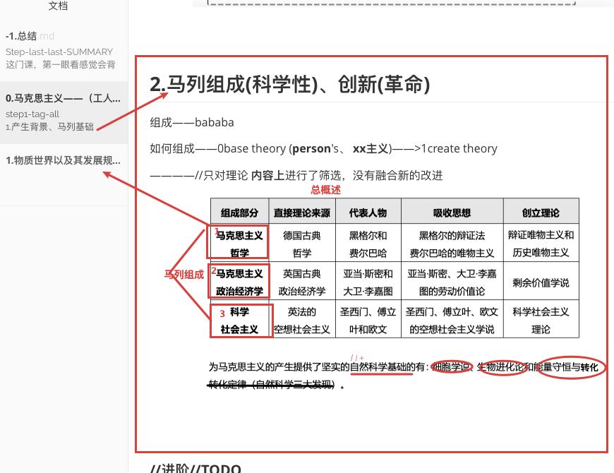

## Step-last-last-SUMMARY

这门课，第一眼看感觉会背中国特色社会主义一类的，这点也经常被拿来调侃。

不过实际上这门课的内容 包含了 人类学、社会学、政治学 等非常有价值的东西，含金量很高；课本上写的学习目的基本上属实，so，推荐理解性阅读。

当你观察到个人月薪6k享受996福报而跟你水平相同的人月收入6w甚至不用干活、或者遇到了月入6w也无法满足社会生存的现象；你想理解为什么的时候，你会思念这门课 (同理适用于 考研政治 等**社会常识性课程**）。

## Step-last-1st-目录结构总结

## //TODO马克思主义存疑

### 理论依据？

理论的建立过程？——>如何进行思考

是否有准确验证？——因为工人运动、苏联而得以实现？

### 商品价值？

以劳动为基本商品价值衡量维度。准确性？

## //TODO中国特色社会主义—vs—国家垄断资本主义

