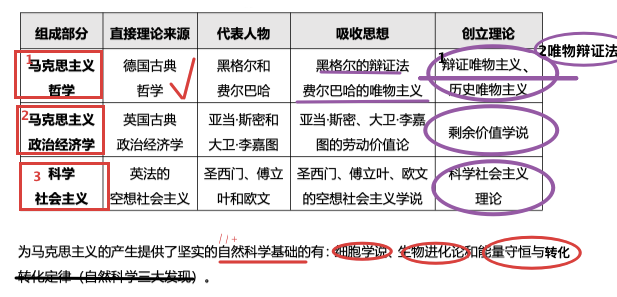
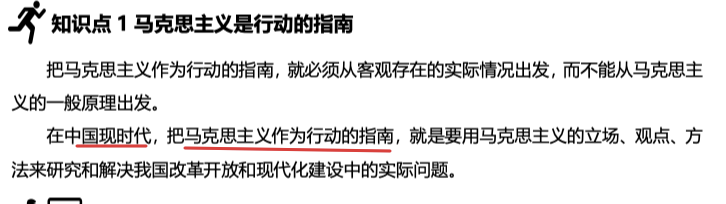
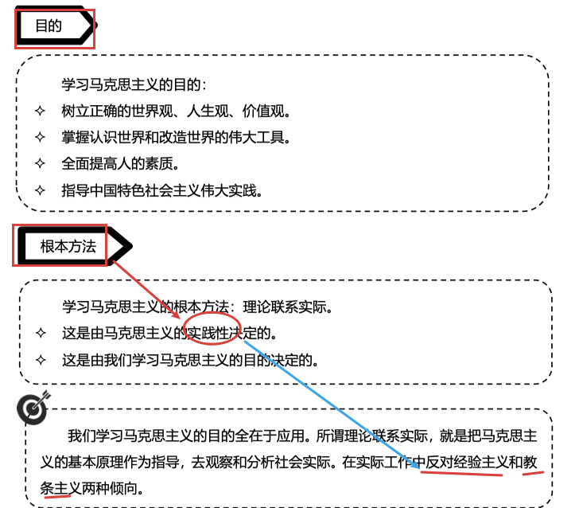
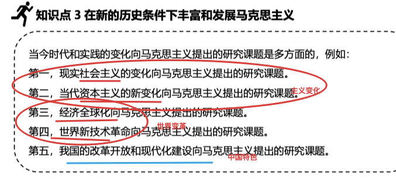

## step1-tag-all

## 1.产生背景、马列基础

产生背景——矛盾；

马列基础——基石-社会学；受众-工人；**组成**-哲学、政治学、经济学、社会科学

## 2.马克思主义组成(科学性)、创新(革命)

组成——bababa

如何组成——0base theory (**person**'s、 **xx主义**)——>1create theory

————//只对理论 **内容上**进行了筛选，没有融合新的改进

### 内在联系

**哲学(指导)——世界观、方法论指导**；

政治经济学(现实)——实际生活的中介；

**—>科学社会主义(结论)**——运用哲学分析经济事实的结论。

#### //进阶//TODO

1古哲学

1+

2古政治经济学

2+剩余价值——//TODO

## 3.学习、发展马克思主义

