## step1-tag-all

个人总结V2：

​	**辩证唯物主义（自然观）**<——哲学基本问题

---

//这章节知识点过多，取消一次性读完所有章节，第一章是归纳，其余是第一章观点的证明

//第一章重要，其余章节分为子step阅读

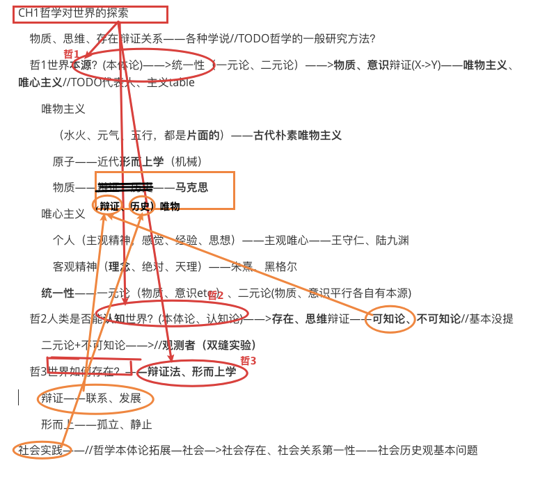

章节知识点：

---

尚德知识点：

1 世界是统一的物质世界

2 物质是不依赖于意识又能为意识所反映的客观实在
3 运动是物质的根本属性
4 时间和空间是物质运动的存在方式
5 实践的本质、特点、形式和作用

notes：

世界本源——。。。

## //TODO0哲学的一般研究方法

哲学更多关注**事物本质**，**很少定义事物**本身

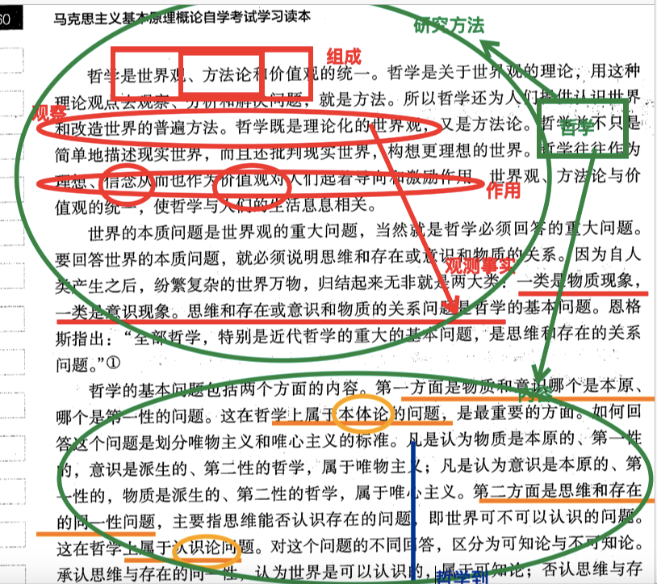

## 1哲学对世界的探索->哲1世界本源(物质)、社会实践

### 1.哲学对世界的探索——>(辩证、历史)唯物—马原

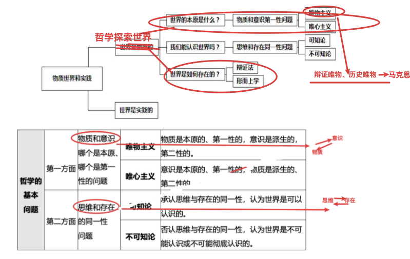

#### 辩证唯物、历史唯物——马克思——物质//TODO

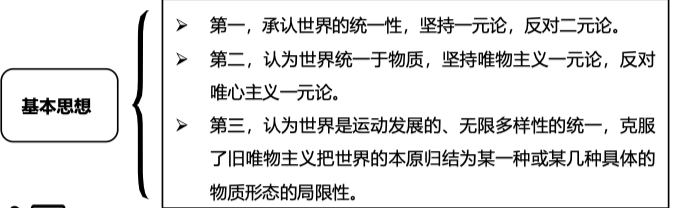

### 2.世界本源——物质——>论证

Step1.1-tag-ch：

物质定义——列宁

​	物质属性——运动

​		运动载体——空间、时间

​	

**物质定义——列宁**

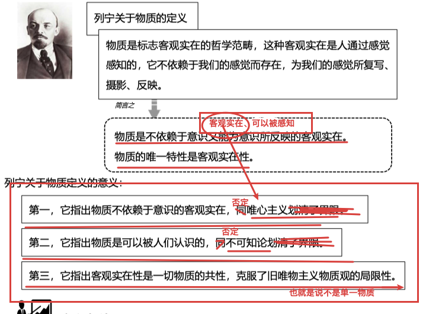

**运动——物质的根本属性、存在方式**

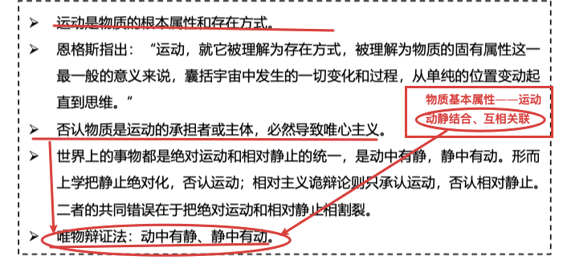

**——运动载体<——空间、时间**

### 3.社会实践

step1.1-tagch

实践的本质//本质、特点、形式、作用

实践——>社会生活

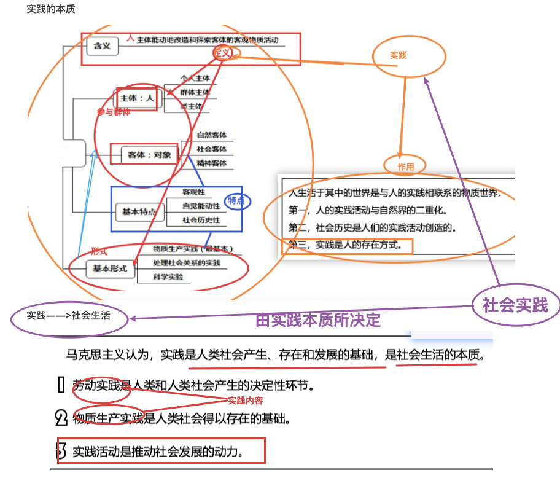

## 2唯物辩证2特征——联系、发展；3基本规律

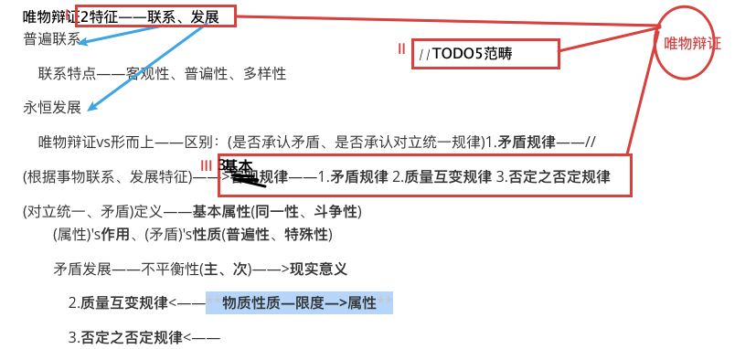

### 2特征——联系、发展

### //普遍联系

### 永恒发展

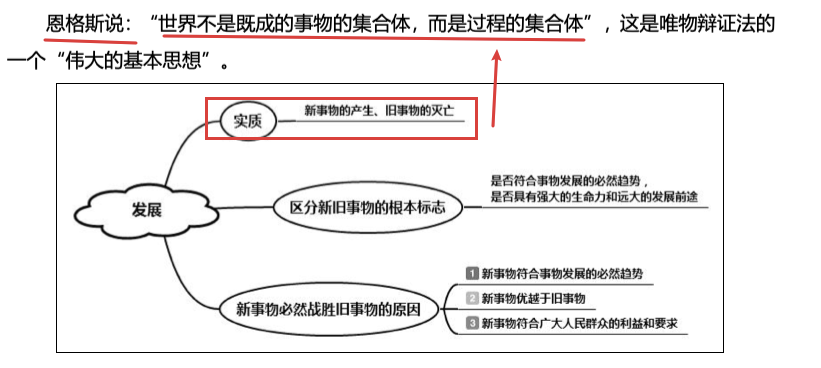

### //TODO5基本范畴

**范畴**——概念被用于对所有存在的最广义的分类。比如说时间，空间，数量，质量，关系等都是范畴。

————哲学最上级**分类体系**，表示概念的**必须元素**

————联系、发展的**5大基本环节**

基本范畴——现象和本质、内容和形式、原因和结果、可能性和现实性、偶然性和必然性。

**现象、本质**

**原因、结果**

**必然、偶然**

**内容、形式**

内容——**构成事物一切要素的总和**，即事物的各种内在矛盾以及由这些矛盾所决定的事物的特性、成分、运动过程和发展的趋势等的。

形式——把内容诸要素统一起来的**结构**或表现内容的方式。

**现象、本质**

本质——**事物的根本性质**以及组**成事物基本要素的内在联系**。

现象——事物的**表面特征**以及这些**特征的外部联系**

### 3基本规律

#### 唯物辩证法vs形而上——>1.矛盾规律

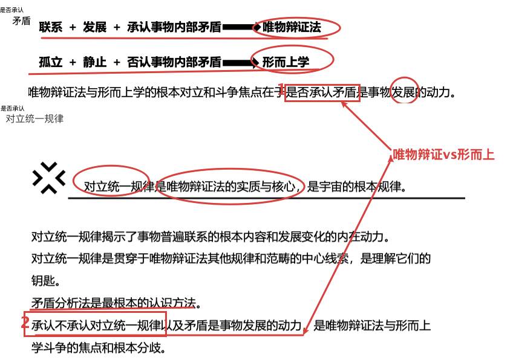

**//矛盾定义——矛盾==对立统一**

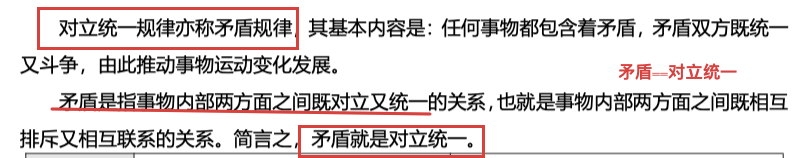

**矛盾属性(同一性、斗争性)、作用**

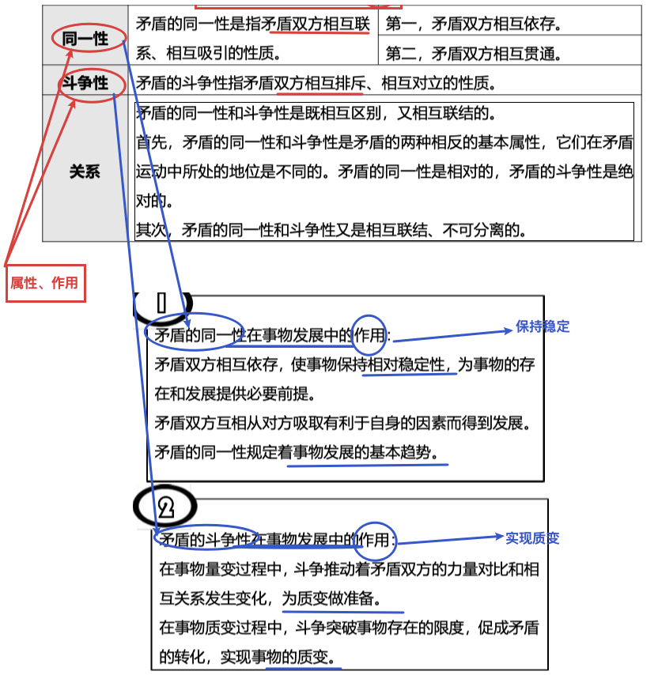

**矛盾性质——普遍性、特殊性**

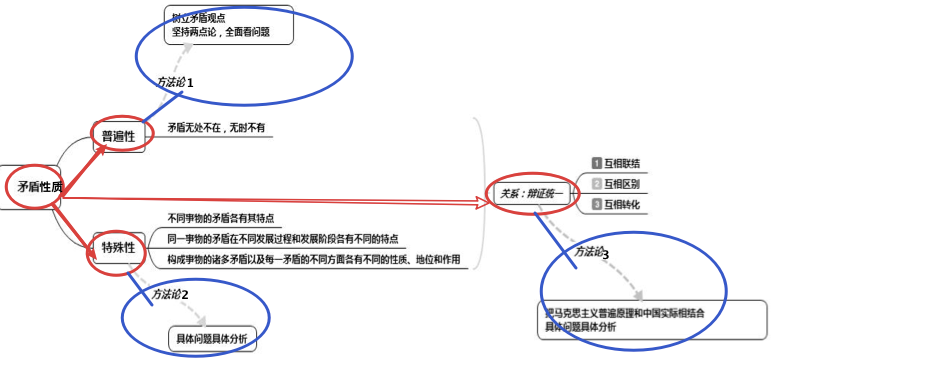

**矛盾发展**(时间演变)——不平衡性(主、次)

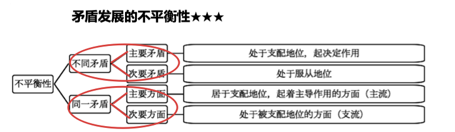

——>**(矛盾发展)'s现实意义**

两点论——

重点论——

两手抓——

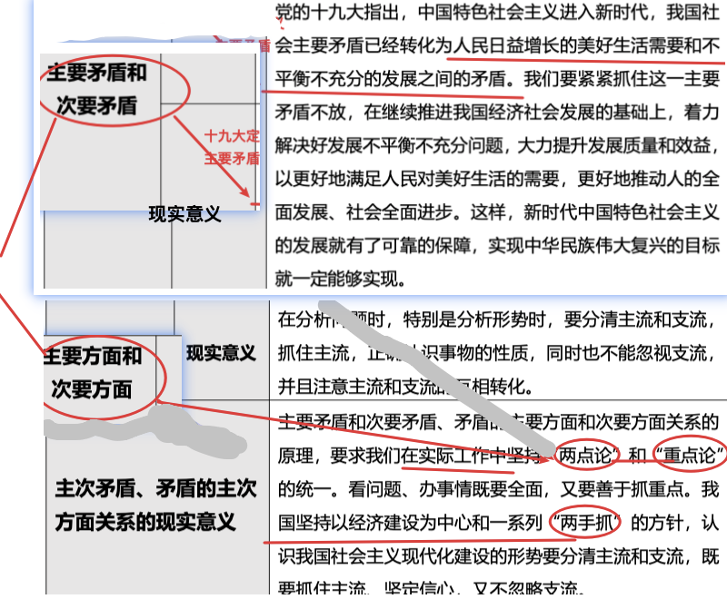

##### 2.质量互变规律//TODO实践性存疑

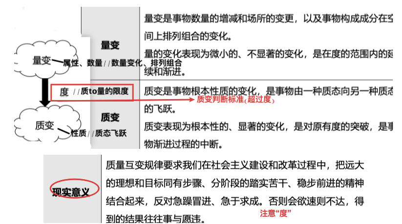

##### 3.否定之否定规律

notes：

(唯物辩证法)肯定、否定 因素——

**扬弃**——辩证否定实质——**新事物在代替旧事物，抛弃旧事物的消极因素，保留并发扬其中对新事物有利的积极因素。**

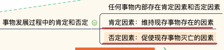

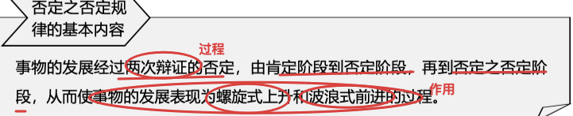

## //3客观规律、主观能动性

客观规律

​	自然规律、社会规律

主观能动性

​	意识起源<——人的主观能动性

实践——**统一客观规律性、主观能动性**

**客观规律**

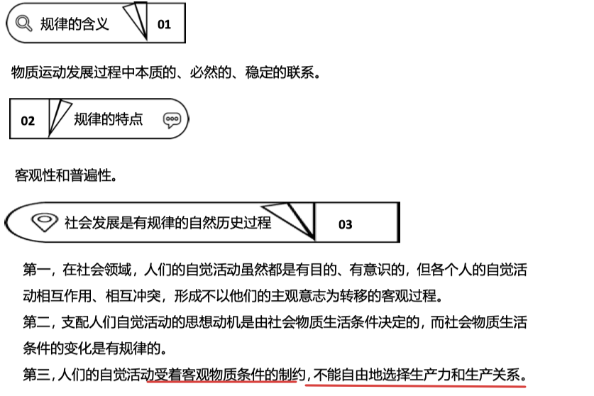

**意识起源、本质、作用**

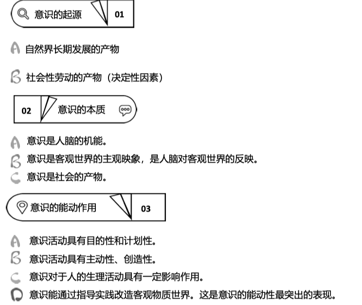

## 4中国-解放思想、实事求是

1 **实事求是**

2 **解放思想**

实事求是+解放思想 辩证统一

notes:

**实事求是**（毛）——实事”就是客观存在着的一切事物，“是“就是客观事物的内部联系，即规律性求”就是我们去研究。——客观事物的**内部关联**。

**解放思想**——从那种落后的传统观念和僵化的教条的束缚中解放出来

辩证统一——实事求是+解放思想

