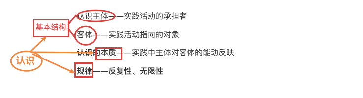
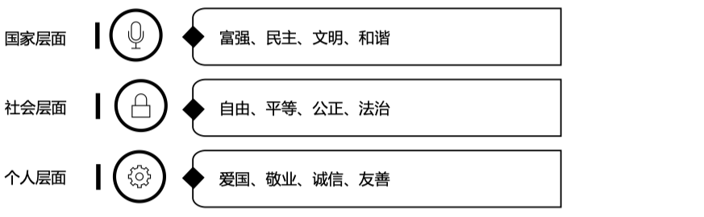
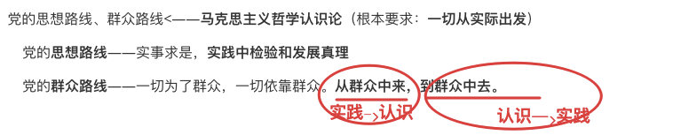

## step1-tag-all

总结V2：

**辩证唯物主义（认识论）**<——认识一般规律

---

## 1实践、认识

实践——**实践**<——**认识的基础**；目的（列宁）

认识——基本结构(**主体、客体**)、性质|特点、结构；**本质**

​	（主体、客体）**关系**(**改造、被改造)**

notes:

实践——本质: **感性的、对象性** 的物质性活动

认识——**实践中主体对客体的能动反映**

**实践**

实践<——**认识的基础**、本质；目的（列宁）

**认识**

**认识的过程**(**无限性**)——实践、认识、再实践、再认识

## 2认识的辩证

认识的辩证<——认识(飞跃)过程
	飞跃1**感性——>理性**——**反经验主义、教条主义**（毛）

​	飞跃2**理性——>实践**——作用：对理性认识**检验**(毛)

### (第一次飞跃)感性—>理性—条件：

1感性材料必须十分丰富，必须合于实际。

2必须有正确的思维方法。

## 3真理与价值<——认识的结果

真理——定义、**属性**(客观性、绝对性、相对性)

​	**实践检验真理的唯一标准**

真理与价值<——**认识的结果**

**社会主义核心价值观**

Notes:

真理——**正确**反映**客体**的**认识**==特殊的理性认识

### 社会主义核心价值观

### 其他

真理的发展过程——相对真理——>绝对真理

## 4党的思想路线、群众路线<——马克思主义哲学认识论

