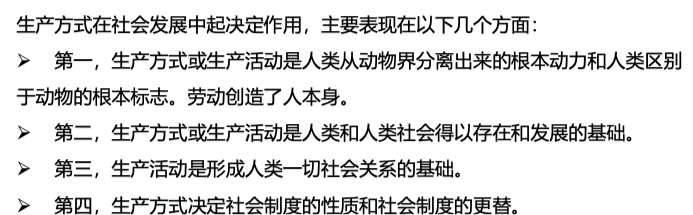
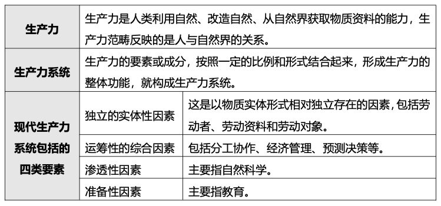
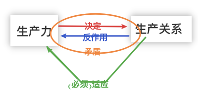
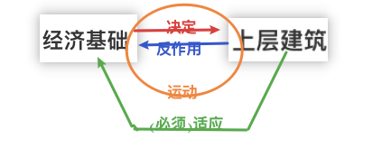
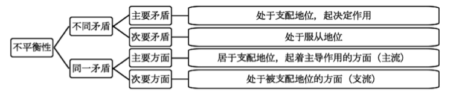
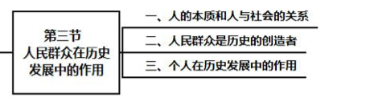
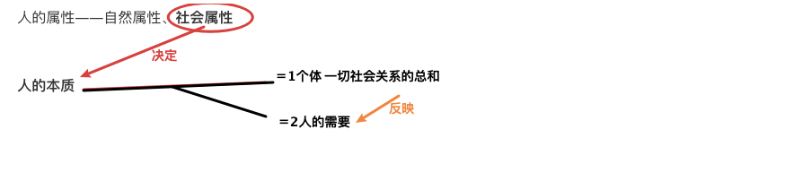

## step1-tag-all

​	2社会历史发展的动力
​		1 社会基本矛盾在社会发展中的作用★
​		2 阶级斗争在阶级社会发展中的作用★★
​		3 革命和改革在社会发展中的作用★★
​	3人民群众在历史发展中的作用
​		1 人的本质和人与社会的关系★★
​		2 历史观上兩种根本对立的观点★
​		3 人民群众在历史上的作用★
​		4 无产阶级政党的群众观点和群众路线★
​		5 个人在历史发展中的作用★

---

## 1社会矛盾、运动规律

经济基础★★
	上层建筑★
	经济基础和上层建筑之间的矛盾★★
社会形态的划分★★
	社会形态的发展是自然历史过程★
	社会历史发展的決定性与选择性★
	社会形态发展的统一性和多样性★

**社会存在**——社会生活条件(**地理环境、人口因素、生产方式**)

​	**生产方式**——定义(**生产力、生产关系**)，**A1作用**//TODO

​		**A2生产力系统(独立实体性、运筹性、渗透性、准备性)**<——**生产力**

​		——>**科学技术是第一生产力(邓小平)**

​		**生产关系体系(生产资料所有制、人类/集团在生产中的地位及关系、产品分配方式)**

​		——**A4(生产力、生产关系)矛盾**——>**社会发展SEC2**

**社会意识**

​	——>**(社会存在、社会意识)'s关系**——//TODO

**经济基础**(社会生产关系总和)<——生产关系

**上层建筑(政治上层建筑、观念上层建筑)**<—(法律制度、设施 )—意识形态

​	政治上层建筑(**国家权力**<——**政治法律制度**以及军队、警察、法院、 监狱、政府机关等设施)

​	**观念上层建筑**——**服务于统治阶级的**  **意识形态**

​	——**(A5经济基础、上层建筑)矛盾**

**A6社会形态**——**划分**

​	**A7社会形态更替的一般规律、特殊形式**

definition:

社会(存在)——社会**物质生活条件**的总和，包括 **地理环境、人口因素** 和 物质生活**资料的生产方式**。

​	生产方式——**生产力、生产关系**——>生产方式决定**社会制度的性质**和社会制度的**更替**。

**社会意识**——**社会精神生活过程[**社会心理与自发形成的风俗、习惯；社会意识形式(社会意识形态(鲜明阶级性)、非社会意识形态)]

​	**生产力**——人类**利用自然获取物质资料的能力**，产生力**范畴**反映的是**人与自然界**的关系。

​	**生产关系**——人们在**物质生产过程**中结成的**经济关系**

经济基础——**社会** **生产关系**总和

**上层建筑**——**经济基础相对应的范畴**

### A1生产方式对社会发展的作用

### A2生产力系统<——生产力

### A4(生产力、生产关系)'s矛盾

### A5(经济基础、上层建筑)'s矛盾

### A6社会形态划分

。。。

**生产关系性质** 划分——原始社会、奴隶社会、封建社会、资本主义社会、共产主义社会(社会主义社会为1st阶段)

**技术社会形态** 划分——渔猎社会、农业社会、工业社会、**信息社会**。

#### A7社会形态更替 一般规律、特殊形式

是同生产力发展一定阶段相应的形态与上层建筑的一体

​	包括：经済形态、政治形态和意识形态

社会形态特点：内容是全面的、是具体的是历史的

社会形态更替的特点：统一性和多样性、必然性与人们的历史选择性、前进性与曲折性

### +ps:社会(主义)基本矛盾；主要、次要矛盾

基本矛盾——>

生产力与生产关系的矛盾

经济基础上层建筑的矛盾

主要矛盾、次要矛盾

## 2社会发展

## 3群众作用

### 人的本质、人与社会的关系

### //TODO人类群众创造了历史？

从社会劳动出发——>群众劳动提供社会物质基础+精英的运筹

————>将英雄 定义为 唯心

我需要认真思考这一点