## step1-tag-all

Ver2:

每章节。。。

---

keyWords:

资本主义 	

​		制度——(经济)制度

​				——政治制度——>意识形态

资本

​	流通过程、剩余价值

## 商品经济

keyWords:

商品

​			商品经济

map:

资本主义社会<—(统治地位)—**A商品经济-A1What is?商品经济(定义、产生)**

​	**商品属性**(**使用价值**、**价值**)

​		(生产商品的)劳动属性(**自然属性-具体劳动**、**社会属性-抽象劳动**)

​		**价值(组成)**==(**原有价值**)消耗掉的生产资料的原有价值+(**新价值**)在生产该商品时新创造的价值

​	**A2How to measure?==商品价值量<—(决定)—社会必要劳动时间**

​		商品价值量、社会必要劳动时间关系()

​	**A3How value presents?价值体现<——商品生产者社会经济关系(货币)'s** **本质**、**职能**

​	**A4Conflict私有制基础上商品经济矛盾**

​	**商品经济's 基本规律**(**价值规律**) **定义、作用**

notes:

(商品)使用价值——商品有用性

价值——无差别的**人类劳动的凝结**

价值规律——由必要劳动时间衡量、等价交换

①商品的价值是由生产商品的社会必要劳动时间決定

②商品交換以价值为基础，实行等价交换。

---

### 1商品经济

#### A1定义、产生

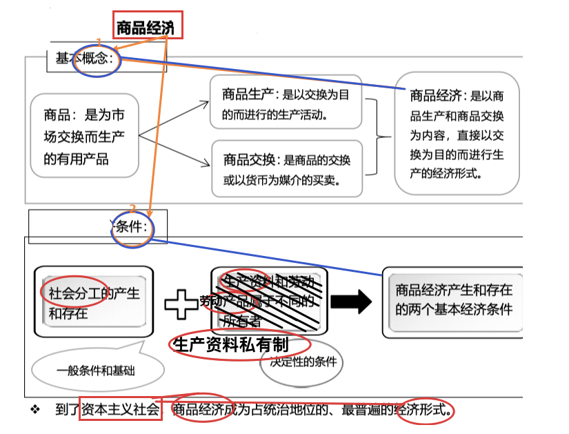

商品属性(使用价值、价值)

#### A2商品价值衡量(商品价值、劳动时间关系)

商品价值量、社会必要劳动时间关系()

**商品价值量<—(決定)—社会必要劳动时间** 

商品**价值量与劳动时间成正比与劳动生产率成反比￥￥重要￥￥**

商品价值量以简单劳动为尺度计量

#### A3价值体现(货币)'s本质、职能

货币：

产生——商品交換长期发展的产物

本质——固定充当一般等价物的商品；体现-商品经济条件下**商品生产者之间的社会经济关系**

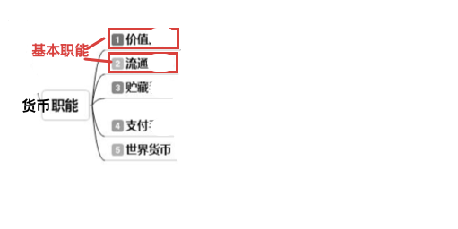

#### A4矛盾

**商品生产者劳动属性**(**私人劳动**、**社会劳动**)<——**商品经济产生条件**(生产资料私有制、生产分工)

**私人劳动和社会劳动的矛盾**是以**私有制为基础的商品经济**的基本矛盾

#### // 基本规律、作用

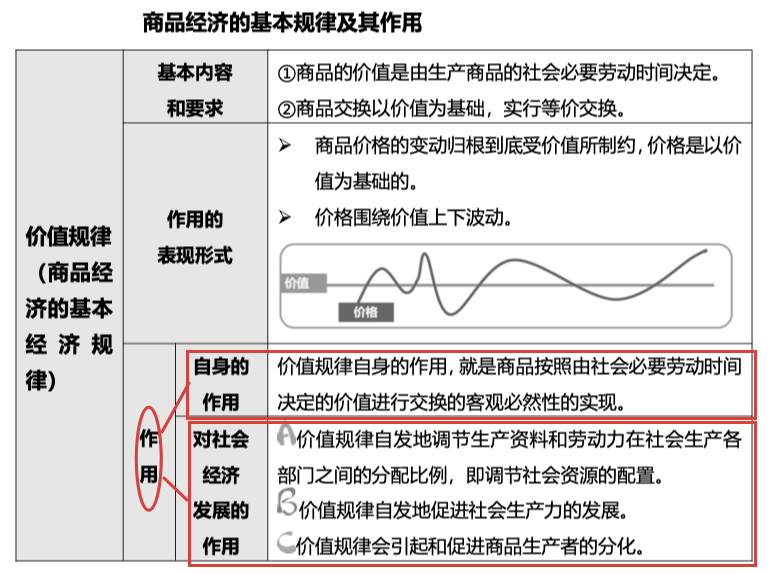

## 资本主义制度

**keyWords:**

资本										

​		资本主义

​			剩余价值规律

​				绝对剩余价值	相对剩余价值	**劳动生产率↑劳动力价值↓//TODO存疑？**

**Map:**

资本主义 产生、确立

​	

资本<—(转化)—货币//TODO

↓

1劳动力成为商品 **条件、价值**

2资本主义 生产过程——**劳动过程**、**价值增值过程统一**	

资本's **本质(资本主义生产关系—资产阶级剥削、无产阶级被压迫)；3不变资本、可变资本**//解释了资产阶级为什么能剥削1<——（不变资本，生产资料垄断）

**4剩余价值**

​	**剩余价值率**；**4.1.剩余价值生产方法(绝对剩余价值、相对剩余价值、**超额剩余价值)<——**资本家对工人的压榨手段**	**//TODO存疑，过于定性，从客观分析增加了语气色彩**

​	**4.2.剩余价值规律**——>**资本主义基本规律**    //TODO跟菲巴克 **复利**之间的关系？(个人、生产关系之间)

**↓5资本积累**//解释了资产阶级为什么能剥削2

​	资本积累 **实质**；**后果**

​		——>**历史趋势**—(马克思改良)—>**生产资料公有制 replace 资本主义私有制**

**Notes:**

劳动力成为商品

**劳动力成为商品**必须具备两个基本条件：

+一是劳动者有人身自由。

+二是**劳动者丧失了一切生产资料和生活资料**，除了自己的劳动力以外一无所有，必须靠出卖劳动力为生。

**剩余价值**——//**概念1如下↓**

> **W（商品价值）**=c（不变资本）+v（可变资本）+**m（剩余价值）**。
> 其中：
> c:不变资本, **生产资料**构成的资本。（土地、机器、厂房、设备）。
> v:可变资本, 以**劳动力**形态存在的资本。（以工资为报酬的劳动力）。
>
> **m(剩余价值)== W(总价值) - c(生产资料) -v(劳动力)**
>
> ——>社会主义国家认为，**剩余价值归无产阶级所有**。

​				//马克思主张**平均生产资料(绝对公有)** ,  **剩余价值(按劳分配)**

**剩余价值率**——剩余价值m和可变资本v的比率：m'=m/v。

————**剩余价值规律**——资本通过组织雇佣劳动进行生产，占用工人的剩余劳动。

(社会)必要劳动时间——人类同一劳动力在商品生产上只使用平均必要劳动时间或社会必要劳动时间(**对社会整体而言**）

劳动者的劳动时间≈≈**工作日**——==**必要劳动时间**(**社会生产价值产品平均劳动时间**)**+剩余劳动时间**(**工作日—必要**)

//——**必要劳动时间**——指在现有的社会正常的生产条件下，在社会**平均**的劳动熟练程度和劳动强度下**制造某种使用价值所需要的劳动时间**。(决定商品的价值量)

​	//——>**↓A缩短**必要**劳动时间**——how：**提高全社会生产率**(资本家追求超额剩余价值的结果)

//——**剩余劳动时间**——劳动时间中用于生产维持劳动者自身及其家庭生活所必需的生活资料的时间以外的部分。//TODO这里的概念存在混淆。

​	//——>↑增加**剩余劳动时间**——how:A的必然结果

**剩余价值**——**概念2**

一部分是必要劳动，用于再生产劳动力的价值;

另一部分是剩余劳动，用于无偿地位资本家生产剩余价值。因此，剩余价值是雇佣工人所创造的的并被资本家无偿占有的超过劳动力价值的那部分价值，它是雇佣工人剩余劳动的凝结，体现了资本家与雇佣工人之间剥削与被剥削的关系。

——**绝对剩余价值**——前提：**必要劳动时间不变**，方法：增加 剩余劳动时间|工作日(**总劳动时间↑、提高劳动时间↑**)//工人会抗议，很少采用

——**相对剩余价值**——方法：缩短必要劳动时间(**提高生产率**)，相对增加 剩余劳动时间|工作日(总劳动时间不变)

### 3可变资本、不可变资本

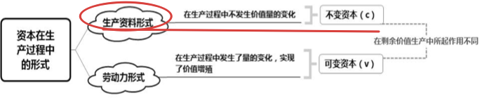

### 4剩余价值生产方法

**绝对剩余价值**

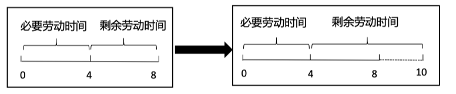

**相对剩余价值<—(过程)↑超额剩余价值—**

缩短必要劳动时间，同时增加剩余劳动时间—方法—>**降低劳动力价值**

而劳动力价值==**工人**及其家庭必要的**生活资料价值**，因而就需要降低这些 生活资料的价值。

**提高社会劳动生产率↑降低单位商品价值↓——>劳动力价值↓**

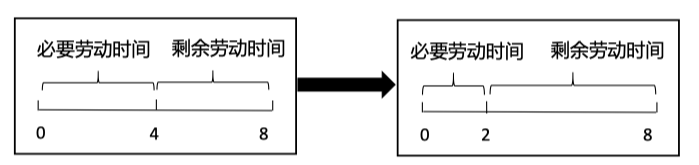

### 4.2剩余价值规律

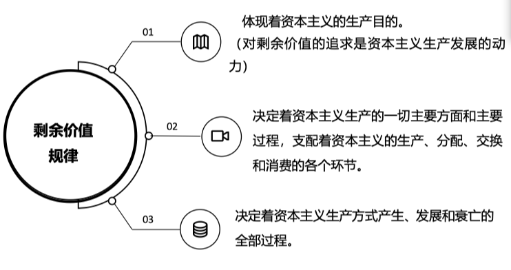

#### +!补充—剩余价值、相对剩余价值、超额剩余价值

//描述对象——商品？

**剩余价值**——

**相对剩余价值**——在工作日长度不变的条件下，由于**缩短必要劳动时间**、相对延长剩余劳动时间而生产的剩余价值。

**超额剩余价值**——商品的个别价位低于社会价值的差额。

### 5资本积累

**本质**

资本家用**无偿占有工人创造的剩余价值**，进行资本积累来**增大资本的规模**—(loop)—🔙

**后果**

**资本有机构成↑**提高、**过剩人口**、**贫富分化**

**历史作用、必然历史趋势**

历史作用——社会劳动**生产力的提高**和劳动的社会化。

必然历史趋势——用和生产社会化性质相适应的**生产资料公有制**代替资本主义私有制。

## 1资本流通过程；2剩余价值分配；3资本主义经济危机

**keyWords:**

资本**流通过程**	**剩余价值分配**

**Map:**

1**资本流通过程**((单产业资本)**循环**、**周转——(多，联系)—>2B(社会总资本) 再生产↓**)

​		//社会总资本再生产的实现==社会总产品

​		**B1社会总产品构成**——> **社会总产品实现(补偿)**问题(**价值补偿、实物补偿**)——**价值补偿、实物补偿矛盾；**

​		**B2比例关系**

**2剩余价值分配//TODO**

​		利润的本质（剩余价值）

​		利润转化为平均利润

​		商业资本和商业利润

​		借贷资本和利息、银行资本和银行利润

​		农业资本和农业利润及地租

**3资本主义经济危机**（**实质**：生产过剩；**根源(基本矛盾)**：**生产的社会化与生产资料私人占有**(财富集中在少量人手中))

​		**经济危机周期性**<——基本矛盾阶段性）

​		资本主义**再生产周期**(经济危机周期)

**Notes:**

**社会资本再生产**——**各个资本**相互交错、互为条件的不断循环运动。（其过程叫做，**社会资本再生产的实现**）

### 1资本流通过程

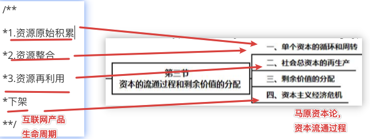

---

**单产业资本循环**

资本循环——

产业资本——

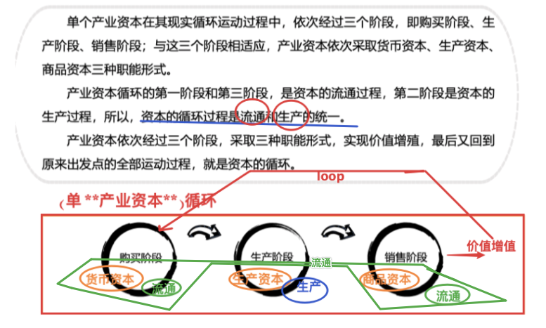

**资本周转**

**资本周转**——不断重复 资本循环的过程

**资本周转速度**影响因素——**1资本周转时间**； **2固定成本**、 **流动成本**

#### 2B社会总资本再生产

##### B1社会总产品构成

**社会再生产核心问题**<——社会总产品的**实现问题**（社会总产品的价值补偿和实物补偿问题）

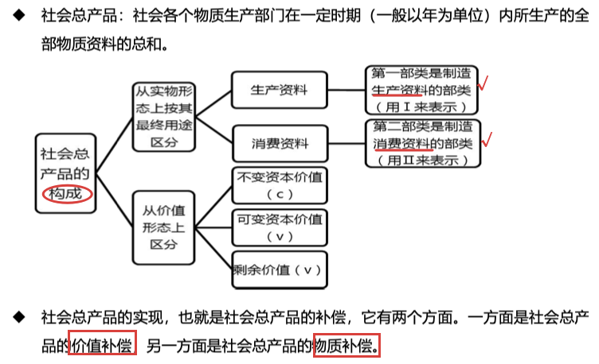

##### B2比例关系

**社会再生产顺利进行的条件**<——两大部类内部各个产业部门之间和两大部类之间保持一定的比例关系

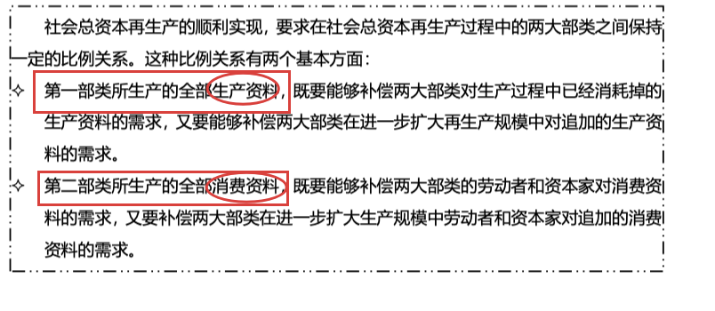

### 2剩余价值分配//TODO

​	1剩余价值转化为利润

​	2利润转化为平均利润

​	3商业资本和商业利润

​	3債绞資本和利息、银行資本和银行利润。

​	4农业本和农业利润及地租

### 3经济危机

实质；根源(基本矛盾)

经济危机的实质——生产力**相对**过剩

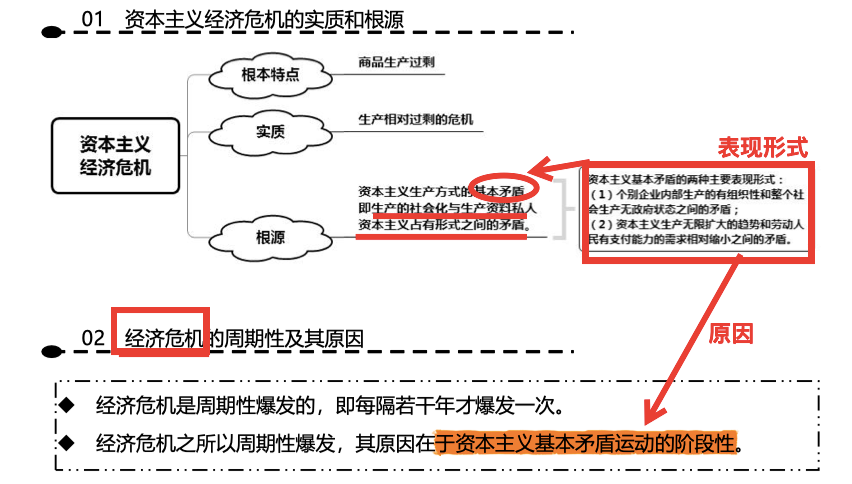

再生产周期

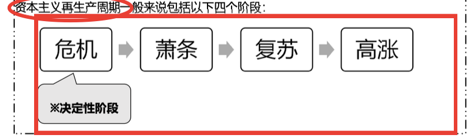

## (资本主义)'s政治制度、意识形态

(资本主义)'s**政治制度**

​	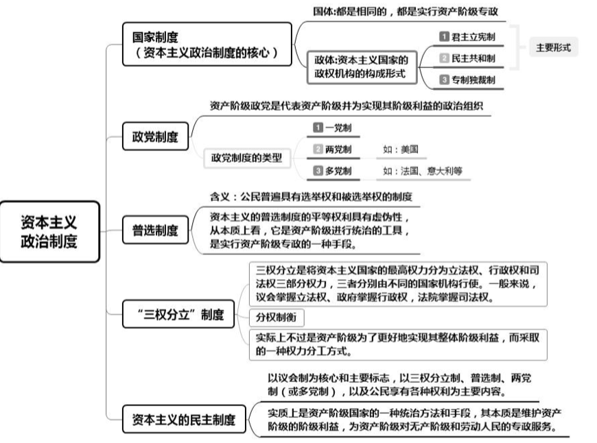

(资本主义)'s**意识形态**

​	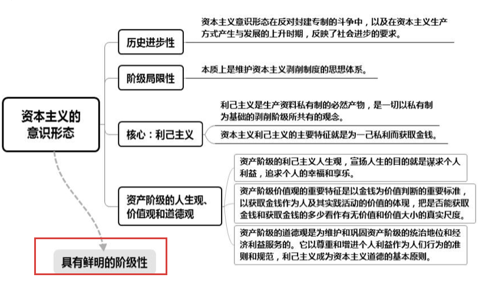

