## step1-tag-all

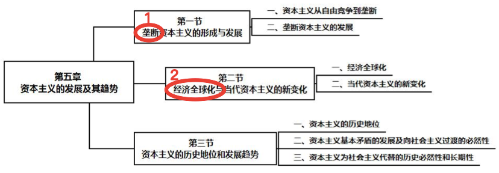

1.垄断资本主义——**形成原因**；**发展阶段**(自由竞争->私人垄断->国家垄断)

​	金融资本、金融寡头

​	垄断和竞争

​	垄断利润及其来源

​	国家垄断资本主义的产生和发展

​	垄断资本在世界范围的扩展

2.A经济全球化——**主要内容**(生产、贸易、资本)、影响；(A背景下)资本主义新变化↓

​	**2008 年国际金融危机以来资本主义的矛盾与冲突**（**经济失调**(福利低负债高)、**政治失灵**(民粹)、**社会融合实效**(右翼)）

​	**资本主义新变化表现；原因、实质**

资本主义历史地位、发展趋势

​	

​	

**Notes**:

金融资本——垄断工业资本+垄断银行资本

金融寡头——掌握了金融资本，操纵国民经济命脉

## 1.垄断资本主义

### 形成原因、特征

原因

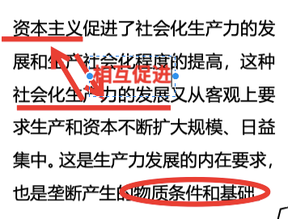

经济特征

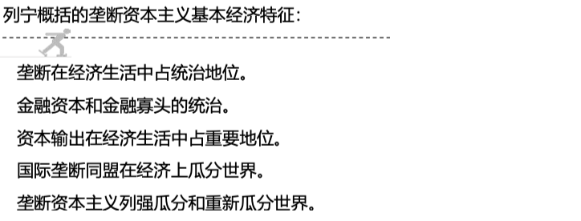

### 发展阶段

总

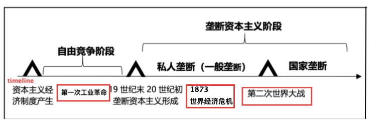

国家垄断

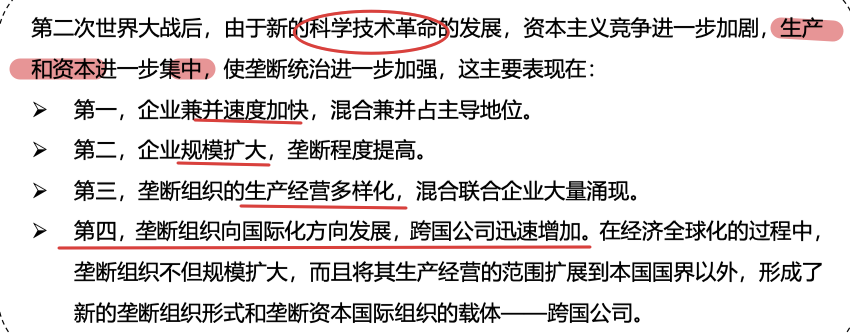

### 金融资本、金融寡头

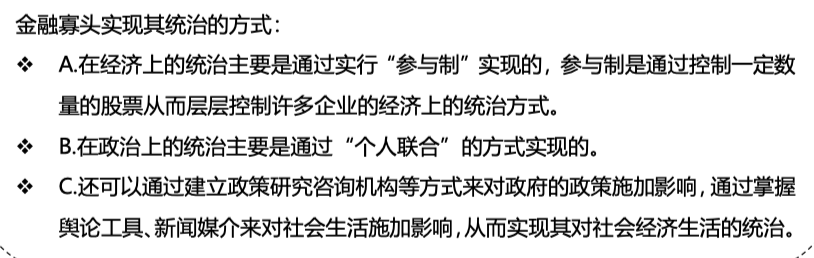

### 垄断下的竞争

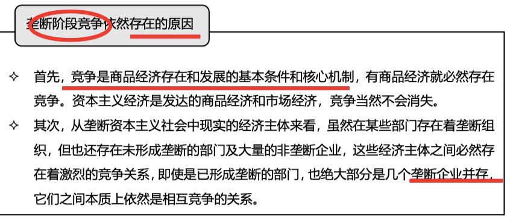

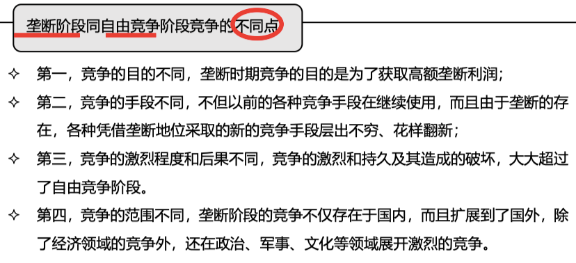

### 垄断利润

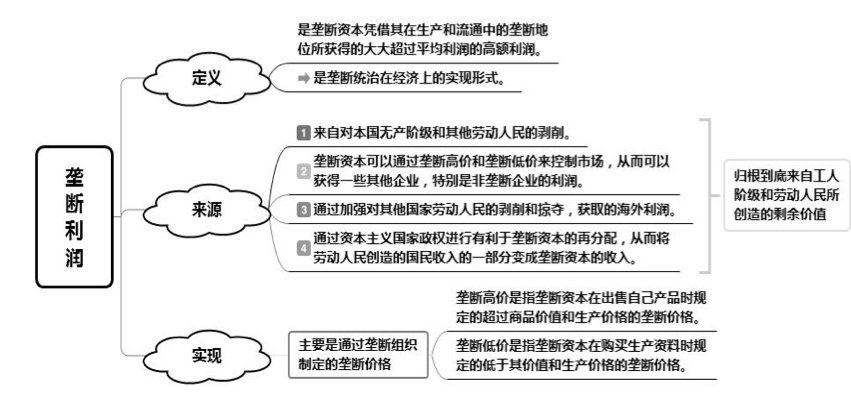

### 国家垄断资本主义

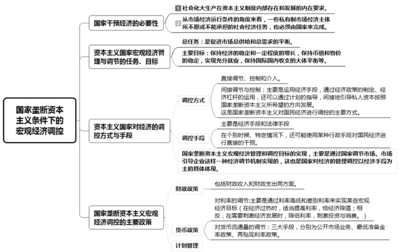

## 2.经济全球化

### 影响

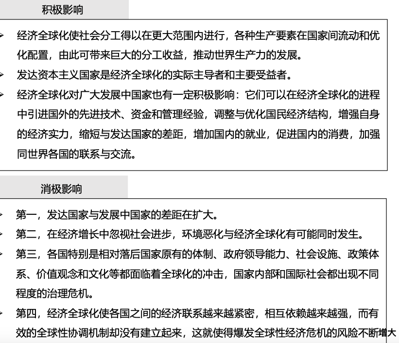

### 资本主义新变化

表现

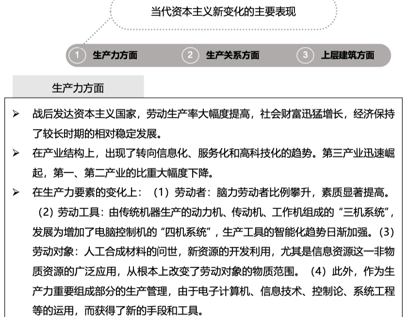

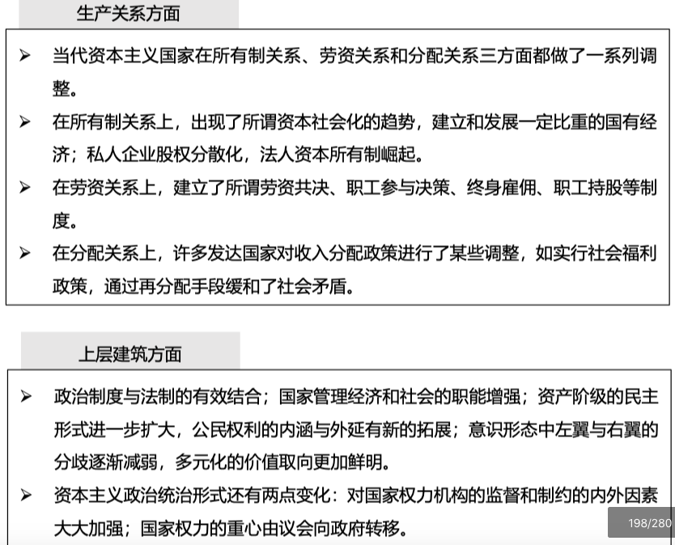

原因

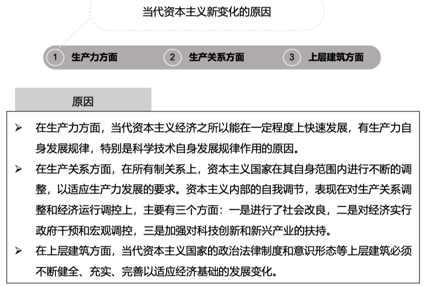

实质

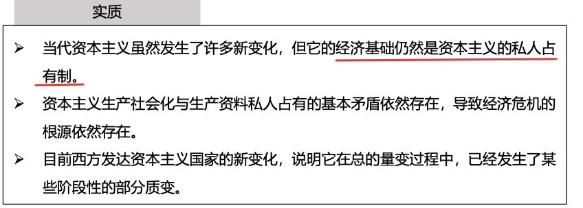

## 资本主义地位、发展趋势

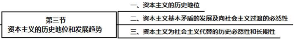

资本主义评价、发展趋势(—>社会主义)

​	社会主义(**过渡、替代**)的必然性

**Notes**:

### 评价、发展趋势

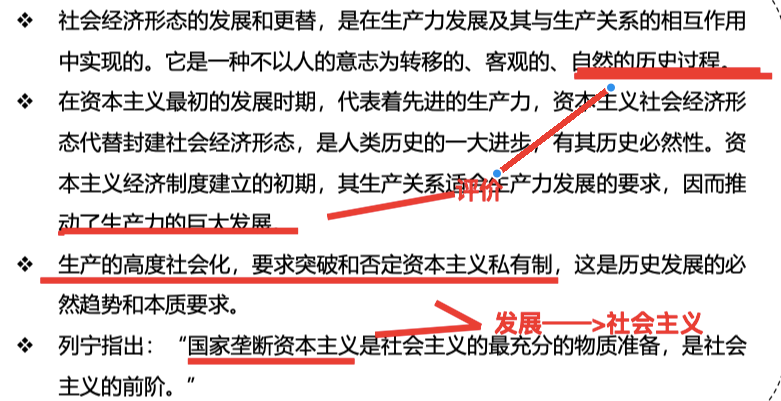

### 过渡、替代

过渡(客观条件)

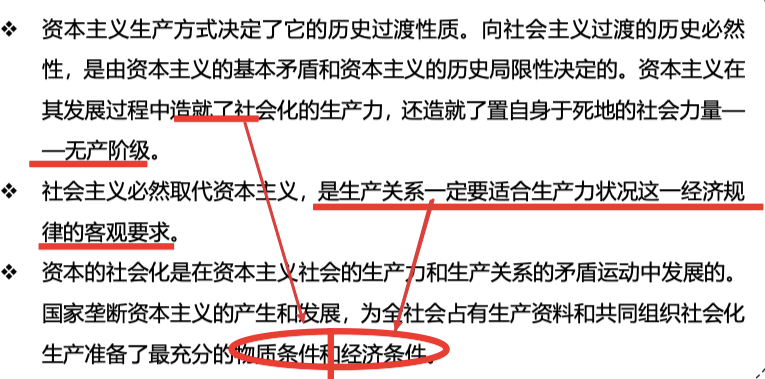

替代 必然

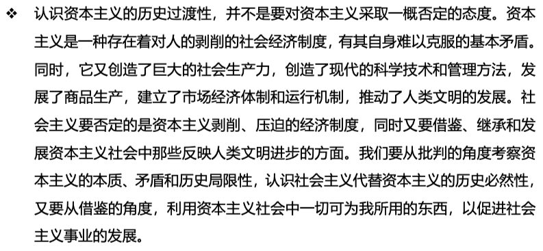

