## step1-tag-all

---

标记：

//不重要

//TODO 待复习

//调研 

总结：

这块涉及到时间的比较多。。。but低频考点

---

1历史进程

​	//理论-实践（苏联—(多国)—中国）

​		**新时代中国特色社会主义**

//2一般原则

//3发展规律（经济相关性(经济落后国家取得成功)、多样性、实践探索）	

**马克思主义政党**——>**社会主义事业**

​	**组成/产生条件**；社会主义事业**领导核心**

**Notes**：

## 1历史进程

**空想—>科学**

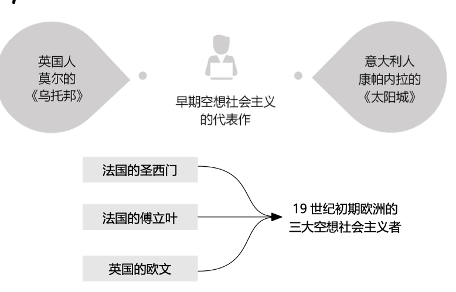

### !无产阶级制度建立//TODO时间、背

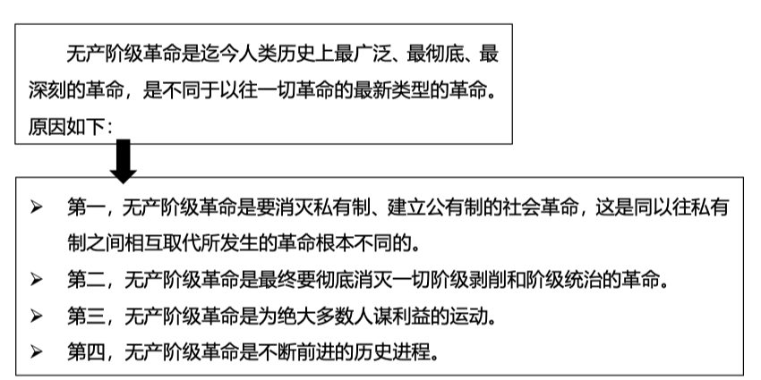

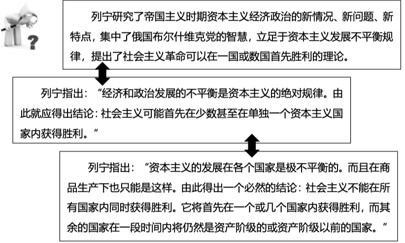

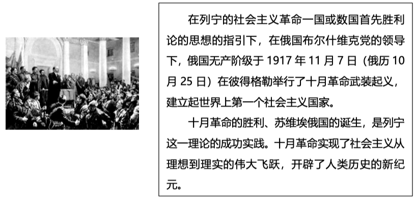

### 实践-苏联

//低频考点

**时间-列宁：1917-1924**

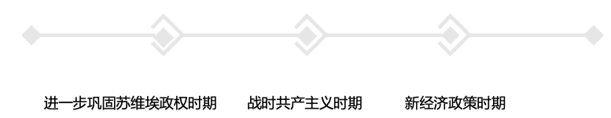

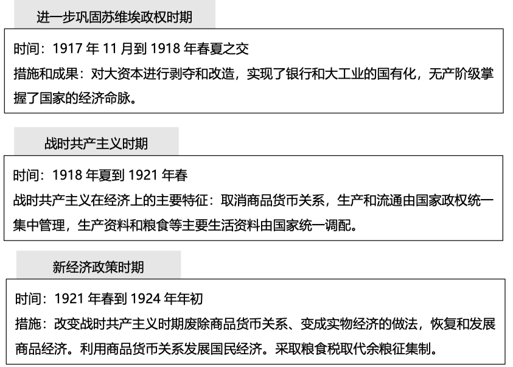

**时间-斯大林：1924-1936**

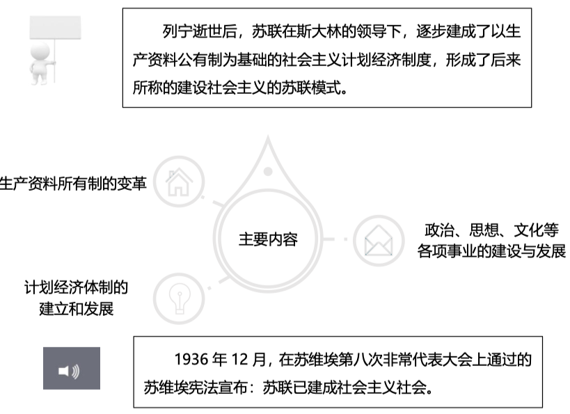

### //实践-多国//调研

//低频

//TODO为什么欧洲走向了跟中国不同的发展道路？

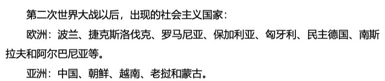

评价：

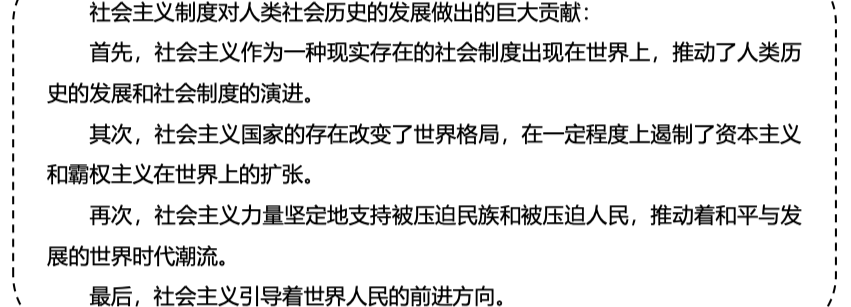

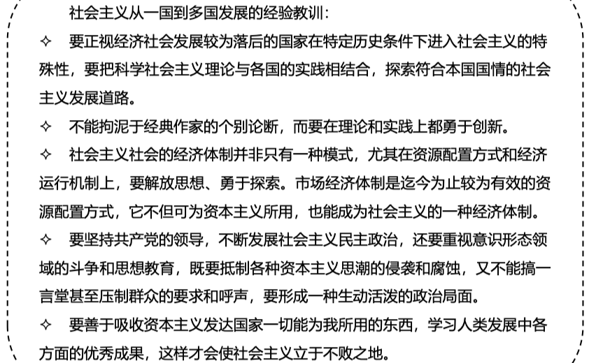

### 实践-中国

timeline

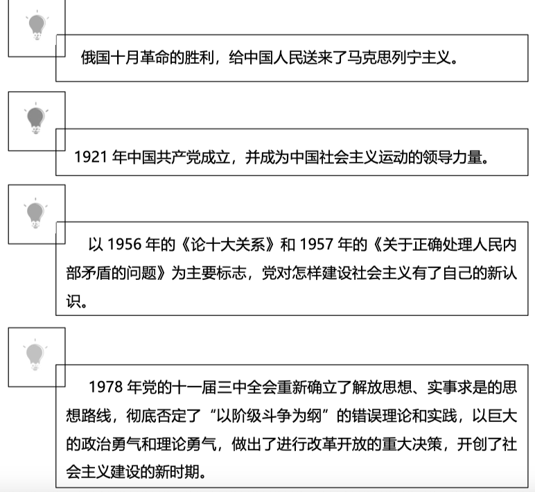

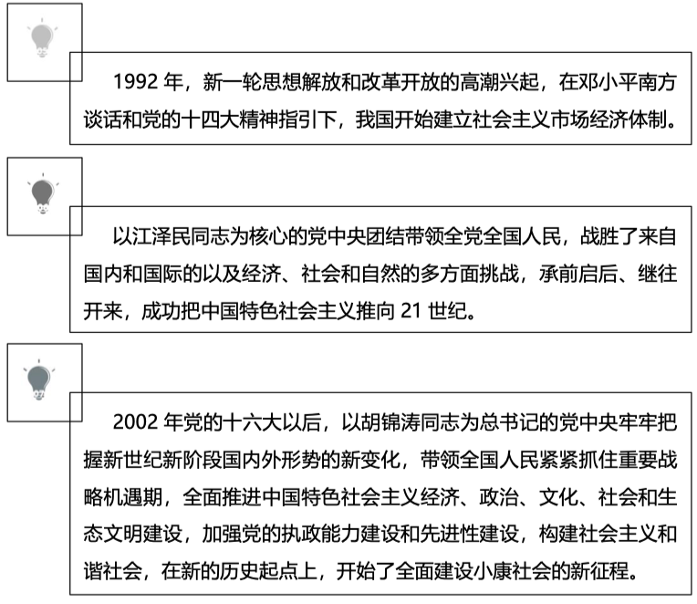

#### 新时代中国特色社会主义//TODO

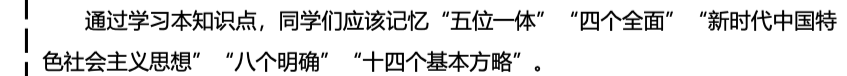

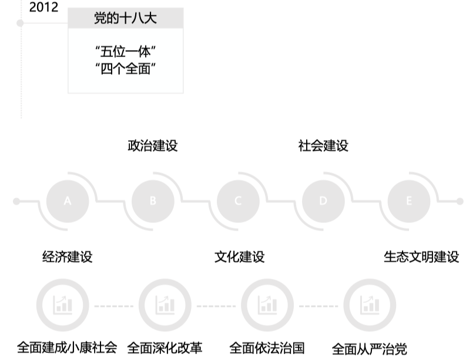

## //2一般原则

一般原则

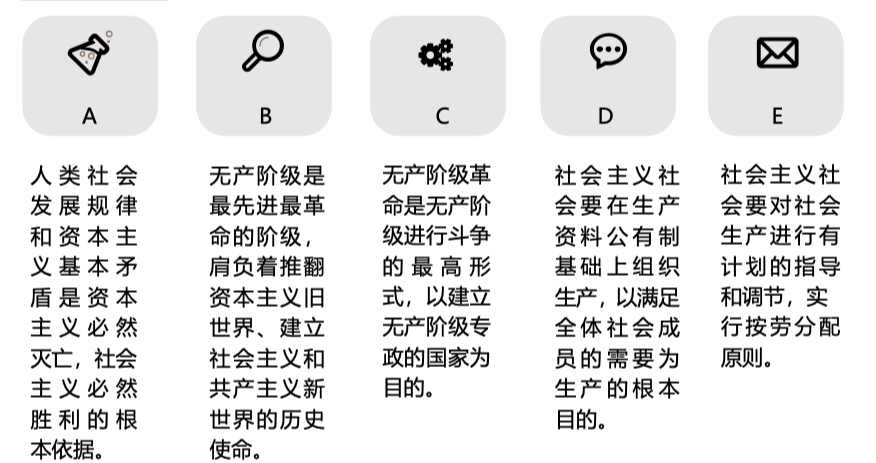

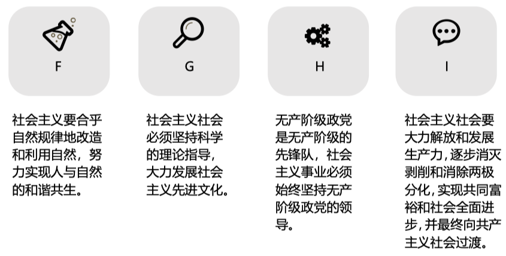

正确把握

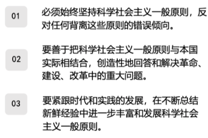

## 马克思主义政党—(领导)—>社会主义事业//TODO

组成/产生条件

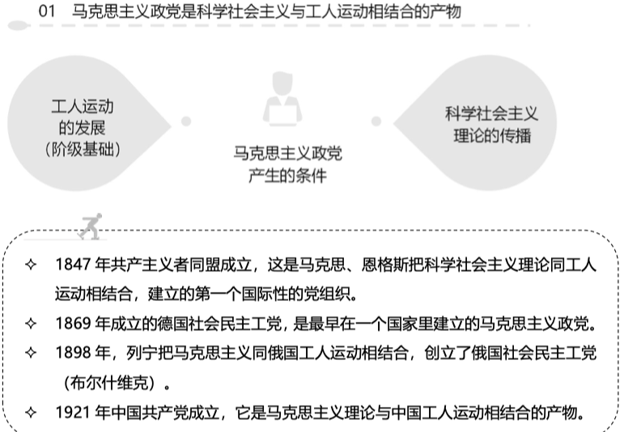

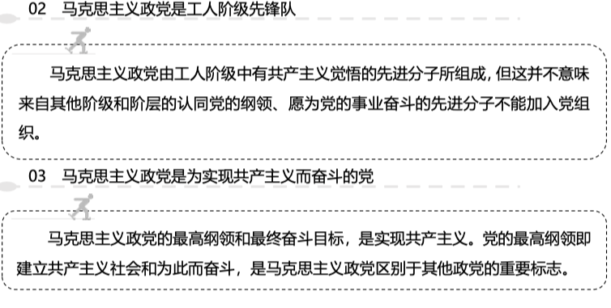

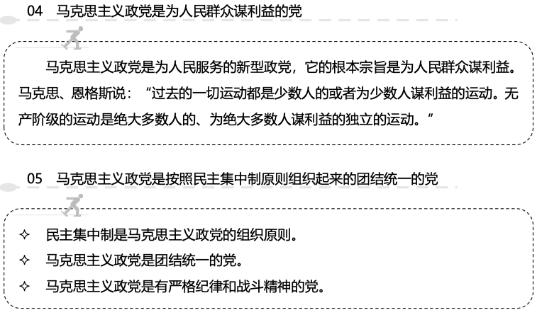

领导核心

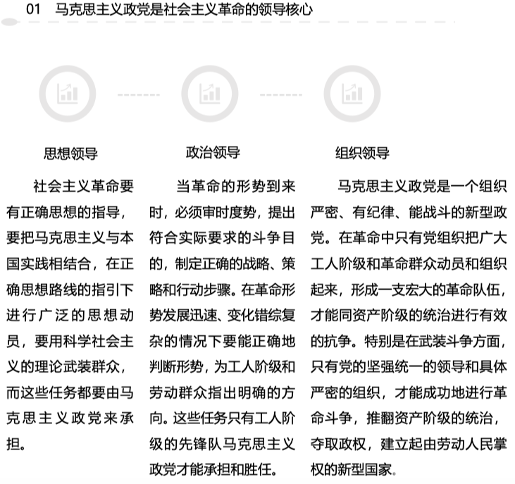

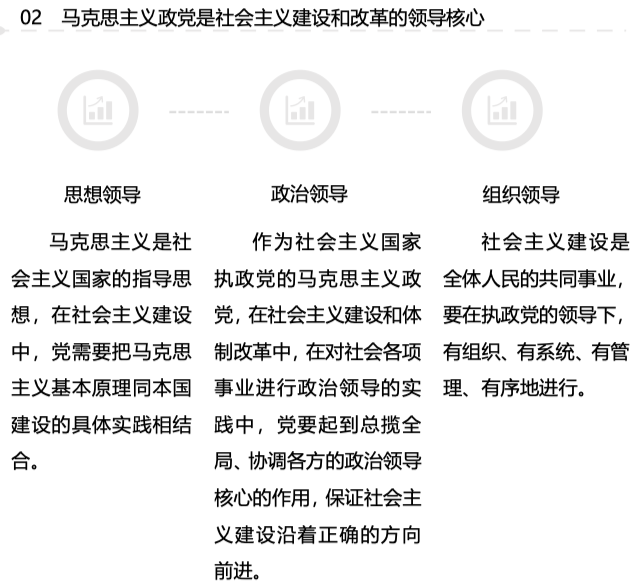

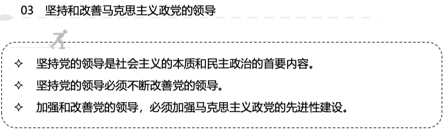

