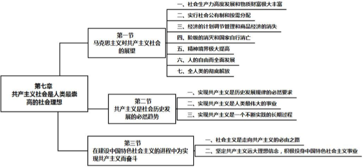
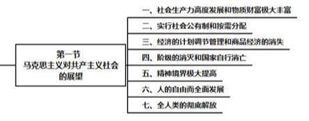
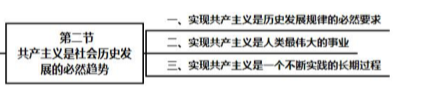
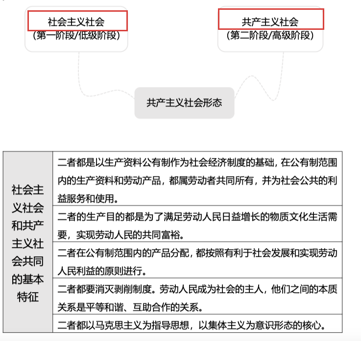
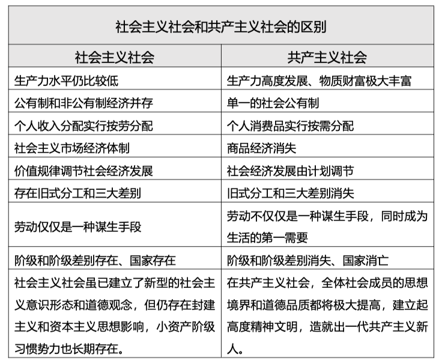
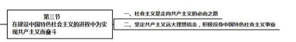

## step1-tag-all

1马克思主义理想(共产主义)社会内容

2共产主义(必然趋势)

3在建设中国特色社会主义的进程中为实现共产主义而奋斗

​	

## 1马克思主义理想(共产主义)社会内容

## 2共产主义社会(社会发展必然趋势)

2共产主义社会<——1社会主义社会

### 社会主义社会vs共产社会主义社会//TODO

//TODO社会主义==国家垄断的资本主义？

不同点

## 3建设中国特设社会主义

