## //概述

### 标记介绍

!#N表示重要；N表示出现次数

ps个人思考

## 1选择

#### !#4哲学基本问题

**2. 辩证法和形而上学的区别在于如何回答（C. 世界的存在是怎样的问题** 

A. 世界的本质是什么的问题 

B. 世界可否被认识的问题 

D. 世界有否统一性的问题 

------

**人物**

---

**14.简单商品经济的基本矛盾是指C.私人劳动和社会劳动的矛盾**

**15.资本有机构成的提高一般是以** **B.生产资料的增大为前提**

**16.从资本周转的角度来考察资本的构成，划分为固定资本和流动资本的是A.生产资本**

**19.在经济危机和萧条阶段，资本主义国家向私人企业注入一部分国有资金以维持其生存的经济行为属于****B.国家和私人资本在企业内部结合的一种方式**

**21.垄断资本主义的历史作用是A.为一个更高级的生产形式创造物质条件**

**22.在社会主义思想史上，标志着科学社会主义理论公开面世的第一个纲领性文件是A.《共产党宣言》**

---

**6.意识的能动性最突出的表现是，意识活动B.能通过指导实践改造世界**】

**7.作为认识和实践活动的承担者，认识主体所具有的突出特点是【 A.能动性** 

**10.除了生产力与生产关系的矛盾，另一对**社会基本矛盾**是【  C.经济基础上层建筑的矛盾**   **】** 

---

### 2017-10

#### !#3唯物辩证法—基本范畴

**5. 在唯物辩证法的基本范畴中，内容和形式反映了（B. 事物的内在要素和结构方式间的关系** 

**8. 下列各项正确说明感性认识和理性认识联系的是（A. 理性认识依赖于感性认识**  

11. 下列关于生产力和生产关系的表述中，不正确的是（　D. 生产关系总是适应生产力的发展要求 

**12. 从历史上看，暴力革命是<u>社会革命</u>的（　B. 基本形式** 

**13. 人区别于动物的根本标志在于（B. 制造使用工具** 

——>人认识社会—改造社会　）。

**14. 两种商品相互交换的量的关系或比例就是商品的（　D. 交换价值**  

A. 价值 

B. 价格 

C. 使用价值 

**15. 相对剩余价值的获得是（　D. 全社会劳动生产率普遍提高的结果** 

**23. 无产阶级革命**的发生归根结底是由（A. 生产力发展水平决定的** 

---

### 2017-04

#### !#3社会主义核心价值观——

#### !#3垄断资本主义

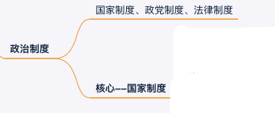

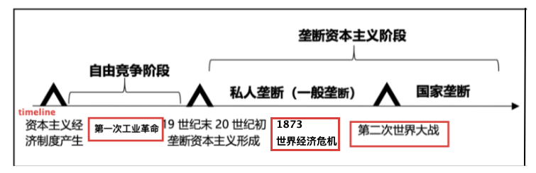

11．在现代生产力系统中，生产工具属予  A．实体性因素

**14．简单商品经济的基本矛盾是D．私人劳动和社会劳动的矛盾**   

**16．生产资料和劳动力实物构成上的比例是资本的**  **C．技术构成** 

**20．下列选项中不属于当代资本主义生产力方面新变化的是    D．在生产资料所有制上出现了法人所有制等新形式**

**21．资本主义经济的发展为向更高级的生产方式过渡创造物质条件，表现C．社会化大生产的发展**   

**22．社会主义社会的改革是D．社会主义制度的自我完善和发展**

## 2简答

#### 从感性认识→理性认识的飞跃(第一次飞跃) 条件

1**感性材料**必须十分**丰富**，必须合于实际。

2必须有**正确的思维方法**。

#### 逻辑证明、实践检验 关系

 1.坚持**实践是检验真理的唯一标准**

2.承认**逻辑证明**的作用。

#### 劳动力商品与一般商品的不同(使用价值层面) 

1.劳动力的**使用价值是劳动**——可以弥补自身价值的价值

2.**可以创造出新的剩余价值**。——>剩余劳动创造的**剩余价值揭示了资本主义生产的本质**和利润来源。

 

#### 社会主义 是走向 共产主义 的必经之路

 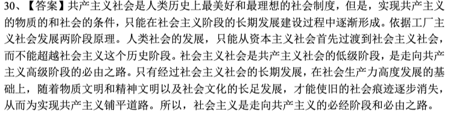

社会主义—作用——极大解放生产力

 

#### !#2马克思主义—介绍，组成部分、内在联系；马克思主义<—德国古典哲学的继承、创新

(1)介绍

马克思主义——关于全世界无产阶级和全人类彻底解放的学说。

**组成**：马克思主义**哲学**、马克思主义**政治经济学**、**科学社会主义**。

**内在联系**：

**哲学(指导)——世界观、方法论指导**；

政治经济学(现实)——实际生活的中介；

**—>科学社会主义(结论)**——运用哲学分析经济事实的结论。

互相渗透、互相弥补；构成统一的马克思主义学说。

(2)马哲 德国古典哲学——继承—>改良

**黑格尔 辩证法**——继承：辩证法；抛弃：唯心主义、神秘主义——>创立：**辩证唯物主义**、**历史唯物主义**

**费尔巴哈 唯物主义**——继承：唯物主义；抛弃：形而上——>创立：**唯物辩证法**

#### 简述马克思主义的科学内涵(内容);学习马克思主义的根本方法

(1) 

**科学内涵**——反对资本主义；建设社会主义、共产主义为目标的科学理论体系

(2) 

**学习方法——理论联系实际**

理论联系实际就是把马克思主义的基本原理作为指导，去观察和分析实际问题。

#### 真理、价值对立统一

(1) 定义

**真理**——(**认识符合事实**)认识与对象的相符合；

**价值**——(**外物满足人的需求**)外物对人需要的满足，表示某物具有对人有用或者使人愉快的属性。

(2) 统一：//对立???

第一真理——**指导社会实践，成功改造世界**，以实践的成果满足人们的需要；<u>真理的价值属性</u>

第二真理——**与正确的价值观**相一致，<u>正确的价值观</u>是在真理指导下形成的。

#### 货币的本质、职能

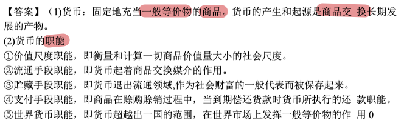 

#### !#2社会主义在探索中前进—理解

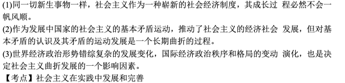 

1必然性——新生社会制度，需要接受考验

2社会基本矛盾——复杂、重新认识

3世界格局变化快

 

#### !#2社会主义发展道路是多样的

 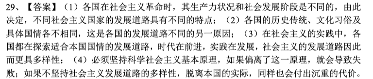

各国：

1.各国社会发展阶段不同

2.各国国情不同

**本国**：

3.必须适合本国国情

4.坚持科学社会主义

#### !**无产阶级革命**是人类历史上最广泛、最彻底、最深刻的革命

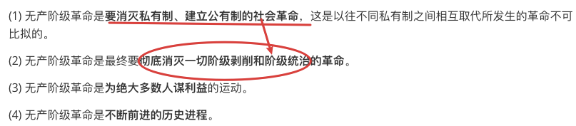

 

#### 实现共产主义是人类最伟大的事业 

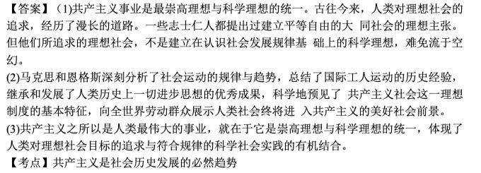

1共产主义 性质——理想、科学性 统一

2社会发展必然趋势

#### 物质、意识辩证关系—原理、意义

(1) 物质、意识——**关系：**

**物质第一性，意识第二性**；

——物质决定意识，意识对物质具有能动的反作用。

(2) **意义：**

坚持**物质决定作用**(主)——>坚持**唯物论**

承认**意识的能动作用**(辅)——>坚持了**辩证法**

反面：—割裂物质的决定作用、意识的能动作用的统一，会导致**唯心主义；形而上学物主义**的错误。

#### 全人类的认识是 有限 与 无限 的统一

 (1) 

认识的**有限性**——每个时代的**个人**每一次具体的**认识是有限的**

认识的**无限性**——**整个人类**无止境的世代更替的认识是**无限的**。

 (2) 

有限性和无限性's——**统一**

**整个人类认识的无限性**，存在于每个时代个人的认识的有限性中，并通过**无数有限性的认识 实现**。

 (3) 

有限性和无限性's——**矛盾**

只有在无限的前进过程中，在至少对我们来说实际上是**无止境的人类世代更迭中**才能得到解决。

  

#### 资本主义国家——利率调节经济how

(1) 资本主义国家的**利率调节**—通过—**利率高低(整体)、差别利率(不同企业)**实现

(2) **差别利率**——

国家对需要支持的产业或企业给予**优惠的信贷条件**，鼓励其发展；

对需要控制的产业或企业给予较**严格的信贷条件**来制约。

(3) **利率高低**(整体)——

国家**在经济过热时**，适当提高利率，给经济降温；

在**需要刺激经济发展**时，则降低利率来刺激投资和消費。

 

#### 共产主义的精神境界

(1) 在共产主义社会，人们树立了高度自觉的劳动态度，遵守社会纪律，团结互助，诚实友爱，完全从社会公共利益出发进行劳作和参加社会活动，人人都习惯于**遵守社会公共生活的基本准则**。

 (2) 在共产主义社会，人们既摆脱了封建的保守的思想观念的来缚，又摈弃了以利己主义为核心的资产阶级思想意识，树立了**以集体主义为核心的共产主义人生观、价值观和道德**。

 

#### 上层建筑 必须适合 经济基础发展 要求的规律、其现实指导意义

 (1) 

**决定**——**经济基础决定上层建筑**。经济基础决定上层建筑的产生和性质，经济基础的变化决定上层建筑的改变。

**反作用(辅助)**——**上层建筑反作用于经济基础**。这种反作用集中表现在它是为经济基础服务的。（2 分）

 (3) **规律：矛盾运动—>新基础**——经济基础和上层建筑之间的矛盾运动，使上层建筑和经济基础的发展要求之间呈现出由基本适合到基本不适合，再到新的基础上的基本适合这样一个发展过程。

 (4) 无产阶级政党路线——上层建筑必须适合经济基础发展要求的規律，是**无产阶级政党制定正确的路线**、方针、政策的理论依据。正确理解和运用这个规律，对于我国正在进行的经济体制改革、政治体制改革以及其他方面的改革，具有**重大的指导意义**。（4 分）

 

#### 商品价值量的决定；与 劳动生产率的关系

(1) **高品的价值量<—(决定)—社会必要劳动时间**。

(3) (商品价值量—劳动生产率)**关系**——单位商品的价值量，与包含在商品中的**社会必要劳动量成正比**，与生产该商品的**劳动生产率成反比**。

 

#### //如何理解—社会主义民主是人类社会最高类型的民主

1) 与以往剥削阶级占统治地位的社会中少数人的民主在性质上根本不同，**社会主义民主是绝大多数人的民主**，它的本质是人民当家作主。

 (2) 社会主义民主首先是社会主义的**国家制度**。社会主义国家是エ人阶级和广大劳动人民当家作主的国家，采取的是**民主共和国的形式**。

 (3) 社会主义民主是**目的和手段的统一**。社会主义民主是为社会主义经济基础服务的，而最终目的则是实

现人民当家作主。

 (4) 民主是具体的、历史的和**不断发展**的，**建设**高度的**社会主义民主是一个长期的历史过程**。

#### 事物发展的内因、外因；其相互关系

内因——事物的**内部矛盾**。(发展变化的 根据)

外因——事物**与他事物的相互作用**，即外部矛盾。(条件)

内因、外因关系：

**内因**是事物发展变化的**根据**，是第一位的原因：

**外因**是事物发展变化的**条件**，是第二位的原因；外因通过内因起作用。

#### !#2生产方式?  生产方式 在 社会发展 中起决定作用(原因)?

(1)

生产方式**(概念)**——人类借以向自然界谋取必需的生活资料的**方式**。

**(组成)**==生产力+**生产关系**。特定的生产力和生产关系的统一。

(2) 

生产方式在社会发展中起**决定**作用。

第一，生产方式是人类从动物界分离出来的根本动力和人类区别于动物的根本标志。

第二，生产方式是人类和人类社会得以存在和发展的基础。

第三，**生产活动**是**形成人类一切社会关系的基础**。

第四，生产方式**决定社会制度的性质和更替**。

#### !#2生产关系？生产资料所有制<——生产关系的基础？

(1) 生产关系是指**人们在物质生产过程中结成的经济关系：**

包括**生产资料的所有制形式**、**人们在生产中的地位及其相互关系**、**产品的分配方式**。

 

 (2) **生产资料的所有制**形式是整个生产关系的基础。

这是因为：

第一，它是**生产劳动**得以进行的**前提**；

第二，它**决定**整个**生产**关系—**性质**；

第三，它**决定**人们在**生产中**—**地位及其相互关系**；

第四，它**决定产品**—**分配方式**。

#### 简述商品经济产生、存在的条件

(1) 产生——商品经济是在**一定历史条件**下产生、发展和存在的。

(2)条件——商品**经济的产生、存在**需要两个基本**经济条件**：

第一个条件是**社会分エ的产生和存在**；(2 分）

第二个也是**决定性的条件**是**生产资料和劳动产品属于不同的所有者**。（2 分）

#### 正确把握科学社会主义的一般原则

(1) 必须**始终坚持**科学社会主义一般原则，反对任何背离这些原则的错误倾向。

(2) 要善于把科学社会主义一般原则**与本国实际相结合**，创造性地回答和解决革命、建设、改革中的重大问题。

(3) 要**紧跟时代和实践的发展**，在不断总结新鲜经验中进一步丰富和发展科学社会主义一般原则。

## 3论述

#### 社会 主要矛盾、次要矛盾的关系原理；其对实际工作的指导意义

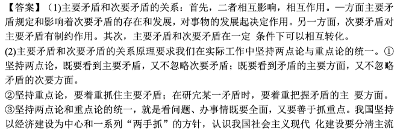

 

**社会基本矛盾**——生产力、生产关系；经济基础、上层建筑

**主要矛盾、次要矛盾**

 (1)关系、原理：

相互影响、相互作用；一定条件下相互转化

(2)指导意义：

坚持重点论——抓主要矛盾

坚持两点论(+与重点论统一)——看清主要矛盾、次要矛盾；矛盾主要面、次要面

#### 分析、评价—杰出人物—历史作用

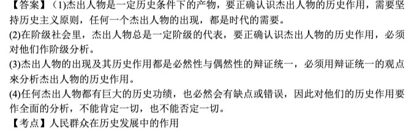

####  试述党的思想路线；说明马克思主义认识论—党的思想路线's理论基础

(1) 党的思想路线是**一切从实际出发**。

**理论联系实际**，**实事求是**，在**实践中检验和发展**真理。

(2) 马克思主义认识论是党的想路线的理论基础。主要表现在：

第一，党的思想路线坚持了一切从实际出发的原则，这是马克思主义认识论的根本要求。

第二，党的思想路线坚持了理论联系实际的原则。马克思主义认识论始终坚持理论联系实际，坚持认识与实践的统一，反对脱离实际的教条主义。

第三，“实事求是”是党的思想路线的核心，这也是马克思主义哲学及认识论的精。

第四，党的思想路线和马克思主义认识论一样，都坚梼实践是检验真理的唯一标淮，主张在实践中检验和发展真理。

#### !#3A剩余价值—生产方法

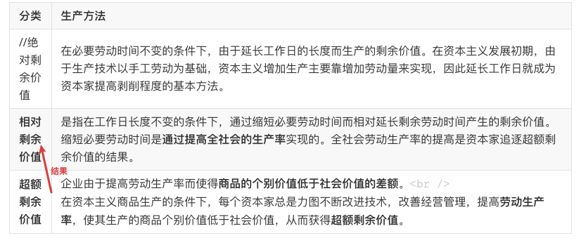

(1) 剩余价值生产==**绝对剩余价值生产**+**相对剩余价值生产**

(2) 在雇佣工人必要劳动时间不变的条件下，由于**工作日的绝对延长**而生产的剩余价值，叫作**绝对剩余价值**。

(3) 在工作日长度不变的条件下，由于**缩短必要劳动时间**，相应延长剩余劳动时间而生产的剩余价值，叫作相对剩余价值。

#### !#3A1相对剩余价值—生产过程

(1) 概念

**相对剩余价值**(概念) ——在工作日长度不变的条件下，由于**缩短必要劳动时间**、相对延长剩余劳动时间而生产的剩余价值

 (2) 过程

相对剩余价值——**生产过程**：

**缩短必要劳动时间——降低劳动力价值——>提高社会生产率**

 (3) 原理

**相对剩余价值生产**<——资本家**追求超额剩余价值**的过程中实现的。

#### 超额剩余价值—生产过程

//TODO剩余价值

(1) 超额剩余价值**(定义)**——**商品的个别价值低于社会价值的差額**

个别企业通过采用先进技术、加强管理等方法**提高劳动生产率**，使其个别劳动时间低于社会必要劳动时间，按社会价值出售商品，**资本家获得更高的剩余价值，即超额剩余价值**。

 (2) 由于**其他企业也可以通过提高劳动生产率**，使其个别劳动时间缩短、个别价值降低，因此**单个企业一般不能长期稳定地得超额剩余价值**。

#### !#2经济全球化的本质、主要内容；在20世纪80年代明显加快的原因

(1) 

概述——**世界经济活动 超越国界**，是**国际经济发展趋势**

经济全球化的**本质**——**资源配置的国际化**。——The World is flat

(2) 

**主要内容**——**生产**全球化、**贸易**全球化、**资本**全球化

(3)

**原因：**

1现代科技(**生产条件**)的进步；**国际经济联系↑**

2国际**贸易**的**自由度**提高↑；国际**资本** **流动性**大幅增加↑

#### 试述意识的<u>能动性</u>及其主要表现。在实际工作中如何正确发挥<u>人的主观能动性</u>？ 

意识的能动性：

①意识的能动作用，是指意识能动地反映客观事物，形成主观观念，并且能动地反作用与客观事物，意识的能动作用具体表现在：其一，意识活动具有创造性，其二，意识活动具有目的性和计划性，其三，意识活动对客观世界的改造作用，这是意识能动作用的最重要的表现，正确发挥意识的能动作用是有条件的，这种条件性的根本点在于，要科学把握物质和意识的辩证关系，把意识的能动作用助于物质决定论的理论基础之上，具体说其一，社会实践是发挥意识能动作用的唯一正确有效的途径，其二，要遵循客观规律，正确认识客观规律，按客观规律办事，是正确实践的前提，因而也是发挥意识能动性的前提，其三，发挥意识的能动性需要具备一定的物质技术条件。

②在任何工作、学习中，都必须以意识的能动性原理为依据，充分发挥主观能动性，这样才能深入解决工作、学习中的各种矛盾。

③在任何时候，发挥人的主观能动性必须注意客观物质条件的制约。

发挥人的主观能动性：

#### 社会历史发展 的 决定性、选择性；关系

(1)定义：

社会进步的**决定性**——**社会发展具有客观规律性**；其根本方向是**不以人的主观意志转移**的、**是必然趋势**。

社会进步的**选择性**——社会主体有意识**选择某种可能目标成为现实**。

(2) 联系：

社会进步的choice选择性和社会进步adv的决定是**1内在统一**的。

一方面，社会进步的选择性只能是在社会进步的决定性提供的多种可能性中选择，而这些可能性本身却是无可选择的；

另一方面社会进步的决定性adv<—(决定)—社会进步的选择性choice，离开了**人的有意识的活动，离开了人的自觉的选择和主观努力，社会进步决定性**就无法得到体现。

这种社会发展决定性、选择性的统一根本上讲就是**人类历史过程中客观规律**和**人的自觉活动相统一**的表现，

(3) 如果否认：(否定决定性、选择性错误的)

否认社会进步的决定性，是历史观上的唯心主义非决定论；

否认社会进步的选择性，是历史观上的机械论和宿命论，二者都是错误的。

##### PS思考—社会意识

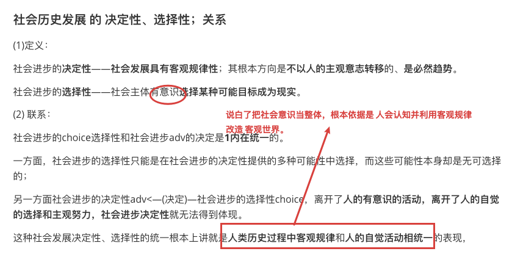

#### 量变、质变辩证关系的原理；现实意义

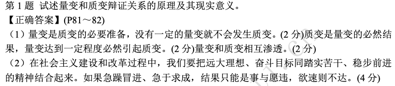

(1) 关系

量变是质变的必要准备，没有一定的量变就不会发生质变。（2 分）质变是量变的必然结果，量变达到一定程度必然引起质变。（2 分）量变和质变相互渗透。

(2) 现实意义

在社会主义建设和改革过程中，我们要把远大理想、奋斗目标同踏实苦干、稳步前进的精神结合起来。如果急躁冒进、急于求成，结果只能是事与愿违，欲速则不达。（4 分）

 

#### 资本积累的 <u>客观必然性</u>、<u>实质</u>；<u>后果</u>

(1) 在**资本主义制度下**，资本积累具有**客观必然性**：

一方面，**对剩余价值的无限追求**是资本家不断进行资本积累的内在动力：

另一方面，**竞争**作为一种强制力量，迫使资本家不断进行资本积累。

(2) 资本积累—实质

资本家用**无偿占有工人创造的剩余价值**进行资本积累来**增大资本的规模**，以便继续占有更多的剩余价值，从而占有不断增大的资本来扩大对工人的剥削和统治。

(3) 资本积累—后果

一是导致**资本有机构成提高**；

二是相对**过剩人口**的形成；

三是引起**严重的贫富两极分化**。

 

#### !#3<u>垄断资本主义</u> <u>基本经济特征</u>；其<u>发展变化</u>是怎样的? 

(1) 基本 **经济特征**

垄断资本主义**基本经济特征**——**垄断在经济生活中占统治地位**。

**发展变化** 表现——垄断程度提高，**垄断组织生产经营多样化并向国际化发展**。

(2) 金融资本和金融寡头的统治。

发展变化 表现——垄断财团实力迅速增长，经营多样化、国际化。

(3) 资本输出在经济生活中占重要地位。

其新变化主要是资本输出方向多变，国家资本输出占一定比例，出现了以“对外援助”形式输出资本的新方式。

(4) 国际垄断同盟在经济上瓜分世界，其发展变化是跨国公司和国家垄断主义的国际垄断同盟的出现和发展。

(5) 垄断资本主义列强瓜分和重新瓜分世界。其新变化是老殖民主义瓦解，各种比较缓和隐蔽的新殖民主义手法大量出现。

#### !#3垄断资本主义的基本经济特征有哪些？其当代发展的新特点，新形式是什么？ 

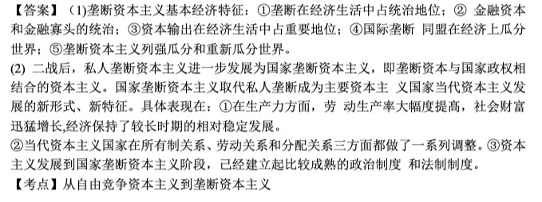 

  

#### **!#3垄断利润**的来源

(1) 垄断资本对**本国无产阶级**和其他劳动人民创造的**剩余价值**的剥削，是垄断利润的主要来源。

(2) 垄断资本通过垄断价格控制**市场**，获得非垄断企业的一部分利润。（2 分）

(3) 垄断资本通过对**其他国家**劳动人民的剥削和掠夺，能够获取来自海外的利润。（1 分）

(4) 垄断资本通过国家政权进行有利于自己的再分配，从而将**国民**收入的一部分变为己有。（1 分）

 

