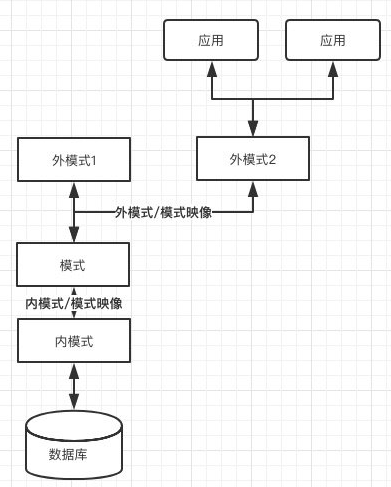

## 1. 数据库基本概念

数据库	DB

数据库系统	DBS

数据库管理系统	DBMS

关系数据库管理系统	RDBMS

数据库管理员	Database Administrator	DBA	公种，运维分支

数据库运行阶段，对数据库维护性工作由**DBA**完成

数据库系统 数据控制功能 ——**数据完整性**、**数据安全性**、**数据库并发控制**

数据库系统 数据存取路径——主存取路径（用于主键检索）、辅助存取路径(用于辅助键检索)

为提高数据存取效率——数据库管理系统需要对数据进行**分类存储**和**管理**

### DBMS的主要功能

- 数据库定义功能

- 数据库操作功能

- 数据库保护功能

- 数据库维护功能

- 数据字典

## 3. 数据库系统结构

数据独立性——应用程序与数据库的 数据结构 之间相互独立

### 数据库三级模式结构

| 模式Schema            | /概念模式/逻辑模式 数据库的核心 |
| --------------------- | ------------------------------------ |
| 外模式External Shema  | /子模式/用户模式                |
| 内模式Internal Schema | /数据物理结构/存储方式          |

### 两层映像

映像，代表一种对应规则，指映像双方如何转换。

#### 外模式/模式映像
#### 模式/内模式映像

## 4. 数据模型

### 数据特征与数据模型组成要素

#### 数据特性

数据具有静态和动态两种特性

 

#### 数据模型组成要素

1. 数据结构
2. 数据操作
3. 数据约束

### 数据模型分类

模型之间的关系：

现实世界

|抽象

↓

概念模型

|转换、组织

↓

逻辑模型

#### 概念层模型——E-R模型(主要)

**基本概念**：

1. 实体——entity——(表中的一行数据)
2. 属性——Attribute
3. 码、键——Key
4. 域——Domain——属性取值范围
5. 实体型——entity type——(表结构)
6. 实体集——entity set——(表+所有数据)
7. 联系——relation

**E-R模型图表示**

#### 逻辑层模型——关系模型(主要)

逻辑层数据模型，支撑DMS实现

分类：

- 层次模型

- 网状模型

- 关系模型

- 面向对象模型

##### 关系模型

概念——用二维表结构表示实体与实体间关系的模型，并以**二维表**格式组织数据库数据。

优点：

//todo

#### 物理层数据模型

略

