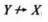
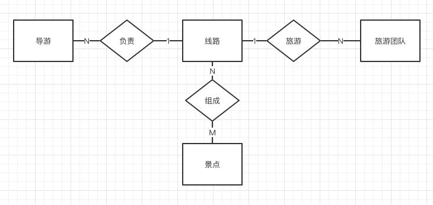

## 2. 关系数据模型


### 关系数据模型概念


**关系模型的组成==关系数据结构+关系操作集合+关系完整性约束**


### [表格]关系数据结构相关概念


| 名词           | 译                                |
| -------------- | --------------------------------- |
| 表             | Table                             |
| 关系           | Relation                          |
| 列             | Column                            |
| **属性**       | **Attribute**——表中一列<br />表中属性个数成为 关系的**元或度**<br />实体所具有的某种特性称之为属性 |
| **元组**       | **Tuple**——表中的一行             |
| **分量**       | **Component**——元组中的一个属性值 |
| **码**         | **Key**——用来表示唯一实体的属性              |
| **超码**       | **Super Key**——一个或多个属性的组合<br />可以根据属性组合找到实体集中唯一一个实体 |
| **候选码**       | **Candidate Key**——超码中最小单元，其真子集不能为超码——所有表的主键集合 |
| **主码**       | **Primary Key**——候选码中的的**一个**——单一表主键 |
| **全码**       | **All-Key**——所有属性集合       |
| **外码**       | **Foreign Key**——关系中的一个属性是另一个关系中的主码——关联其他表的主键的列 |
| **主属性**     | **Primary Attribute**             |
| 外码           | Foreign Key                       |
| 参照关系       | Referencing Relation              |
| 域             | Domain                            |
| **数据类型**   | **Data Type**                     |
| **关系模式** | **Relation Schema**<br />关系模式是type，关系是value<br />关系模式是对关系的描述，也被统称为**关系**<br />R（U，D，dom，F）——形象化表示<br />R为关系名，U为组成该关系的属性名集合，D为属性组U中属性所来自的域，dom为属性向域的[映象](https://baike.baidu.com/item/%E6%98%A0%E8%B1%A1)集合，F为属性间数据的依赖关系集合。<br />R(U)或R(A1，A2，…,An)——简记——U为属性名集合，A1，A2，…,An为各属性名。 |
| **关系数据库** | **Relation Database**             |


#### 超码、候选码、主码 区别


超码包含候选码，候选码包含主码


超码**Super Key**——一个或多个属性的组合<br />可以根据属性组合找到实体集中唯一一个实体 

**候选码**  **Candidate Key**——超码中最小单元，其真子集不能为超码——所有表的主键集合  

**主码**  **Primary Key**——候选码中的的**一个**——单一表主键


### 关系数据操作——集合


#### 关系操作——集合

关系操作 特点是**集合操作**方式，操作对象和结构都是集合。

通过关系语言实现。


#### 关系代数


##### 集合运算——元组运算/操作行


并∪、交∩、差-、笛卡尔积×


| 运算  | 表示 | 描述 |
| ---- | ---- | ---- |
| 并∪  | R3=R1∪R2 |      |
| 交∩  | R3=R1∩R2 | R3=R1∩R2=R1-(R1-R2) |
| 差-  | R3=R1-R2 |      |
|   笛卡尔积×   | R3=R1×R2 | R1 m元关系，R2 n元关系，运算结果m+n元关系 |


并、交、差运算前提——属性个数相同、属性的域相同


##### 关系运算——操作行和列


选择SELECT、投影PROJECTION、连接JOIN、除DIVISION


| 运算                           | 表示                                                         | 描述                                      |                                                              |
| ------------------------------ | ------------------------------------------------------------ | ----------------------------------------- | ------------------------------------------------------------ |
| 选择SELECT                     | $$\sigma_F$$(R)                                              | F条件表达式、R运算关系名(表)              | SQL=SELECT 关系名 WHERE 条件<br />SELECT语句                 |
| 投影PROJECTION                 | $$\pi_A$$(R)                                                 | A属性序列、R运算关系名(表)                | PROJECTION 关系名 (属性名1，属性名2，...)<br />——用于相关列展示 |
| 连接JOIN<br />($$\theta$$连接) |  | JOIN 关系名1 AND 关系名2 WHERE 条件       | XθY 为链接的条件，θ 是比较运算符，X 和 Y 分别为 R 和 S 上对应列<br />将两个关系属性满足条件的元组连接组成新的关系 |
| 除DIVISION                     | R3=R1÷R2                                                     | R1 m元关系，R2 n元关系，运算结果m-n元关系 |                                                              |


##### 选择

元组表达式：


示例：

房屋(房屋编号，小区名，租金，地区)

使用关系代数查询'万科城'小区的房屋信息：

$$\sigma_{小区名='万科城'}$$(房屋)


##### 投影


示例：

会员(会员编号，会员名，性别，所在区，联系电话)

使用关系代数查询会员的会员名和联系电话：

$$\pi_{会员名，联系电话}$$(会员)


##### 连接


示例：

职工表：EMP(ENO,ENAME,ESEX,EAGE)	职工编号，姓名，性别，年龄

项目表：PRO(PNO,PNAME,PMANEY)	项目编号，项目名称，项目预算

工资情况：SAL(ENO,PNO,SALARY)	职工编号，项目编号，职工工资


使用关系代数语言查询年龄超过40的职工编号和工资：

$$\pi _{ENO,PMANEY}(\sigma_{EAGE>40}(EMP \Join SAL))$$


##### 除


##### 数据完整性

数据完整性——**数据正确性、有效性、相容性**。即控制数据在一定范围内的有效或要求数据之间满足一定关系，保证输入到数据库中的数据满足相应的约束条件，以确保数据有效、正确。


####关系演算——元组关系演算

关系演算：

以数理**逻辑**中的谓词作为演算基础，其中元组关系演算语言——**ALPHA**

<http://cs.tju.edu.cn/faculty/zhangkl/teaching/db/chp2.pdf>


逻辑运算符

| 逻辑运算符 | 解释 | 示例 |
| ---------- | ---- | ---- |
| ∧          | 交 |      |
| ∨          | 并 |      |
| →          | 条件   |      |
| ↔          | 双条件 |      |
| T          | 恒真   |      |


谓词逻辑(一阶逻辑)

| 逻辑运算符 | 解释   | 示例 |
| ---------- | ------ | ---- |
| ∀          | 任意   |      |
| ¬          | 非     |      |
| ∃          | 存在   |      |


运算符的优先次序为：

算术比较运算符最高，
量词次之且∃高于∀ ，逻辑运算符最低且次序
为¬、∧、∨，括号中的运算符优先；


示例：

[例2] 查询年龄小于20岁的学生

{ t | Student(t) ∧ t[4] < 20}

[例3] 查询学生的姓名和所在系

{ t | (∃u) (Student(u)∧t[1]=u[1]∧t[2]=u[5]) }

[例4] 关系R和S都是二元关系，则与元组表达式

{w|(∃u) (∃v)(R(u) ∧ S(v) ∧ u[2]= v[1] ∧ w[1]=u[1] ∧ w[2] = v[2]) }等价的关系代数表达式是：

$$\pi _{1,4}( \sigma _{2,3} (R \times S))$$


### 关系模型完整性约束


保证现实世界、数据库内部的数据 正确性、相容性、一致性


1. 实体完整性约束——定义主键、候选键

2. 参照完整性约束——定义外键

3. 用户定义完整性约束——用户自定义(为空、check、触发器)


关系模式完整性约束的检验——insert、delete、update操作时对上述约束进行检验


## 3. 关系数据库规范化理论

### 关系模式存在的冗余、异常


数据冗余、更新异常、插入异常、删除异常

**数据冗余——造成数据库数据不一致的原因**


异常原因：

数据依赖——数据之间的相互依赖关系，包括函数依赖和多值依赖。


### 函数依赖与关键字


关键字——码

关键码——主键

---

函数依赖——关系中属性间的对应关系——functional dependency(FD集)。

属性X函数决定Y——X$\rightarrow$Y

属性Y不能函数决定X——


| 函数依赖性质                     | 表示                                       | 解释                           |
| -------------------------------- | ------------------------------------------ | ------------------------------ |
| 完全函数依赖                     | X$\rightarrow$Y，X’→Y<br />(X’是X的真子集) | X定义了Y                       |
| 部分函数依赖<br />(局部函数依赖) | X→Y，X’!→Y                                 | X不能定义Y                     |
| 传递函数依赖                     | X→Y(Y !→X),Y→Z                             | X经传递联系到了Z，z函数依赖于X |


FD集示例//TODO

```java
// 存在关系R
R = (司机编号、汽车牌照、形式公里、车队编号、车队主管)

//其中一种FD集表示为	//1NF
  
F = {}


```


#### 函数依赖集

定义——functional dependency(FD集)


关系模式 使用函数依赖集表示 示例：

R (订单编号，日期，客户编号，客户名称，客户电话，地址，图书编号，书名，定价，数量)

使用 函数依赖集 表示：

> 订单编号→日期，客户编号
>
> 图书编号→书名、定价
>
> 订单编号，图书编号→数量
>
> 客户编号→客户名称，客户电话，地址


F＝{A→B,B→C}


#### 函数依赖的闭包

由F中的所有FD可以推导出所有FD的集合，记为F+。


#### 最小依赖集

看着做，整合传递依赖


Fmin={A→B,B→C}


#### 根据函数依赖集 求超键、候选键、主键


求候选键 即为求 最小函数依赖


#### 写出关系模式R的基本依赖

示例：

关系模式R(日期，职工号，姓名，公众，额定工作量，本月超额)

每个职工只属于一个工种，每个工种的额定工作量唯一，每个工种的职工有多人

**基本依赖**：
职工号→姓名

职工号→工种

工种→额定工作量

(职工号，日期)→本月超额


关键码为(职工号，日期)


**判断R的范式：**

1NF，存在局部函数依赖，例如

(职工号，日期) →姓名


**将R规范到3NF**：

R1(职工号，姓名，工种)

R2(工种，额定工作量)

R3(职工号，工种，本月超额)


#### E-R图转换为关系模型


关系：

景点：景点编号、景点名称、地点、景点描述

线路：线路编号、线路名称、线路描述

导游：工号、姓名、等级

团队：团队编号、人数、开始日期、截止日期


E-R图示例：



关系模型：

景点(<u>景点编号</u>，景点名称，地点，景点描述)

线路(<u>线路编号</u>，线路名称，线路描述)

导游(<u>工号</u>，姓名，等级，线路编号)	外键：线路编号

团队(<u>团队编号</u>，人数，开始日期，截止日期，线路编号)	外键：线路编号

组成(<u>线路编号</u>，<u>景点编号</u>)	外键：线路编号，景点编号


### 范式——Normal Form


概念：

模式分解Schema Decomposition——低NF转换为高NF

规范化Normalization——模式分解的过程

局部依赖和完全依赖：对于FD  W→A，如果存在XW有X→A成立，那么称W→A是局部依赖（A局部依赖于W）；否则称W→A是完全依赖。

主属性和非主属性——如果A是关系模式R的候选键中的属性，那么称A是R的主属性；否则称A是R的非主属性。

主关键字——主码


#### 1NF——列的原子性——所有属性不可再分

#### 2NF——满足1NF，且非主属性都完全函数依赖于候选关键字。 ——

#### 3NF——满足2NF，且非主属性都不传递依赖于候选关键字 。(不依赖其他关系主键)

#### BCNF——满足3NF，且每个属性都不传递依赖于候选关键字。——满足3NF，且主属性之间没有依赖关系——解决3NF有时出现的插入、删除异常问题


#### 判断数据库遵循的范式

1NF，因为存在非主属性对码的部分函数依赖，所以不是2NF


#### 将关系模式R规范到3NF

看着做，重点为分割建立关联表


> R1(教师号，姓名，部门号)
>
> R2(部门号，部门名称)
>
> R3(科研项目编号，项目名称，项目名称，项目经费)
>
> R4(科研项目编号，教师号，担任工作，完成时间)