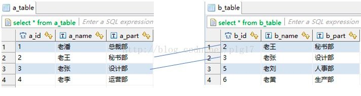
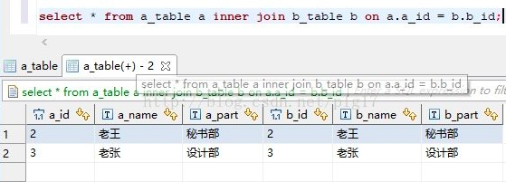
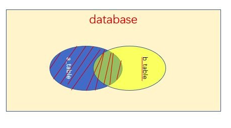
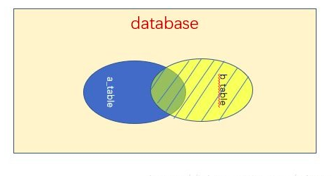

## 1. SQL概述


### SQL特点

1. SQL不是(某数据库供应商)专用语言
2. 易学
3. 功能强大


### SQL组成

1. DDL——CREATE、ALTER、DROP——Data Definition Language数据定义语言
2. DML——SELECT、INSERT、UPDATE、DELETE——Data Manipulation Language数据操纵语言
3. DCL——GRANT、REVOKE——Data Control Language数据控制语言
4. 嵌入式和动态SQL规则
5. SQL调用和会话规则


### 预处理作用

预处理是先用预处理程序对源程序进行扫描，识别出SQL语句，并处理成主语句的函数调用形式；再用主语言的编译程序把源代码编译成目标程序。

这样不用 扩充语言的编译程序就能处理SQL语句。

保证数据安全。


### 强制存取控制实现

对每个数据对象赋予一定密级，每个用户也有对应许可证级别。


## 2. MySQL


### MySQL语言要素

- 常量
- 变量
- 表达式
- 内置函数


### MySQL对象

表、存储过程、函数

```mysql
customers_test.tbl1
```


## 3. 数据定义 


### SQL数据定义包括——数据库模式定义、表定义、索引定义、视图定义


### CREATE

```mysql

# 创建表 #创建模式
# 定义主键、外键
# 定义索引
CREATE TABLE Student(
Sno INT,
Name VARCHAR(20) not NULL,
Gender CHAR(2),
Class VARCHAR(20),
Major VARCHAR(20),
Dno CHAR(2),
PRIMARY KEY(Sno),
FOREIGN KEY(Dno) REFERENCES Dept(Dno))ENGINE=InnoDB DEFAULT CHARSET=utf8;


```


#### MySQL数据类型

数值类型——INT、DOUBLE、BOOL

日期类型——DATE、TIMESTAMP、TIME

**字符串类型——CHAR(定长)、VARCHAR(可变长)**


#### 索引

索引以文件形式存储

索引关键字为INDEX或KEY，两者效果相同

```mysql

# 创建表 时 创建索引


```


#### 约束


约束保证数据完整性，索引是为了提高数据查询效率

约束种类：

- 非空约束——NOT NULL
- 唯一约束——UNIQUE ();
- 主键约束——PRIMARY KEY ();——==NOT NULL + UNIQUE
- 外键约束——FOREGIN KEY() REFERENCES()
- 自增约束——AUTO_INCREMENT
- 默认约束——default——给定默认值
- 检查性约束——check——保证列中值符合指定条件


```mysql
create table member(
   id      int(10),
   phone   int(15)  unsigned   zerofill,
   name    varchar(30)   not   null,
   constraint   uk_name   unique(name),
   constraint   pk_id     primary key (id),
   constraint   fk_dept_id   foreign key (dept_id，字段2)
   references  dept(主表1)(dept_id)
);


```


### 更新表

#### CHANGE[COLUMN]

#### MODIFY[COLUMN]

#### RENAME[COLUMN]


### INDEX


### MySQL主键列需要遵守的规则


复合主键——两个以上的列

1. 一个表只能定义一个主键
2. 主键的**值必须能够唯一标识表中每一行记录**，且不能为NULL
3. 符合主键不能包含不必要的多余列
4. 一个列名在符合主键的列表中只能出现一次


## 4. 数据更新


### 插入

#### INSERT…VALUES

#### INSERT…SET

#### INSERT…SELECT

```mysql

# INSERT VALUES 直接插入数据
INSERT INTO worker (name) VALUES (‘tom’);


# INSERT SET 直接插入数据2
INSERT INTO worker SET name=’tom’;


# INSERT SELECT 插入从其他表选择的行
INSERT INTO tbl_name1(col1,col2) SELECT col3,col4 FROM tbl_name2;


```


### 交操作

INTERSECT	交操作


### 修改数据


```mysql
# UPDATE...SET...
# 更新表
UDPATE Course SET Time=64 where Dno=’数据库系统原理’;

```


### 删除

```mysql
# 删除默认表
DROP TABLE;


# DELETE 删除表数据
DELETE FROM table_name [WHERE Clause]

# MySQL
DELETE FROM runoob_tbl WHERE runoob_id=3;

```


## 5.数据查询


### 多表查询

<https://blog.csdn.net/leshami/article/details/5563199>

```mysql
# 多个条件可以使用AND关键字连接
SELECT table1.column, table2.column
		FROM table1, table2
    WHERE table1.column1 = table2.column2;

SELECT 车号,出发地,目的地,姓名，身份证号
	FROM 车次，用户，订单
	WHERE 车次.车号=订票.车号 AND 用户.身份证号=订票.身份证号;
	
# 多表连接 #TODO


# BETWEEN使用
SELECT ENAME FROM EMP WHERE EAGE BETWEEN 30 AND 40;


```


### 内嵌查询

```mysql
SELECT column_name [, column_name ]
FROM   table1 [, table2 ]
WHERE  column_name OPERATOR
      (SELECT column_name [, column_name ]
      FROM table1 [, table2 ]
      [WHERE]);

# MySQL
SELECT * FROM 订票 
WHERE 身份证号 IN (SELECT 身份证号
FROM 用户 WHERE 姓名=’杨鸣’)
ORDER BY 订购日期 DESC;
```


### GROUP BY


### HAVING

(vs SELECT)针对GROUP BY子句添加过滤条件

```mysql
SELECT column1, column2
FROM table1, table2
WHERE [ conditions ]
GROUP BY column1, column2
HAVING [ conditions ]
ORDER BY column1, column2


# MySQL
# 订20张身份证以上进行统计
SELECT 身份证号,COUNT(*) AS 订票次数
	FROM 订票
	GROUP BY 身份证号
	HAVING COUNT (*)>20;

```


#### ORDER BY


DESC	降序

ASC	升序


### LIMIT

返回前x行记录

```mysql

# 检索记录前5行
SELECT * FROM table LIMIT 5;  


# 检索记录行 6-15
SELECT * FROM table LIMIT 5,10;  
```


### 连接

概念——相比通过SELECT FROM tbl1,tbl2...这种形式自动整合了表字段


建表语句

```mysql
CREATE TABLE `a_table` (
  `a_id` int(11) DEFAULT NULL,
  `a_name` varchar(10) DEFAULT NULL,
  `a_part` varchar(10) DEFAULT NULL
) ENGINE=InnoDB DEFAULT CHARSET=utf8;


CREATE TABLE `b_table` (
  `b_id` int(11) DEFAULT NULL,
  `b_name` varchar(10) DEFAULT NULL,
  `b_part` varchar(10) DEFAULT NULL
) ENGINE=InnoDB DEFAULT CHARSET=utf8;

```


表数据



#### 内连接

返回两个表交集部分，图中阴影部分。(形成中间表为两表笛卡尔积)

```mysql
SELECT * FROM a_table a INNER JOIN b_table b ON a.a_id= b.b_id;
```




#### 左连接

//外连接包括——左连接和右连接

左(外)连接，左表(a_table)的记录将会全部表示出来，而右表(b_table)只会显示符合搜索条件的记录。右表记录不足的地方均为NULL。

```mysql
SELECT * FROM a_table a LEFT JOIN b_table b ON a.a_id=b.b_id;
```




#### 右连接

右表的数据完全显示出来，左表显示符合搜索条件的，记录不足处为NULL

```mysql
SELECT * FROM a_table a RICHT RIGHT JOIN b_table b ON a.a_id=b.b_id;
```





#### 全连接(全外连接)

MySQL不支持


## 6.视图View


视图——(根据SQL语句)，用户查询时定义的虚表


### 视图与真实表的区别


### 视图优点

1. 集中分散数据
2. 简化查询语句
3. 重用SQL语句
4. 保护数据安全
5. 共享所需数据
6. 更改数据格式


### 创建、删除/更新/查询视图

创建、删除

```mysql 
CREATEVIEW view_name [(column_list)] AS select_statement [WITH[CASCADE|LOCAL]CHECK OPTION]

# CREATE
# WITH CHECK OPTION ，指定对视图的需改需要符合select_statement #指where子句的限定条件
CREATE OR REPLACE VIEW mysql_test.customer_view AS SELECT * FROM mysql_test_customers WHERE cust_sex='M' WITH CHECK OPTION;


# 使用视图 可选(column)

CREATE MYVIEW (ENO,ENAME) AS
	SELECT ENO , ENMAE FROM EMP WHERE ENO > 10;


# VIEW 查看视图定义
SHOW CREATE VIEW view_name;


```

更新数据

```mysql

# 插入
INSERT INTO mysql_test.customers_view VALUES(909,'周明','M','武汉','洪山区');

# 更新
UPDATE mysql_teest.customers_view  SET cust_address='上海市';
```


查询数据

```mysql
SELECT cust_name,cust_address FROM mysql_test.customers_view WHERE cust_id=905;

```


