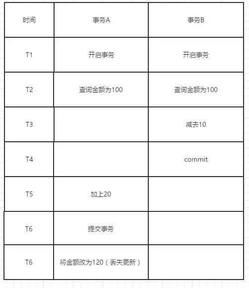

## 1. 数据库完整性

概念：

### 数据库完整性——数据库中 数据的 正确性、相容性

正确性——type正确

相容性——约束schema正确


DBMS必须提供一种功能来保证数据库中数据是正确的，避免非法的不符合语义的错误数据的输入和输出，即所谓——**垃圾进垃圾出**


### 完整性约束


作用对象——列、元组、表

类型：

####  实体完整性——主键、候选键

#### 参照完整性——外键

#### 用户定义完整性——非空、CHECK和触发器


### 命名完整性约束


```mysql

# 建立表级约束

CONSTRAINT [symbol]

# 约束创建PRIMARY KEY
 create table primary_test2
 (
test_id int not null,
test_name varchar(255),
test_pass varchar(255),
#指定主键约束名为test2_pk，对大部分数据库有效，但是对mysql无效，此主键约束名仍为PRIMARY
constraint test2_pk primary key (test_id)
 );

# 直接创建PRIMARY KEY
create table teacher_tb5
 (
t_name varchar(255),
t_pass varchar(255),
primary key(t_name,t_pass)
 );


```

### 更新命名完整性约束


```mysql
 #删除外键约束
 alter table student_tb2
 drop foreign key student_teacher_fk;
 
 #增加外键约束
 alter table student_tb2
 add foreign key(t_java) references teacher_tb2(t_id);
```


ALTER TABLE独立更新完整性约束不会删除表内容，DROP TABLE全部删除


## 2. 触发器

触发器组成——事件——条件——动作


由事件驱动的数据库对象，保护数据库完整性。

每个事件支持一个触发器，INSERT\UPDATE\DELETE 之前和之后，每个表最多支持6个触发器

创建

```mysql
CREATE TRIGGER trigger_name trigger_time trigger_event
	ON tbl_name FOR EACH ROW trigger_body

# MySQL
CREATE TRIGGER mysql_test.customers_insert_trigger AFTER INSERT 
	ON mysql_test.customers FOR EACH ROW SET @str='one customer added!'


```


### INSERT触发器

可以引用NEW虚拟表进行操作


### DELETE触发器

可以引用OLD虚拟表进行操作


### UPDATE触发器

可以引用OLD访问update之前的数据；引用NEW访问update之后的数据

```mysql

CREATE TRIGGER mysql_test.customers_update_trigger BEFORE UPDATE
	ON mysql_test.customers FOR EACH ROW
	SET NEW.cust_addr=OLD.cust_contact;

```


## 3. 权限控制


### 用户管理

```mysql
# 创建用户
# IDENTIFIED BY 为明文密码
# IDENTIFIED BY PASSWORD 为散列密码，通过如下语句获得
SELECT PASSWORD(456);


CREATE USER 'zhangsan@localhost' IDENTIFIED BY '123',
	'lisi@localhost' IDENTIFIED BY PASSWORD
	'*1913820398HHIO124999IIOJOI12';

# 删除用户
DROP USER lisi@localhsot;

# 修改用户账户
RENAME USER 'zhangsan@localhsot' TO 'wangwu@localhsot';

# 修改密码
SET PASSWORD FOR 'wangwu@localhsot' PASSWORD(123);
SET PASSWORD FOR 'wangwu@localhsot' ='*1913820398HHIO124999IIOJOI12';


```


### 权限管理


```mysql
# 创建权限
# privilege 包括ALL\SELECT\INSERT\UPDATE\DELETE\ALTER\INDEX\REFERENCES等
# object_type 表示对象类型，使用TABLE\FUNCTION\PROCEDURE标识
# privilege_level 包括列权限、表权限、数据库权限、用户权限，对应privelege不同
# WITH GRANT OPTION 用户授予其他用户权限或其他用户删除权限

GRANT privilege,[privilege],.. 
	ON [object_type]privilege_level 
	TO user [IDENTIFIED BY password]
[REQUIRE tsl_option]
[WITH [GRANT_OPTION | resource_option]];

# MySQL

GRANT SELECT (cust_id,cust_name)
	ON mysql_test.customers
	TO 'zhangsan@localhost';
	
	
# 权限的转移GRANT WITH GRANT OPTION
# 允许将zhou用户的权限赋给其他用户
GRANT SELECT,UPDATE
	ON mysql_test.customers
	TO 'zhou@localhost' IDENTIFIED BY '123'
	WITH GRANT OPTION;


# 撤销权限
REVOKE   privilege_type [(column_list)]      
        [, priv_type [(column_list)]]...
ON [object_type] privilege_level
FROM user [, user]...


```


#### 用户修改数据库模式权限

索引Index权限、资源Resource权限、修改Alteration权限、撤销Drop权限

## 4. 事务并发控制


### 事务

用户定义的完整工作单元

BEGIN TRANSCATION ——定义事务

COMMIT——提交事务

ROLLBACK——事务回滚

```mysql
BEGIN TRANSACTION
	read(A);
	A=A-S;
	if(A<0) ROLLBACK;
	else{read(B);
			 B=B+S;
			 write(B);
			 COMMIT;}

```


#### 事务的特征ACID


Atomic原子性——不可分割

consistency一致性——事务满足数据库完整性约束，且执行完成后由一个一致性变为另一个一致性(数据库之间一致)

isolation隔离性——事务之间彼此独立

durability持续性（持久性）——对数据库的改变是永久的


```mysql
# 事务编写示例

```


### 并发带来的问题

产生原因——破坏了事务隔离性


**并发带来的问题——丢失更新、脏读、不可重复读**


丢失更新——事务T1 T2同时读取数据，T2的修改结果丢失——解决：乐观锁

脏读——T2事务未提交，T1读取到T2的数据

不可重复读——T2对数据修改，T1读取结果不一致

幻读——T2对数据插入和删除，T1读取结果不一致


<https://www.jianshu.com/p/d8bc0a843dd0>

不可重复读示例：




### 封锁——并发控制


封锁技术用来解决并发问题

lock锁是一个与数据项相关的变量，锁描述了该数据项的**状态**


排他锁exclusive lock——x锁——写操作

共享锁shared lock——S锁——读操作——锁可以共享


#### X锁与S锁如何协调

如果事务对数据加S锁，礽允许其他事务再加S锁；

但在数据所有S锁接触之前不允许任何事务对数据加X锁


//遵循两段锁协议的任何并发调度都是**可串行化**的


#### 锁的粒度

粒度细，并发性大，软件复杂度和系统开销越大


### 锁级别//TODO


### 死锁与活锁、饿死——锁技术带来的问题


活锁——事务一直等待(拿到资源不释放)

死锁——两个事务互相占用对方锁

饿死——事务一直等待(事务A让其他事务先行执行)

阻塞


#### 可串行性

可串行性——事务可以串行调度——并发执行的正确性标准


#### 两段锁协议


## 5. 备份和恢复//TODO


```mysql
# 备份

SELECT *INTO OUTFILE 'file_name' export_options
	|INTO DUMPFILE 'file_name'

# 恢复
LOAD DATA INFILE 'file_name.txt'
	INTO TABLE tbl_name
	[FIELDS
  	[TERMINATED BY 'string']
    [[OPTIONALLY]ENCLOSED BY 'char']
    [ESCAPED BY 'char']
  ]
  [LINES
  	[STARTING BY 'string']
    [TERMINATED BY 'string']
  ]

```


### 恢复


### 检查点主要思想

在DBS运行时 ，DBMS定时设置检查点。在检查点时刻在真正做到把DB的修改写到磁盘，并在日志文件上写入一个检查点。DB恢复时，只有那些在检查点后面的事务需要恢复。


### DBMS恢复子系统

DBMS的恢复子系统采取一系列措施保证在任何情况下保持事务的原子性和 持久性

//实现事务的持久性，事务出错时及时恢复