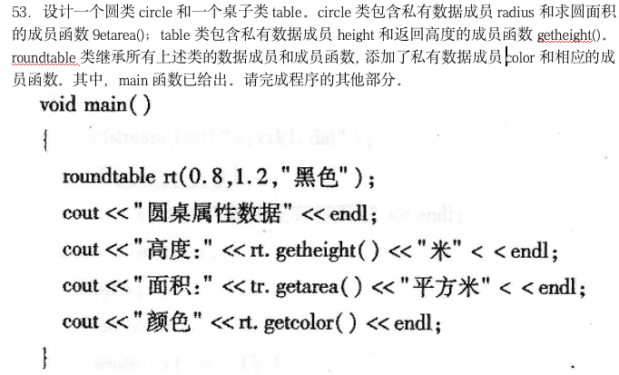

## step0-整理思路

1.**整理知识点**

知识点位置：

​	Devonthink

​	xmind

​	typora


2.**补充漏题**


3.**make cheatsheet**


## 1知识点整理-CH

//整理方法——对**不熟练部分加粗**


### C++关键字


### CH1

#### 语法

const

**类实现区别**——new、ClassA a(xxx)


#### STL

数组——**反转**、复制、排序、——#include \<algorithm>

数组——降幂、检索——#include \<functional>

​		

### CH2


#### 语法

结构——>类
	抽象、封装、继承、多态


#### STL

\#include<string>
\#include <algorithm>
5C++标准class(注:**小写**)
	string对象
	complex对象
	数组、泛型


#### //题


### CH3


​	

### CH4

​	

### CH5

​	

### CH6

​	

### CH7

​	

### CH8

​	

### CH9

​	

### CH10

​	


## !2补充

### 头文件、域

stdio——C输入、输出

iostream——C++


### float、double数据类型


### 指针、引用区别

(1)指针：指针是一个变量，只不过这个变量存储的是一个地址，指向内存的一个存储单元；而引用跟原来的变量实质上是同一个东西，只不过是原变量的一个别名而已。如：

int a=1;int *p=&a;

int a=1;int &b=a;

上面定义了一个整形变量和一个指针变量p，该指针变量指向a的存储单元，即p的值是a存储单元的地址。

而下面2句定义了一个整形变量a和这个整形a的引用b，事实上a和b是同一个东西，在内存占有同一个存储单元。


### 类

#### 内联函数

inline关键字

```cpp
inline int max(int a, int b)
{
    return a > b ? a : b;
}1234
```

则调用：`cout << max(a, b) << endl;`

在编译时展开为：`cout << (a > b ? a : b) << endl;` 从而消除了把 max写成函数的额外执行开销。

**限制**：

循环语句、switch 语句的函数不能说明为内联函数外，其他函数都可以说明为内联函数。

**适用情况**：

使用内联函数可以**提高程序执行速度**

**不适用**：

**函数体语句多**，则会增加程序代码的大小。


#### 友元函数


#### 静态成员

静态数据成员——类外**定义**；类外初始化

静态成员函数——


#### 构造函数、析构函数

构造函数——可以重载

析构函数——不可重载


### 方法、函数；区别

//方法==(类)成员函数//只有C++有成员函数这个概念

1.一个**方法**（method）会隐私的传递调用该方法的对象。

例如：在Java非静态方法中可以使用this关键字

2.一个方法可以可以处理包含在一个类里面的数据（记住一个对象是一个类的实例）

例如：在Java的方法中，可以调用静态的变量，这些是属于类的数据而非某个对象。

通俗一点来说：方法J就是面向对象版的函数


### 模板定义;模板函数、模板类


### 多态性—>虚函数、纯虚函数、虚基类


#### 多态性

C++ 多态意味着调用成员函数时，会根据**调用函数的对象的类型来执行不同的函数**。

——解决**函数名二义性**


#### 虚函数(多态性)—>动态联编

**虚函数的定义要遵循以下重要规则**：

　　1.如果虚函数在基类与派生类中出现，仅仅是名字相同，而形式参数不同，或者是返回类型不同，那么即使加上了virtual关键字，也是不会进行滞后联编的。

　　2.只有类的成员函数才能说明为虚函数，因为虚函数仅适合用与有继承关系的类对象，所以普通函数不能说明为虚函数。

　　3.静态成员函数不能是虚函数,因为静态成员函数的特点是不受限制于某个对象。

　　4.内联(inline)函数不能是虚函数，因为内联函数不能在运行中动态确定位置。即使虚函数在类的内部定义，但是在编译的时候系统仍然将它看做是非内联的。

　　5.构造函数不能是虚函数，因为构造的时候，对象还是一片未定型的空间，只有构造完成后，对象才是具体类的实例。


**动态联编**

实现动态联编首先要有继承性，并且要求建立子类型关系，其次，一个重要的条件就是虚函数，继承是动态联编的基础，虚函数是动态联编的关键。


#### 纯虚函数

```C++
class Shape {
   protected:
      int width, height;
   public:
      Shape( int a=0, int b=0)
      {
         width = a;
         height = b;
      }
      // pure virtual function
      virtual int area() = 0;
};
```


#### 虚基类

子类中只包含一个该虚基类的备份。——**解决继承二义性**

```C++

class CBase { }；
class CDerive1：virtual public CBase{ }；
class CDerive2：virtual public CBase{ }；
class CDerive12：public CDerive1，CDerive2{ }；
则在类CDerive12的对象中，仅有类CBase的一个对象数据
```


## !3特定题目


### 选择


### 程序填空


### 程序设计




