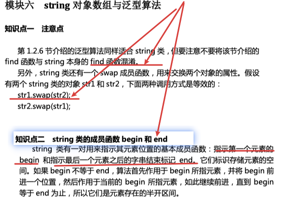

## 结构——>类

类

​	抽象、封装、继承、多态

### 补充

#### 类图、对象图

##### 类图

##### 对象图

//可能存在多个类图

## 5C++标准class

C++标准class

​	string对象
​		string对象数组、泛型
​	complex对象

### #include\<string>对象

### #include\<complex>复数

