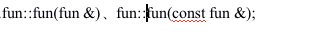
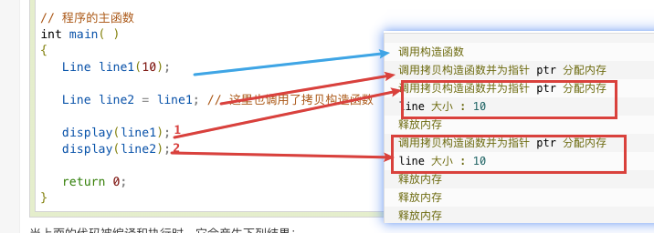
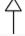
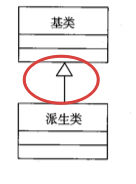
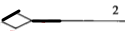
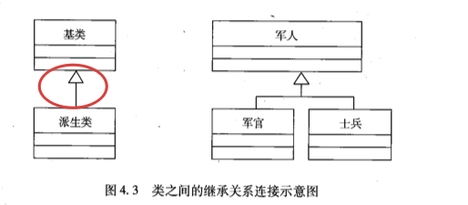
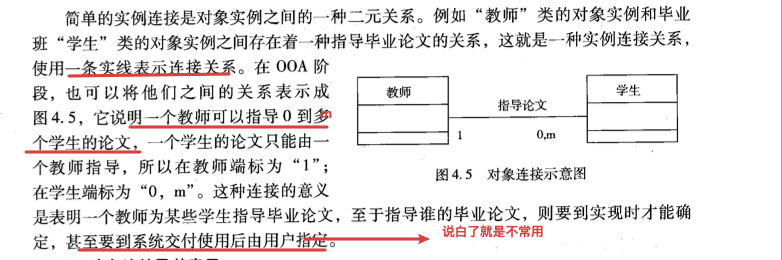

## step1-tag-all

Version2；

+类组成

构造函数、析构函数
	析构函数
	4.**拷贝构造函数**
9.UML
	类、对象
	对象结构；连接
	使用实例
	对象、类；消息


----

构造函数、析构函数
	析构函数
	4.**拷贝构造函数**
9.UML
	类、对象
	对象结构；连接
	使用实例
	对象、类；消息


## 类成员、对象成员初始化

### 类成员

要点：

- 数据成员+成员函数
  //实质是类变量+类函数
- 先声明再定义——（构造、析构）声明**无需声明返回值(类名)**


类(成员函数)先声明 再 定义

```C++
#include <iostream>
 
using namespace std;
 
class Line
{
   public:
      int getLength( void );
      Line( int len );             // 简单的构造函数
  //——————Look here——————
      Line( const Line &obj);      // 拷贝构造函数
      ~Line();                     // 析构函数
 
   private:
      int *ptr;
};
 
// 成员函数定义，包括构造函数
Line::Line(int len)
{
    cout << "调用构造函数" << endl;
    // 为指针分配内存
    ptr = new int;
    *ptr = len;
}
 
//——————拷贝构造函数——————
Line::Line(const Line &obj)
{
    cout << "调用拷贝构造函数并为指针 ptr 分配内存" << endl;
    ptr = new int;
    *ptr = *obj.ptr; // 拷贝值
}
 
Line::~Line(void)
{
    cout << "释放内存" << endl;
    delete ptr;
}
int Line::getLength( void )
{
    return *ptr;
}
 
void display(Line obj)
{
   cout << "line 大小 : " << obj.getLength() <<endl;
}
 
// 程序的主函数
int main( )
{
   Line line(10);
 
   display(line);
 
   return 0;
}
/**
*result:
*调用构造函数
*调用拷贝构造函数并为指针 ptr 分配内存
*line 大小 : 10
*释放内存
*释放内存
*/
```


### 对象成员初始化//TODO

new；();=；区别


## 构造函数、析构函数

### 4.copy构造函数

https://www.runoob.com/cplusplus/cpp-copy-constructor.html

概念

- 具有单个形参，该形参（常用**const**修饰）是对该类类型的引用。

它在创建对象时，是使用**同一类中之前创建的对象**来**初始化新创建的对象**。

- **声明方式**——//示例类名为fun




#### 1特性

##### 1copy初始化总是调用copy构造函数

直接初始化 **int a(5);** 拷贝初始化 **int a = 5;**

//理解**总是**这个概念，——1.1对copy构造函数**对象进行操作时也会调用拷贝构造函数**

```c++
A x(2);　　//构造函数
A y = x;　　//拷贝初始化，调用拷贝构造函数
```


#### 2使用场景

- （1）一个对象以值传递的方式传入函数体
- （2）一个对象以值传递的方式从函数返回
- （3）一个对象需要通过另外一个对象进行初始化。

**必须**定义copy构造函数**场景**：

只包含类类型成员或内置类型（但不是指针类型）成员的类，无须显式地定义拷贝构造函数也可以拷贝；有的类有一个数据成员是指针，或者是有成员表示在构造函数中分配的其他资源，这两种情况下都必须定义拷贝构造函数。


特性1+2示例：

```C++
#include <iostream>
 
using namespace std;
 
class Line
{
   public:
      int getLength( void );
      Line( int len );             // 简单的构造函数
  //——————Look here——————
      Line( const Line &obj);      // 拷贝构造函数
      ~Line();                     // 析构函数
 
   private:
      int *ptr;
};
 
// 成员函数定义，包括构造函数
Line::Line(int len)
{
    cout << "调用构造函数" << endl;
    // 为指针分配内存
    ptr = new int;
    *ptr = len;
}
 
//——————拷贝构造函数——————
Line::Line(const Line &obj)
{
    cout << "调用拷贝构造函数并为指针 ptr 分配内存" << endl;
    ptr = new int;
    *ptr = *obj.ptr; // 拷贝值
}
 
Line::~Line(void)
{
    cout << "释放内存" << endl;
    delete ptr;
}
int Line::getLength( void )
{
    return *ptr;
}
 
void display(Line obj)
{
   cout << "line 大小 : " << obj.getLength() <<endl;
}
 
// 程序的主函数
int main( )
{
   Line line(10);
 
   display(line);
 
   return 0;
}
/**
*result:
*调用构造函数
*调用拷贝构造函数并为指针 ptr 分配内存
*line 大小 : 10
*释放内存
*释放内存
*/
```


1.1对copy构造函数**对象进行操作时也会调用拷贝构造函数**

```C++

#include <iostream>
 
using namespace std;
 
class Line
{
   public:
      int getLength( void );
      Line( int len );             // 简单的构造函数
      Line( const Line &obj);      // 拷贝构造函数
      ~Line();                     // 析构函数
 
   private:
      int *ptr;
};
 
// 成员函数定义，包括构造函数
Line::Line(int len)
{
    cout << "调用构造函数" << endl;
    // 为指针分配内存
    ptr = new int;
    *ptr = len;
}
 
Line::Line(const Line &obj)
{
    cout << "调用拷贝构造函数并为指针 ptr 分配内存" << endl;
    ptr = new int;
    *ptr = *obj.ptr; // 拷贝值
}
 
Line::~Line(void)
{
    cout << "释放内存" << endl;
    delete ptr;
}
int Line::getLength( void )
{
    return *ptr;
}
 
void display(Line obj)
{
   cout << "line 大小 : " << obj.getLength() <<endl;
}
 
// 程序的主函数
int main( )
{
   Line line1(10);
 
   Line line2 = line1; // 这里也调用了拷贝构造函数
 
   display(line1);
   display(line2);
 
   return 0;
}
```




2使用场景//TODO


## 9.UML

类、对象
对象结构；连接
使用实例
对象、类；消息


### step2-总结-符号

| UML元素          | 符号                                                         | 图示                                                         |
| ---------------- | ------------------------------------------------------------ | ------------------------------------------------------------ |
| 类、对象表示     | //                                                           |  |
| (类)继承         |  |  |
| (对象)-聚合-聚集 |  |  |
| (对象)-聚合-组合 |  |                                                              |


### 类、对象

要点：

1分为短式、长式

2对象：类，表示区别，在名字上


### 类关系、对象关系

要点：

类

​	派生类—继承—>基类**——** **三角** $\Delta$ **箭头** 

对象

​	类关联多个类——概念：多关系；**聚集**——

​	类——概念：一对一关系；**组合**——

#### 类关系(继承)



#### 对象关系

​	聚集——空心菱形

​	组合——实心菱形


#### //不常用

实例连接




消息连接


实例

即 基类、继承类 连接多种表型形式


