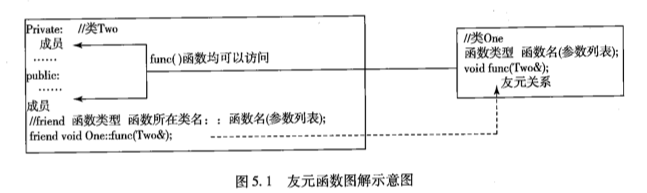
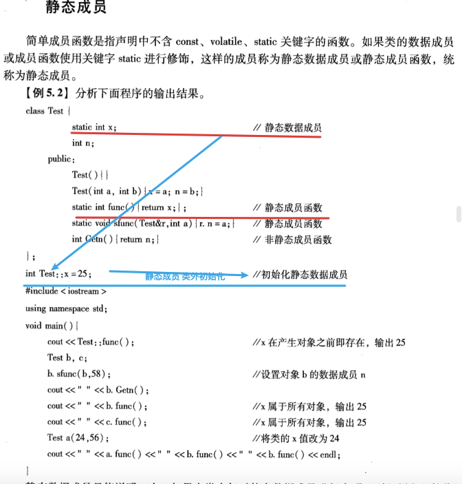
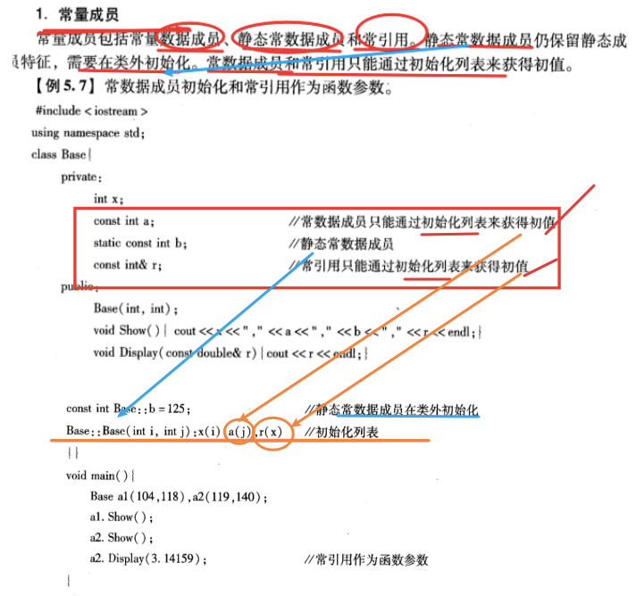

## step1-tag-all


Version2：

——做题获得

类成员——==成员函数、成员变量
友元函数
//其他
	const对象
	指向类成员函数的指针

+const、static区别


---

——做题获得

类成员——==成员函数、成员变量
友元函数
//其他
	const对象
	指向类成员函数的指针


## 成员函数


## 友元函数

### 友元函数

声明：


特点：


适用场景：





### const对象


## 补充——static成员、对象；const成员、对象

//声明；适用场景


名词：

类成员——类数据成员；(或)类成员函数


#### static、const区别

**\#define**

\#define和那两个都不一样，它属于宏，是预处理器的一部分。预处理是在编译之前的一道，简单地进行字符串替换。它不按照语言的语法，而是直观自己的语法。你#define里面写的东西会被简单粗暴地塞进去：

```C++
#define FuckTwice fuck fuck

FuckTwice;

/**
*result:
*fuck fuck;
*/
```

编译器会感觉你写了一个变量，名字是fuck，类型是fuck。


**static**静态
static很讨厌，有三个个完全不同的含义：


**const**常量


#### static成员




#### const成员




