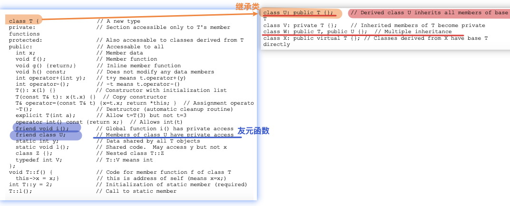

## step0-做题

## Sstep1-tag-all

派生类(继承) 概念
二义性；支配规则
	作用域分符和成员名限定
	派生类支基类的同名函数
典型问题
	派生类没有使用基类的数据成员
	派生类支基类的同名函数
	二义性
	友元和派生类

Notes：

**二义性**——派生类继承多个基类，基类A、基类B有同名函数——>解决：作用域分辨符"::"+成员名

示例：

1**解决二义性示例**——

## Inherite

