## //0调研


### 0where？

洛谷


### 库

\#include  <iostream>

数组ー一*反转林、复制、排序、一\# include <algorithm>

数组--降幂、检索一-# include <functional>

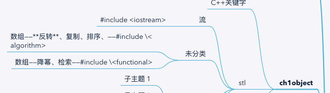

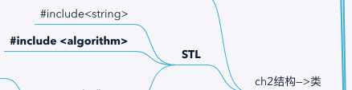


## 1Core


### //resources

1ch1_C++primer5th——2第一章_C++ Primer 第五版（习题集)

3github_cheatsheet

https://github.com/lerenhua/c_Primer_Plus_exercise

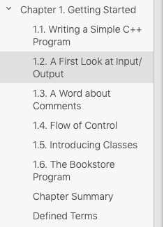


### 0编辑

GNU

命令 -o——>指定文件名

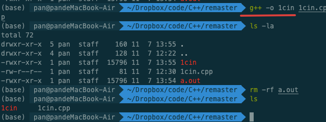


### //1cin、cout——Q1-8


2个数字相乘

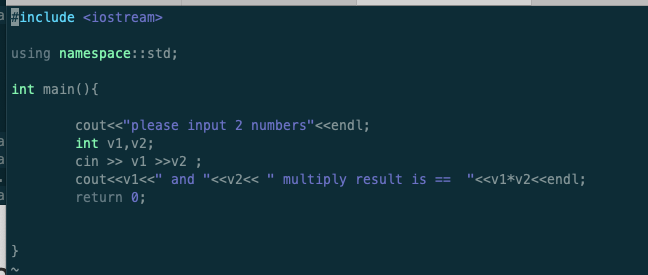


#### cin

```C++
//1无需endl；

cin>>xx1>>xx2;	


//-----------------------------------

/**
//0对比
cin>>ch——不计入空格
cin.get(ch)——统计空格、制表符\t、换行符\n
---
cin.getline()   // 接受一个字符串，可以接收空格并输出

**/

//cin>>ch
//循环输入ch
//ctrl+z	EOF//ctrl+d	mac	EOF
    while (cin >> ch) {
        all++;
        if (ch == 'a' || ch == 'e' || ch == 'i' || ch == 'o' || ch == 'u')
            counts++;

        if(all>10)
            break;
    }


//cin.get(ch)
//区别


```


### 2flow_control/conditional_statements—while|for、if|switch


#### while、for

for——适合循环已知

while


#### if、switch

##### switch

可连用

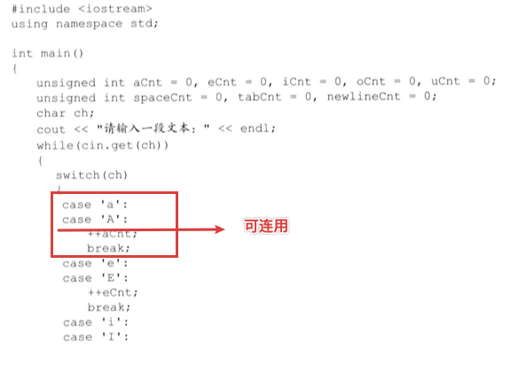


#### //-1quiz_location

ch1_Q1.9-19

ch5.3_Q5.4-13

#### //0junk//quiz_ch1

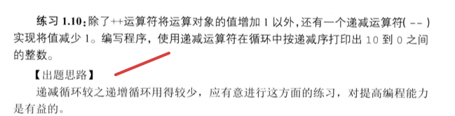

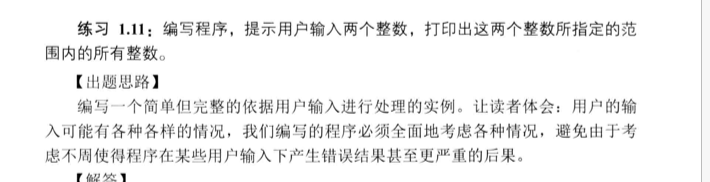

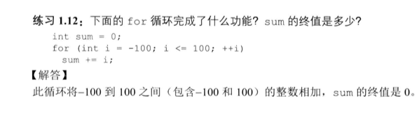

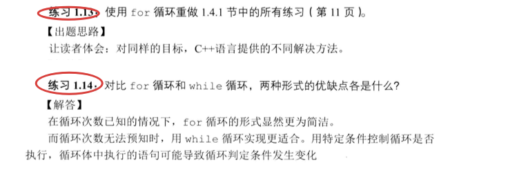


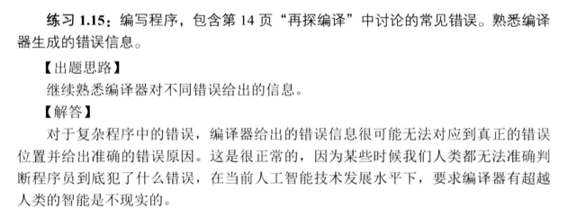


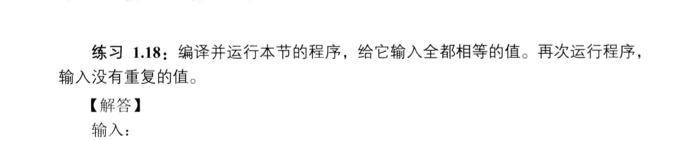

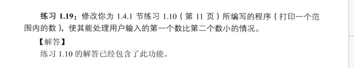

#### //0junk//quiz_ch5.3

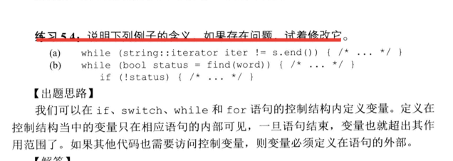

a迭代器使用错误；先x.begin()——x.end()

```
String: iterator iter=s.begin (); 
while  (iter! =s.end ()

++lter:
```

b bool变量定义在外部

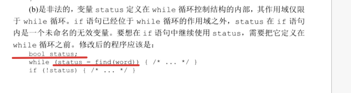


---


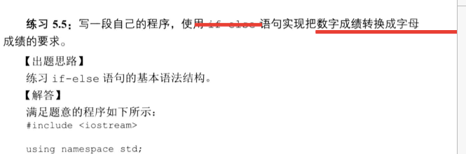

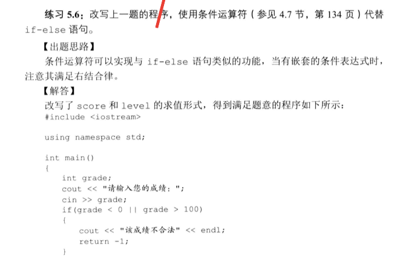

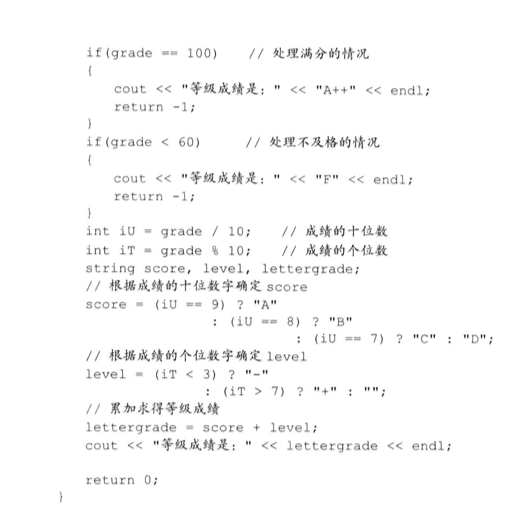

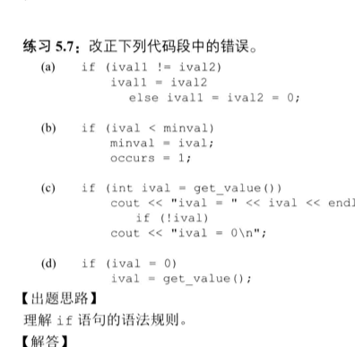

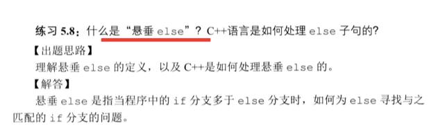

元音字母

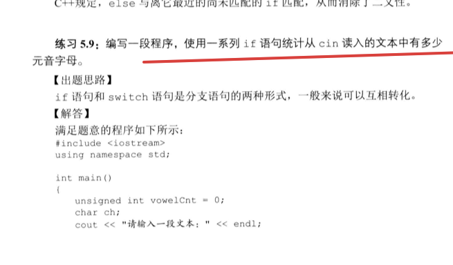

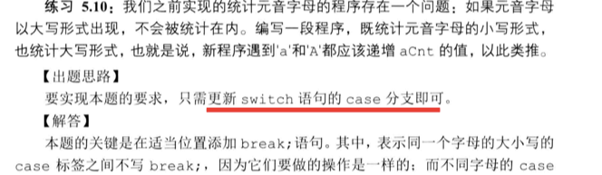

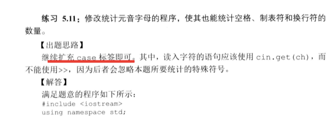

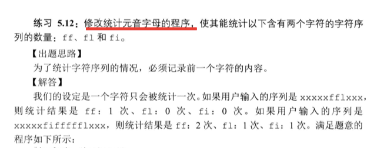


编程错误

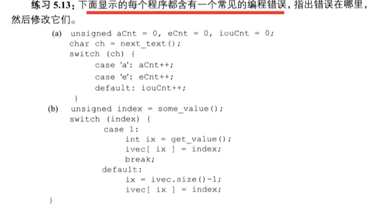

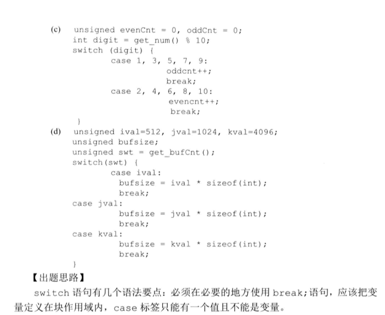


### +ClassesTODO


## 2基础


### //+复合类型<—类型


Any type that is not a [fundamental type](https://en.cppreference.com/w/cpp/language/types) (a type in the core language) is a compound type.

**Fundamental types**: void, nullptr_t, bool, integer/character/floating-point types, ranges (C++20)
Compound types: All other types

Another way to think about this is that an object is a **compound type** if you have to use another type when writing it's declaration:

```cpp
std::vector<T> myVec; // type T used in type std::vector<T> => compound
int* myPtr; // type int used in type int* => compound
double myVal = 10.3; // double is a fundamental type => fundamental
double& myRef = myVal; // type double is used in type double& => compound
```


### 3.1Arrays

C++primer_5th_ch3.5——Q3.27-37


#### 本质

Arrays——container——下标访问(**有序**)——**定长**//better perfomance

Vector——														——非定长


要求：

**维度**——1大于0;2常量(表达式)


Ex：

```c++
//多种类型
int iArray[10]={0};
char cArr[10]={0};

//------------------
//初始化(未赋值)——>*存在全局、局部变量 初始化 区别
//string——空串
//int——0
  
  
  
  
  
```


**3. 5.1. Defining and Initializing Built-in Arrays**

3.5.2. Accessing the Elements of an Array

**3.5.3. Pointers and Arrays**

3.5.4. C-style Character Strings

3.5.5. Interfacing to Older Code


#### 字符数组


#### //0junk//quiz_ch3.27-37

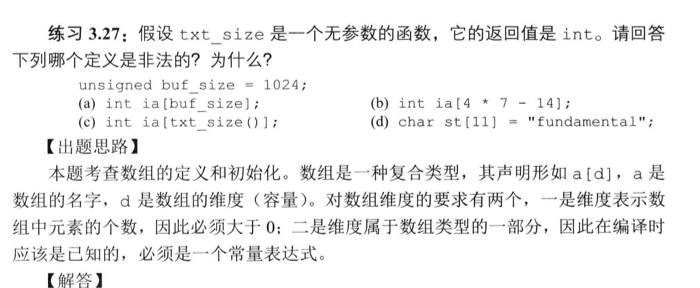


### 3.2.Arrays—Multidimensional Arrays


codes://TODO

Initializing the Elements of a Multidimensional Array

Subscripting a Multidimensional Array

Using a Range for with Multidimensional Arrays

Pointers and Multidimensional Arrays

#### 定义、赋值

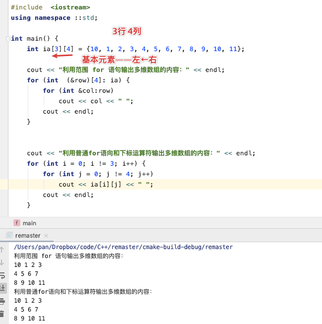

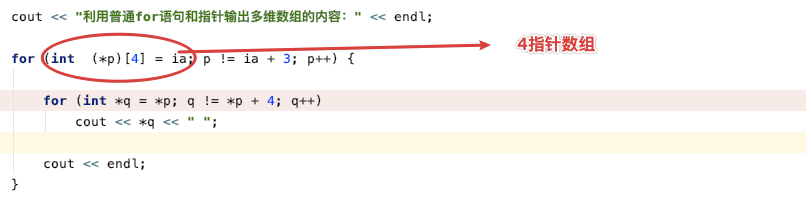

——>使用auto版本

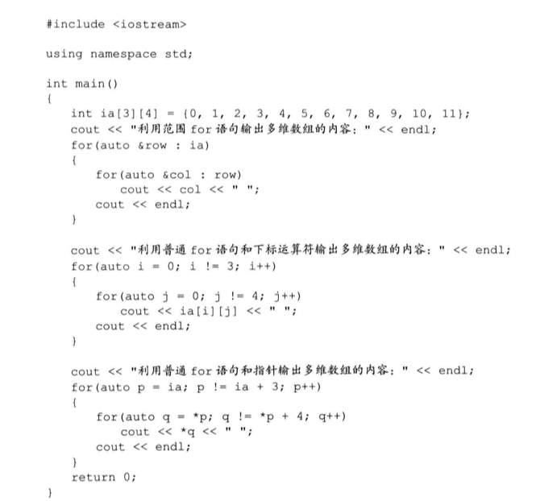


#### feature

```C++
/**
 * 1Array vs Vector
a——>Array2Vec——Array(defined)—>vector
b——>Vec2Array——iterator...
// Array直接初始化Vector对象
// 3.41: 编写一段程序，用整型数组初始化一个 vector 对象
 * */

#include  <iostream>
#include  <vector>
#include  <ctime>
#include  <cstdlib>

using namespace ::std;

int main() {
    const int sz = 10; //常量 sz 作为数组的维度


    //------------------
    //1define array
    int a[sz];

    srand((unsigned) time(NULL)); //生成随机数种子

    cout << "array：" << endl;

//利用范固 for 循环遍历数组的每个元素

    for (auto &val :a) {
        val = rand() % 100;
        cout << val << " ";
    }

    cout << endl << "vector:" << endl;

    //2to vector

    vector<int> vInt(begin(a), end(a));

    for (int i = 0; i < 10; i++)
        cout << vInt[i] << "  ";

    cout << endl;
}

```


#### //0junk//quiz_ch3.41-45

41编程序

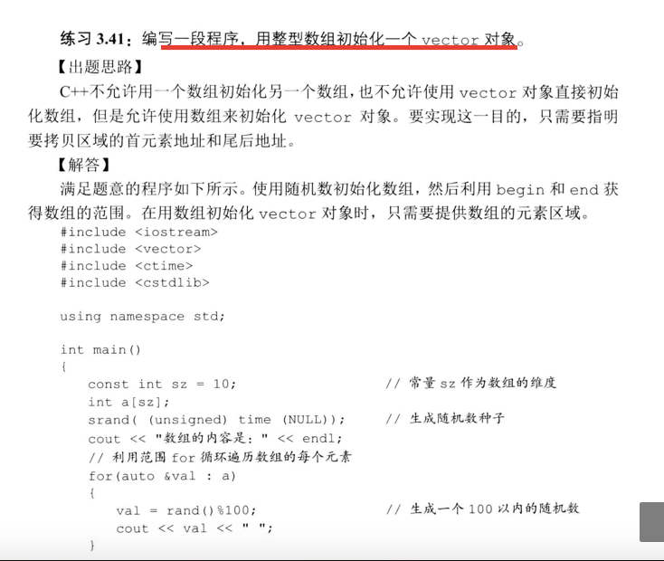

——>45,改写41程序


### 3.3.Arrays—Algorithm//TODO

The C++ Standard Library_ A Tutorial and Reference-Addison-Wesley Professional (2012)


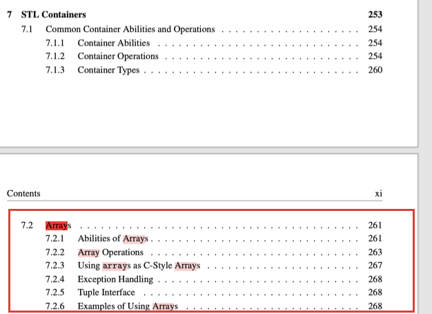


## 2Quest

### 1io输入、输出——cin、cout

### 2conditional结构——顺序、选择、循环

//what结构//TODO？

### 3array数组——一维、二维;(定义、初始化|赋值)


### 4字符数组


### 5数组——算法


## +3feature


### static、const

//声明；适用场景


名词：

类成员——类数据成员；(或)类成员函数


#### static、const区别

**\#define**

\#define和那两个都不一样，它属于宏，是预处理器的一部分。预处理是在编译之前的一道，简单地进行字符串替换。它不按照语言的语法，而是直观自己的语法。你#define里面写的东西会被简单粗暴地塞进去：

```C++
#define FuckTwice fuck fuck

FuckTwice;

/**
*result:
*fuck fuck;
*/
```

编译器会感觉你写了一个变量，名字是fuck，类型是fuck。


**static**静态
static很讨厌，有三个个完全不同的含义：

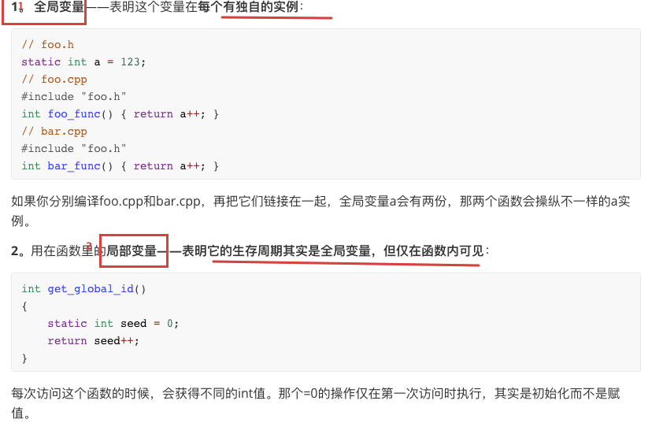


**const**常量


#### static成员


#### const成员


