## index


### 考纲


**类**

​	类定义、实例化

​	成员

​		**友元成员**、**静态成员**

​	函数

​		构造函数、**复制构造函数**、析构函数；

OOP

​	继承

​		公有继承（赋值兼容性）

​	**重载**

​		函数重载；运算符重载

​	**多态**

​		对象成员；虚函数多态性


### C++Primer


**Class类**<——ch7

​	feature——1ADT;

​		2访问控制、封装;

​		3adv_feature——友元

​		4scope范围

​	method函数

​		5constructorsRe

​	member成员

​		6static_class_member


OOP(多类)<——ch15

​	

多类


### //junk//resources

考纲

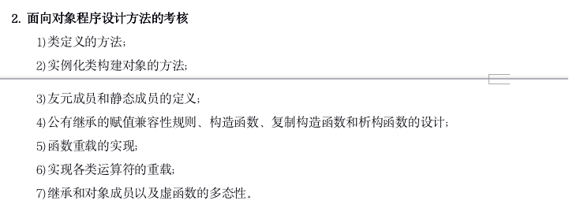

C++_Primer_ch7+ch15

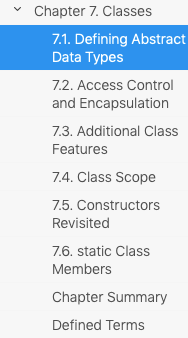


## 1类


### //价值

数据结构的C++实现

现代C++开发基于class types定义而不是build-in types


### 0feature


#### Abstract Data Types & Class


#### *friend友元


##### 概述

独立的**function**，不属于类


​	


##### *友元函数

(function、运算符)**A** 声明在类内部

A获得类private member访问权限

```C++
class Y {
    int data; // private member
    // the non-member function operator<< will have access to Y's private members
    friend std::ostream& operator<<(std::ostream& out, const Y& o);
    friend char* X::foo(int); // members of other classes can be friends too
    friend X::X(char), X::~X(); // constructors and destructors can be friends
};
// friend declaration does not declare a member function
// this operator<< still needs to be defined, as a non-member
std::ostream& operator<<(std::ostream& out, const Y& y)
{
    return out << y.data; // can access private member Y::data
}
```


实现步骤：

- 1类内声明
- 2类外实现


1

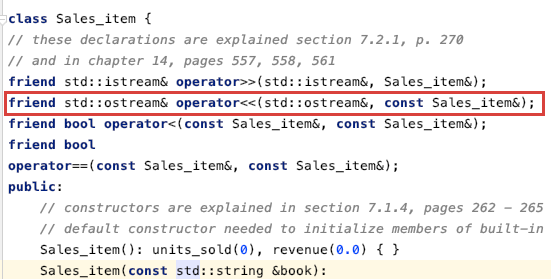

2


##### 友元类

单向性

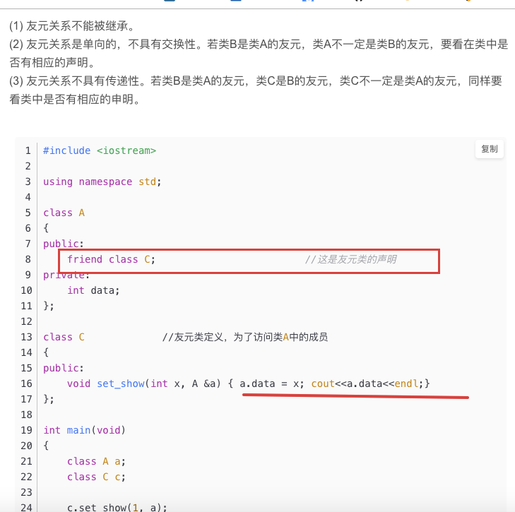


##### *友元成员函数


classA——method

classB——提供private member内容，供friend A::method()访问


作用：

成员函数访问


使用流程：

1. 定义ClassA，声明method()
2. 定义ClassB
3. 定义A::method()

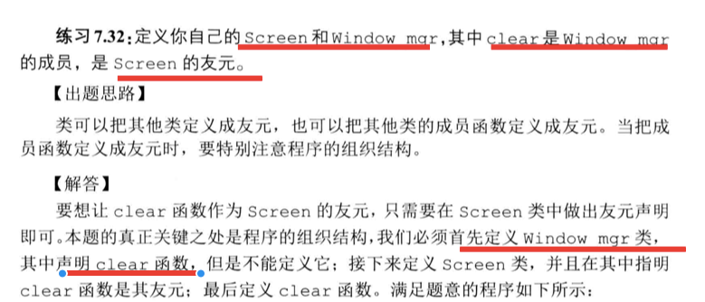

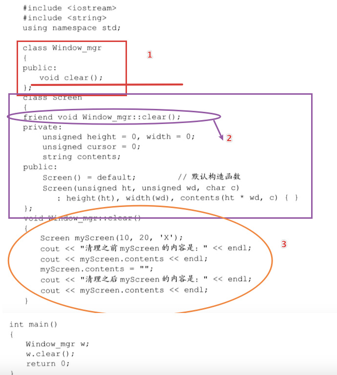


### 1member


#### static_class_member静态成员

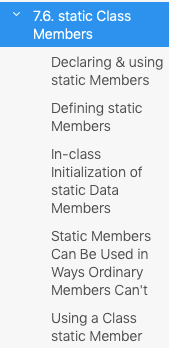


##### 概念

所有类对象共享

类外定义

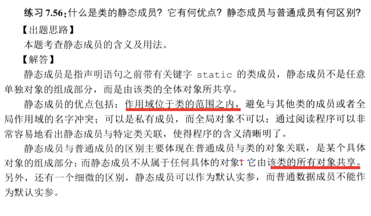


##### declare、using、defining

声明

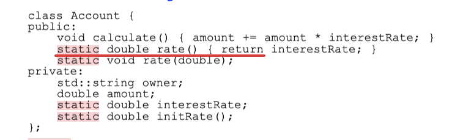


定义

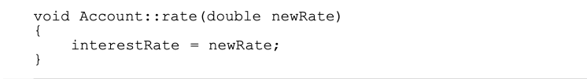


使用

//使用作用域访问符:: 访问

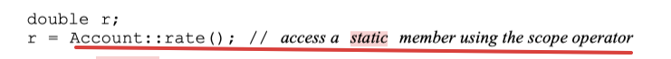


##### //junk//quiz_ch7.6_56-58


### 2method


#### //function&method

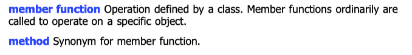


#### 静态成员函数const member

### 

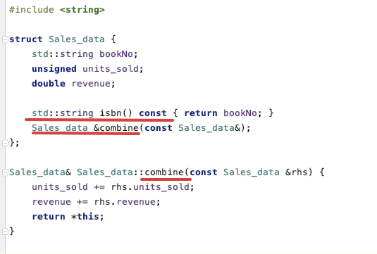


####拷贝构造copy constructor  


##### 概念


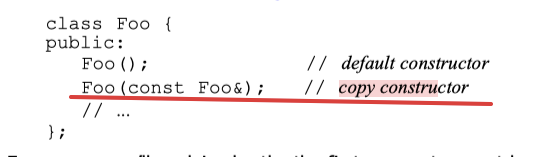


##### 声明、定义

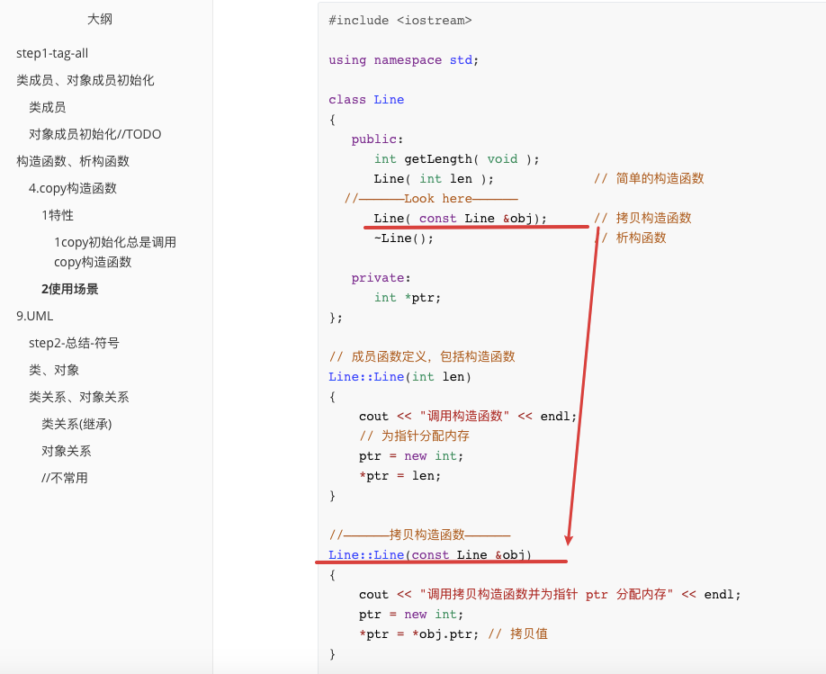


##### *使用场景

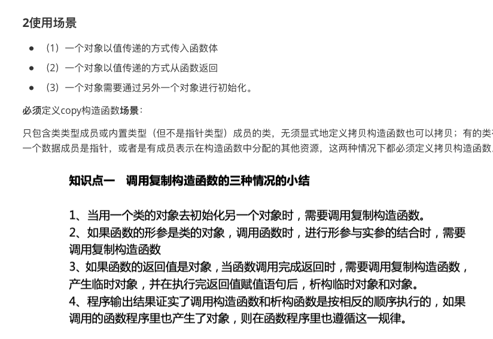

示例：

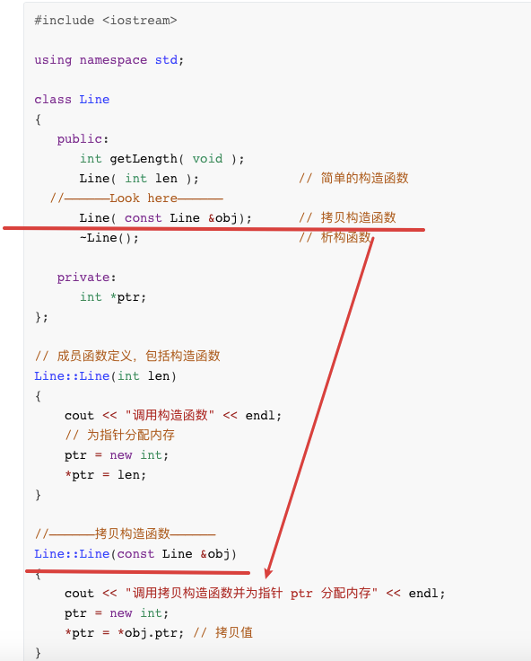

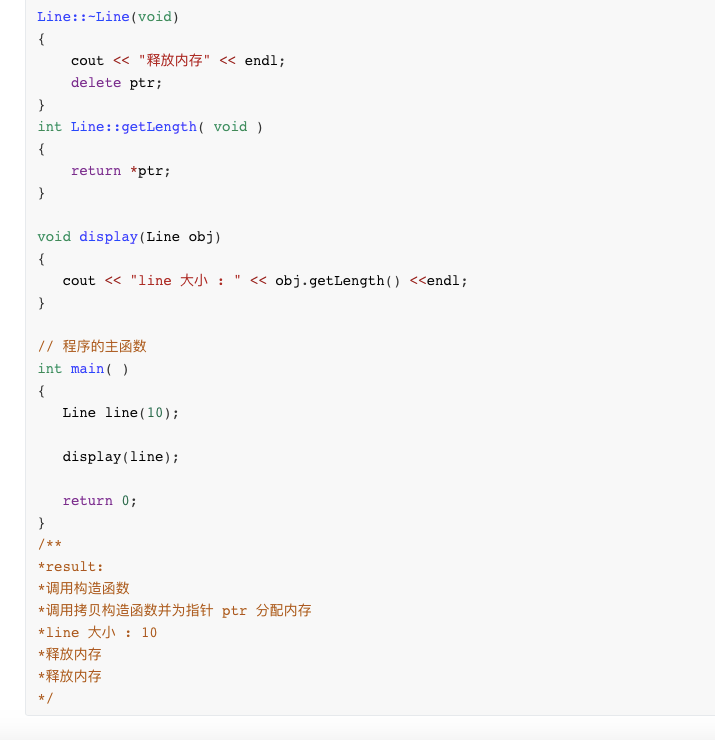


#### 析构函数desctructor


无参数

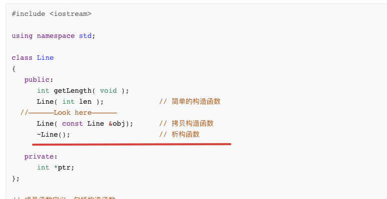

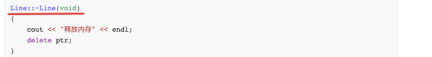


### //z.quiz

7.1——1-15

7.2——16-22

7.3——23-32

7.4——33-35

7.5——36-55

7.6——56-58


## 2OOP


### *运算符重载Overloaded Operations


#### 需求

- 必须包含一个class、(or)enum类型的操作数——>形参类型要求
- ***返回值 为 形参的某一个**——

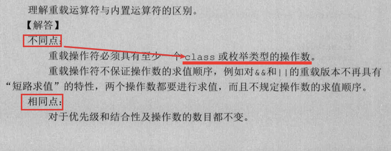

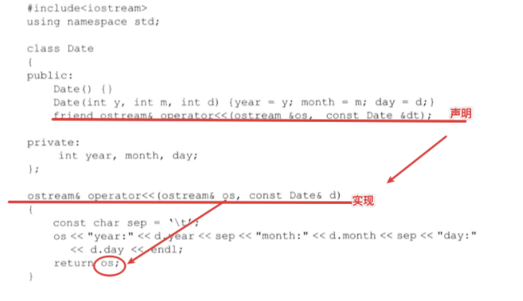


#### 使用

声明

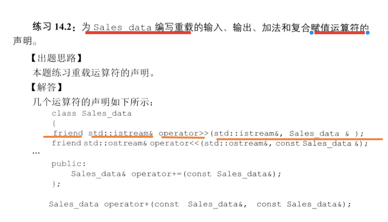

实现
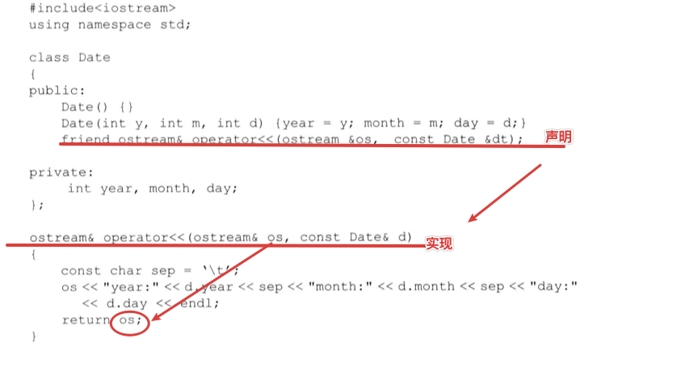


#### //junk//quiz_ch14.2_1-12


### 继承Derived Classes


#### 概念


基类base class

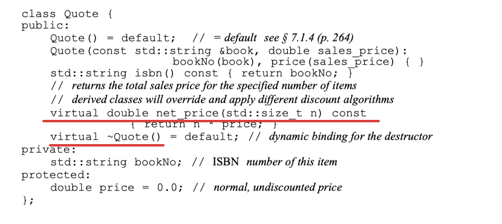


继承类derived class

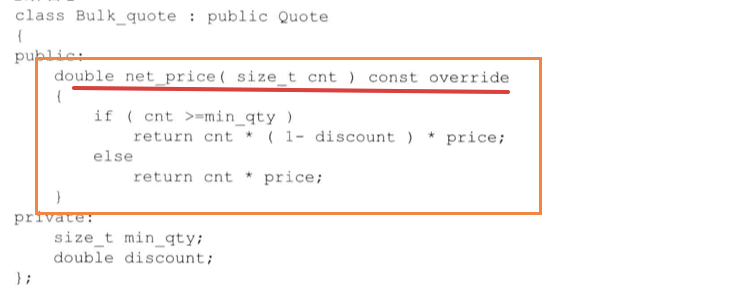


```C++


```


#### protected&private访问符区别

Protected——可以被该类的成员、友元；派生类成员访问

private——可以被基类的成员、友元；**派生类不能访问**


#### public/protected/private继承区别

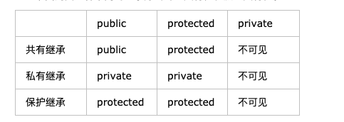


#### //junk//quiz_ch15.2_1-7


### 虚函数Virtual Function


#### 虚函数—概念

基类声明，继承类重定义


声明

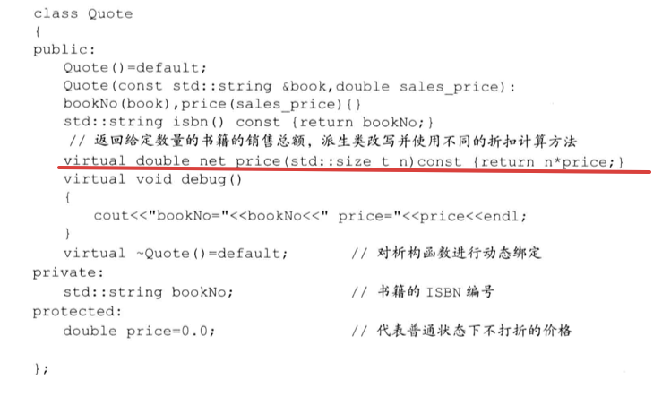

定义

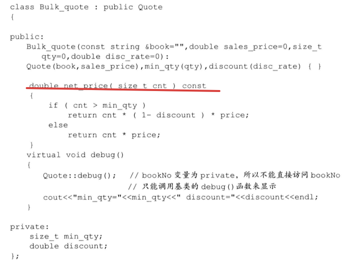


#### 纯虚函数pure virtual

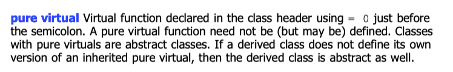


### *多态Polymorphism


https://zhuanlan.zhihu.com/p/37340242

概念：

一个接口，多种方法


目的：

封装可以使得代码模块化，继承可以扩展已存在的代码，他们的目的都是为了代码重用。而多态的目的则是为了“接口重用”。也即，不论传递过来的究竟是类的哪个对象，函数都能够通过同一个接口调用到适应各自对象的实现方法。


定位：

OOP核心原理


实现：

//相同点：都使用override关键字

编译时多态性（静态多态）——通过**重载函数**实现：先期联编 early binding
运行时多态性（动态多态）——通过**虚函数**实现 (基类**指针**—>派生类 **对象**)：滞后联编 late binding


示例：

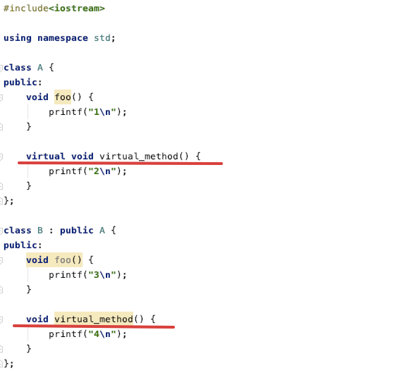


A *p=&a;

p->virtual_method();

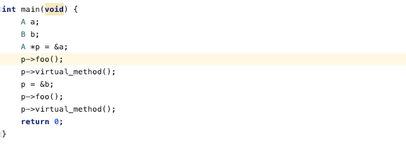


